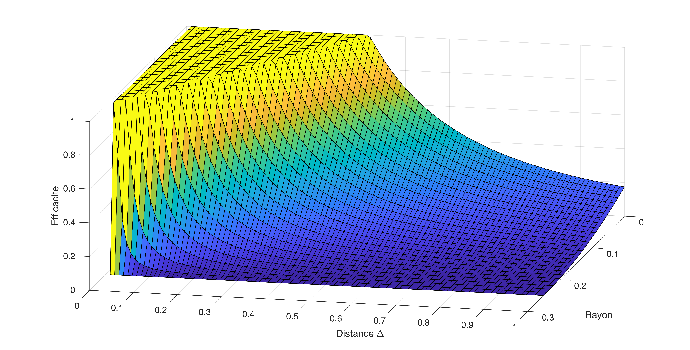

## Concentration de fluorophores: microscope à balayage

*Durée: 120m*

### Question

Le microscope à balayage (recopié ici bas) utilise un tube photomultiplicateur R3896 avec un socket C7950 en détection confocale pour imager du FITC. L'objectif 40x est utilisé correctement. Le sténopé (*pinhole*) devant la PMT A a un diamètre de 10 µm.  Quel est la concentration de FITC si vous mesurez ceci à l'oscilloscope en provenance d'un seul pixel en illuminant avec un laser bleu à 488nm qui produit 100 mW:


### Réponse

#### Stratégie générale

Le problème serait extrêmement simple si on savait déjà le volume excité et qu'on détectait tout. On aurait simplement la puissance totale émise (en photons/s ou en puissance) qui serait obtenue par l'irradiance et la surface totale de fluorophores:
$$
\text{P}_\text{Émis} =\text{I}_\text{Exc} N \sigma = \text{I}_\text{Exc} VC \sigma,
$$
avec $N$ le nombre de fluorophores excités par l'irradiance $I_\text{exc}$ et $\sigma$ la section efficace du fluorophore. On remarque que les unités sont :
$$
\frac{\text{Photons}}{\text{s}} =\frac{\text{Photons}}{\text{s} \cdot \text{m}^2} \cdot \text{Molecules} \cdot \frac{\text{m}^2}{\text{Molecule}} = \frac{\text{Photons}}{\text{s} \cdot \text{m}^2} \cdot \text{m}^3 \cdot \frac{\text{Molecules}}{\text{m}^3} \cdot \frac{\text{m}^2}{\text{Molecule}}
$$
et que tout fonctionne.  La complexité vient du fait 1) qu'on ne détecte pas tous les photons et 2) qu'on ne sait pas quel volume est excité et imagé.

On sépare le problème en quatre:

1. **Détection:** Le capteur *détecte* 3 photons par µs ($\text{P}_\text{Dét}$). Cela correspond à combien de photons émis par le volume ($\text{P}_\text{Émis}$)? On cherche la correspondance entre $\text{P}_\text{Dét} = \alpha \text{P}_\text{Émis}$ où $\alpha$ est la fonction de transfert du microscope qui dépend de l'optique, de l'objectif, etc..
2. **Volume détecté**
3. **Irradiance d'excitation:** Quelle est l'irradiance $\text{I}_\text{Exc}$ qui atteint le volume d'excitation qui sera imagé et quel est ce volume $V$? 
4. **Concentration:** Sachant la puissance de l'excitation et de la détection, combien de fluorophores de sections efficaces $\sigma$ sont présents dans le volume pour permettre ce niveau de détection? Nous devrons obtenir de l'information sur le volume excité et le volume imagé ou détecté.

#### Détection

Un tube PMT a [une efficacité de 20% environ](https://www.hamamatsu.com/resources/pdf/etd/R12829_TPMS1083E.pdf) ($\eta$). En supposant que tout l'optique utilisée est essentiellement parfaite et que les filtres ne bloquent pas l'émission de fluorescence, il ne reste que le filtre OD 0.5 qui est utilisé comme réflecteur partiel (30% perdu en transmission, 70% en réflexion), donc de l'arrière de l'objectif à la PMT, on aura une perte de $10^{-0.5} = 30\%$, donc 70% de transmission $T$ de notre signal. L'objectif utilisé a une ouverture numérique de $\text{NA} =  n \sin \theta_\text{NA} = 0.8$ dans l'eau, donc un  angle d'acceptance de $37^{\circ}$. Si on calcule la fraction $F$ d'angle solide que cela represente, on obtient: 
$$
F = \frac{2\pi ( 1 - \cos \theta_\text{NA})}{4 \pi} = 0.1
$$

On peut même somplifier pour les petits angles: 
$$
F = \frac{ 1 - \cos \theta_\text{Max}}{2} = \frac{ 1 - (1 - \frac{\theta^2_\text{Max}}{2}+...)}{2} \approx \frac{\theta^2_\text{Max}}{4}
$$


Ainsi, on a $\alpha = \eta T F$:
$$
\text{P}_\text{Émis} = \frac{\text{P}_\text{Dét}}{\eta T F} = 71.4 \times \text{P}_\text{Dét} = 214\ \text{Photons}/\mu \text{s}
$$

Donc il y a 214 photons/s émis par le volume détecté. On ne sait pas quel est ce volume qui est imagé.


#### Volume détecté

Deux aspects entre en jeu ici: quel volume est excité et quel volume est détecté? L'image du sténopé donne le diamètre de la tache imagé mais la tache d'Airy du faisceau donne le diamètre excité.  Le plus petit des deux doit être considéré. 

* Par optique géométrique on voit une série de télescope de grossissement $f_2/f_1$ fait l'image du sténopé de $d_s = 10\ \mu m$ au plan objet. Le sténopé correspond donc à un cercle de diamètre de $d_o$ à l'objet:

$$
d_o = \frac{180\ \text{mm}/40}{100\ \text{mm}}\frac{{100\ \text{mm}}}{{75\ \text{mm}}}\frac{{40\ \text{mm}}}{{50\ \text{mm}}} d_s = 0.048 d_s = 0.48 \mu m
$$
* Par simple calcul de diffraction, le diamètre de la tache d'Airy de l'excitation est $\frac{1.22\lambda}{ \text{NA}} = 0.76\ \mu\text{m}$.

Donc le facteur limitant ici est le sténopé, qui est plus petit que le diamètre du disque d'Airy (on voit aussi que la différence entre les deux reste mineure).   Pour voir comment faire un  calcul approximatif de la profondeur de champ, lisez la partie supplémentaire à la fin de ce document intitulé "[Information supplémentaire](#Information%20supplémentaire)". On obtient une profondeur de champ d'environ h = 1 µm, pour un volume de :
$$
V = \pi (d_o/2)^2 h = 0.18\ \mu\text{m}^3
$$


#### Irradiance d'excitation

La totalité de la lumière arrive sur la tache d'Airy, donc l'irradiance est de 100 mW sur $\pi (0.76\ \mu m)^2$ donc 
$$
I_o = \frac{P}{A} = \frac{100\ \text{mW}}{1.81\ \mu\text{m}^2} = 55\ \text{mW}/\mu\text{m}^2
$$


#### Concentration

Finalement, on peut obtenir la concentration sachant que $P_\text{Emis} = I_o V C \sigma$, donc:
$$
C = \frac{P_\text{Emis}}{I_o V \sigma} = \frac{214\times10^{6}\ \text{Photons/s} \times 3.2 \times 10^{-19} \text{J/Photon}}{0.055\ \text{W}/\mu\text{m}^2 \times 0.18\ \mu\text{m}^3 \times 3 \times 10^{-8}\ \mu\text{m}^2 } = 0.23\ \text{molécules}/\mu \text{m}^3
$$


#### Information supplémentaire

**Approximation géométrique de la profondeur de champ:** On peut obtenir la fonction de transfert d'un plan à une distance $\Delta$ du plan objet: il suffit d'obtenir une expression de la hauteur du rayon a la position du sténopé en fonction de cette distance au plan objet. C'est en fait relativement simple: la matrice ABCD de transfert entre le plan de l'objet et le plan du sténopé est connue: c'est simplement une série de téléscope donc:
$$
\Biggl[
\begin{matrix}
r^\prime \\
\theta^\prime \\   
\end{matrix}
\Biggl]
=
\Biggl[
\begin{matrix}
M & 0 \\
0 & 1/M \\   
\end{matrix}
\Biggl]

\Biggl[
\begin{matrix}
r \\
\theta \\   
\end{matrix}
\Biggl]
$$

 Pour obtenir la matrice à une distance $\Delta$ du plan focal, on ajoute une propagation dans l'air de $\Delta$:
$$
\Biggl[
\begin{matrix}
r^\prime \\
\theta^\prime \\   
\end{matrix}
\Biggl]
=
\Biggl[
\begin{matrix}
M & 0 \\
0 & 1/M \\   
\end{matrix}
\Biggl]
\Biggl[
\begin{matrix}
1 & \Delta \\
0 & 1 \\   
\end{matrix}
\Biggl]

\Biggl[
\begin{matrix}
r \\
\theta \\   
\end{matrix}
\Biggl]
=
\Biggl[
\begin{matrix}
M & \Delta M \\
0 & 1/M \\   
\end{matrix}
\Biggl]
\Biggl[
\begin{matrix}
r \\
\theta \\   
\end{matrix}
\Biggl]
$$

Le système n'est plus imageant ($B \ne 0$), donc à une distance $\Delta$ devant le plan focal pour une hauteur de rayon $r$, certains rayons seront projetés au-delà du sténopé
car la hauteur $r^\prime$ est donnée par:
$$
M r + \Delta M \theta < r^\prime \label{eq:rayon}.
$$

Un rayon $(r, \theta)$ originant à une distance $\Delta$ du plan focal sera détecté s'il entre dans le sténopé de rayon $r_o = 5\ \mu m$:
$$
M r + \Delta M \theta < r_o \label{eq:rayonDetecte},
$$
et ne sera pas détecté si il arrive à l'extérieur du sténopé:
$$
M r + \Delta M \theta > r_o \label{eq:rayonBloque}.
$$
Donc pour un $(r,\theta)$ donné, l'angle maximale possiblement détecté est:
$$
\theta_\text{Max} = \frac{ r_o - M r }{\Delta M} \label{eq:angleMax}.
$$
qui doit être inclus entre $[-\theta_\text{NA},\theta_\text{NA}]$
sachant que l'ouverture numérique permet la détection de $\pm \theta_\text{NA}$. 

Si on regarde au plan focal, ($\Delta=0$), on voit que:
$$
r^\prime = M r
$$
comme montré plus haut, un rayon à une hauteur $r$ est grossi à $M r$, donc les rayons jusqu'à 0.24 µm seront imagés à l'intérieur du sténopé (10 µm / 2 = 21 x 0.48 µm/2), pour tous les angles de rayons jusqu'à $\theta_\text{NA}$. Pour les rayons avant le plan focal où $\Delta > 0$ , on voit que les rayons seront projetés selon $\ref{eq:rayon}$. En regardant sur l'axe $(r=0)$, on obtient que :
$$
r^\prime = \Delta M \theta.
$$
On veut savoir a partir de quelle position les rayons à l'intérieur de l'ouverture numérique commenceront à être projeter au delà du sténopé, donc:
$$
\theta \lt \frac{r_o}{\Delta M}.
$$


 À partir de $\Delta \gt \frac{r_o}{ M \theta}$, les rayons commenceront à être  bloqués car l'angle maximal qui passera dans le sténopé sera de $\frac{r_o}{\Delta M}$ au lieu de $\theta_\text{NA}$. Pour $\Delta < \frac{n r_o}{M \text{NA}}$  l'angle maximal est $\theta_\text{NA}$.

On obtient l'efficacité de collection relative au plan focal avec $\frac{1}{2} ( 1 - \cos \theta) \approx \frac{\theta^2}{4}$ et donc:
$$
{\cal F} = \frac{1}{\theta^2_\text{NA} \Delta^{\prime 2}} \text{  pour } \Delta^\prime > \theta^{-1}_\text{NA}
$$
avec $\Delta^\prime = \frac{\Delta}{r_o/M}$, soit la distance $\Delta$ en unité de grosseur de sténopé imagé au plan focal. L'efficacité de collection est tracé a l'aide du script Python suivant.

```python
import matplotlib.pyplot as plt
import numpy as np

xb = np.linspace(1/0.6, 6, 100)
xnb = np.linspace(0, 1/0.6, 100)
plt.plot(xb, 1/(0.6*0.6)/(xb*xb), label='bloque')
plt.plot(xnb, 1+0*xnb, label='non-bloque')
plt.xlabel('Distance [multiple de $r_i$]')
plt.ylabel('Efficacite de collection')
plt.title("Profondeur de champ")
plt.legend()
plt.savefig("graph.pdf", bbox_inches='tight')
plt.savefig("graph.png", bbox_inches='tight',dpi=600)
plt.show()
```

 

On voit qu'a partir de $\Delta^\prime = 2$, l'efficacité a tombé à moins de 50%, donc on peut dire que la profondeur de champ sera approximativement de $\Delta^\prime = 4 $, soit 4 fois le diamètre du sténopé au plan focal (ici, 2 microns). Le volume imagé sera donc $\pi \left(\frac{r_o}{M}\right)^2 \times 4 \left(\frac{r_o}{M}\right) = \frac{4\pi r_o^3}{M^3} = 1.35\ \mu \text{m}^3$.

```matlab
% Code MATLAB
[r,d] = meshgrid([0:0.01:0.25],[0.01:0.01:1]);surf(r,d,max(min((ro - M.*r)./(d*M), 0.6),-0.6).*max(min((ro - M.*r)./(d*M), 0.6),-0.6)/4/(0.6*0.6/4));figure(1)
zlabel('Efficacite de collection')
xlabel('Rayon')
ylabel('Distance \Delta')
```


