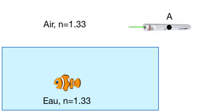
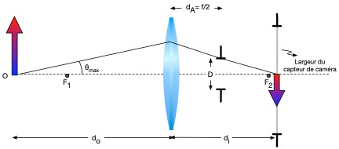
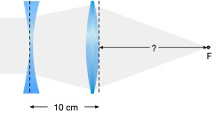
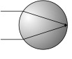

# Optique Géométrique

Les questions de cette section se rapportent à l'optique géomtétrique, où la longueur d'onde est négligeable. On parle de lentilles, formation d'image et de systèmes optiques simples. 

**Objectifs**

1. Faire le tracé de rayons pour les rayons importants et pour obtenir une image
2. Définir et identifier la distance focale d’une lentille simple ou complexe, ses plans principaux et ses plans nodaux.
3. Comprendre et expliquer l'origine de la formation de l'image dans des systèmes simples et complexes et savoir calculer la position de l’image
4. Expliquer la différence entre une image réelle et une image virtuelle
5. Comprendre, expliquer et savoir faire des calculs impliquant les phénomènes qui régissent l'optique géométrique
6. Savoir utiliser la loi de l’imagerie, la loi de Lensmaker et bien utiliser les conventions de signes
7. Expliquer, connaître les propriétés, savoir reconnaître, concevoir et faire des calculs impliquant un système 4f
8. Définir et savoir utiliser les matrices représentant les différentes composantes simples pour transformer les rayons
9. Décrire et savoir utiliser le formalisme des matrices ABCD
10. Comprendre et savoir comment obtenir la condition d’imagerie, les plans principaux et les points nodaux d’un système complexe
11. Identifier la distance focale équivalente d’un système complexe
12. Calculer la position d’une image avec le formalisme matriciel
13. Résoudre des problèmes en utilisant le formalisme matriciel

**Références**

1. Notes de cours "Optique" de Daniel C. Côté, Chapitre 2, sections 1 et 2 ([iBook](https://itunes.apple.com/us/book/optique/id949326768?mt=13) ou [iPDF](https://www.dropbox.com/s/ms9onzkg4y4771n/Optique-1.1.9.pdf?dl=0)).
2. Hecht, Section 5.2 et et 6.1
3. Saleh & Teich: Sections 1.C

## Points cardinaux

*Durée: 2m*

### Question

Sur la figure suivante:

tracez les rayons cardinaux passant par les points focaux  [$F_1$] et [F~2~] , nodal [PN~1~] et [PN~2~] et par les plans principaux [PP~1~] et [PP~2~ ].

### Réponse

1. Le rayon au plan principal PP~1~​ apparaît au plan principal PP~2~ à la même hauteur en subissant toute l'action de la lentille.

2. Un cône au plan nodal ressort avec un cône de même grandeur.  Si un rayon croise la plan nodal sur l'axe optique, il continue tout droit (rayon rouge).

3. Un rayon passant par le point focal F~1​~ ressort parallèle (rayon vert)

4. Un rayon parallèle se dirige vers le point focal F~2~ (rayon bleu)

   

## Distance focale

*Durée: 1m*

### Question

**[V ou F]** La distance focale est définie comme la distance entre la surface (physique) d’une lentille et son point focal.

### Réponse

Faux. C'est la distance entre le plan principal et le point focal.

## Plans nodaux

*Durée: 1m*

### Question

**[V ou F]** Les plans nodaux sont des plans de grossissement angulaire unitaire.

### Réponse

Vrai.
## Plan principaux

*Durée: 1m*

### Question

**[V ou F]** Les plans principaux sont des plans de grossissement transverse unitaire.

### Réponse

Vrai.
## Plans nodaux et principaux

*Durée: 1m*

### Question

Où sont les plans nodaux et les plans principaux pour une lentille mince ?

### Réponse

Au centre.

## Couches diélectriques

### Question

Imaginez une série arbitraire de plaques diélectriques parallèles, d'indices de réfraction tout aussi arbitraires mais sans absorption, le tout, dans l'air (comme une fenêtre multi-couche épaisse).  Démontrez de façon générale la relation entre les coefficients de réflexion (ou de transmission) dans un sens et l'autre, c'est-à-dire qu'arrive-t-il à l'intensité de la lumière provenant de la gauche et celle provenant de la droite en termes de coefficients de Fresnel ? Vous devez obtenir que le coefficient de transmission (ou de réflexion) de l'intensité par la gauche et par la droite est identique s’il n’y a pas d’absorption.

### Réponse

## Salle d'interrogation

### Question

Vous savez que les coefficients de transmission par la gauche ou par la droite sont identiques (même chose pour les coefficients de réflexion). Dans les émissions de télé de Gangsters et Police, il y a souvent des fenêtres “miroirs” où le suspect ne peut pas voir à l’intérieur, mais les victimes peuvent le voir et essayer de l’identifier.  À la lumière de la question précédente, expliquez ce qui se passe de façon formelle.  Vous devriez utiliser une petite égalité très simple pour supporter votre explication.

### Réponse

## Lentille à distance focale donnée

*Durée: 20 m*

### Question

Pour une lentille biconvexe diélectrique épaisse d’indice n et de rayons de courbure avant et arrière identiques R, obtenez une expression pour l’épaisseur qui donne une distance focale infinie.

### Réponse

## Lunette dans l'eau

### Question

Lorsqu’on regarde dans l’eau sans lunettes de plongée, on ne voit pas très bien.  Au contraire, avec des lunettes de plongée, on voit clairement les objets.  Comment expliquer cela considérant que l’oeil est identique dans les deux cas et que les lunettes de plongée sont plates?

### Réponse

La distance focale du dispositif optique qu'est l'oeil dépend du milieu incident du rayon (habituellement l'air). Lorsque nous sommes dans l'eau, l'image ne se forme plus directement sur la rétine mais plutôt un peu derrière, comme si nous étions myope. Si nous mettons des lunettes de plongée, le milieu du rayon incident est de nouveau de l'air et cela corrige notre vue.
## Laser dans l'eau

### Question

Vous avez un pointeur laser inoffensif rouge et vous voulez viser un poisson rouge qui se trouve devant vous dans un lac sans vague alors que vous êtes sur un quai.  Vous regardez le poisson.  Où devez-vous viser pour atteindre le poisson sous l’eau: un peu en avant, un peu en arrière ou exactement où vous le voyez?

### Réponse

## Inversion

### Question

Un miroir inverse la gauche et la droite. Pourquoi n’inverse-t-il pas le haut et le bas?

### Réponse

Un miroir n'inverse pas vraiment la gauche et la droite: il inverse le devant et le derrière (i.e. il inverse $\hat{z}$ en $-\hat{z}$).  Ce faisant, le système de coordonnées est maintenant "main gauche" au lieu de "main droite" et en effet, la gauche et la droite sont inversés. Mais en fait, le haut et le bas, si on se tourne la tête de $90^o$ vers la gauche sont aussi inversés, en ce sens que le haut est a ma droite mais a la gauche pour mon image.

## Image-objet

### Question

Quelle est la position de l’image si un objet est placé à $f/2$ devant une lentille de distance focale  $f$ ? L’image est-elle virtuelle ou réelle ? 

### Réponse

## Tracé de rayons

### Question

**[VRAI ou FAUX]** Pour trouver la position d’une image dans un système optique, on doit tracer au moins 3 rayons provenant de l’objet.

### Réponse

Faux.  Deux sont suffisants.

## Loupe

*Durée: 1m*

### Question

Comment faire la meilleure loupe ?

### Réponse

Pour utiliser une loupe, la meilleure position de l'objet est au plan focal.  Une image à l'infini est obtenue, mais notre oeil, avec sa lentille, formera un image sur la rétine.

## Doublet

*Durée: 1m*

### Question

Y'a-t-il une bonne raison de faire une lentille de type doublet achromatique avec le même matériel ?

### Réponse

Non.  Les deux matériaux sont de types Crown et de type Flint. Les verres de types Crown sont peu dispersifs, alors que les verres de type Flint sont très dispersif. Deux matériaux identiques ne permettraient pas de corriger les aberrations chromatiques.

## Objet dans l'eau

*Durée: 1m*

### Question

Un objet dans l’eau a l’air plus profond ou moins profond?

### Réponse

Moins profond.

## Lentilles cornéennes

*Durée: 1m*

### Question

Pourquoi les lentilles cornéennes avec correction pour l’astigmatisme sont-elle plus chères ?

### Réponse

Parce qu'elles doivent s'orienter dans l'oeil car la correction qu'elles produisent est associée à l'axe des $x$ et $y$, elle n'est pas symétrique. Elle ont donc un poids dans le bas qui les fait s'orienter correctement.

## Déterminant matrices ABCD

*Durée: 10 m*

### Question 

Montrez que le déterminant des matrices ABCD est en général $n_i/n_f$, avec $n_i$ l'indice du milieu incident et $n_f$ l'indice du mileu sortant.

### Réponse

La matrice la plus générale est l'interface diélectrique courbe qui représente n'importe quels deux milieux d'indices $n_1$ et $n_2$ séparés par une quelconque interface de rayon $R$:
$$
M_{1\rightarrow 2} = 
\Biggr[
\begin{matrix}
1 & 0 \\
-\frac{n_2-n_1}{n_2 R_1} & \frac{n_1}{n_2}
\end{matrix}
\Biggl]
$$
Cette matrice a un déterminant de $n_1/n_2$.  De plus, n'importe quelle série d'interfaces arbitraires entre deux milieux peut s'exprimer sous la forme d'un produit de matrices d'interfaces diélectriques de courbure arbitraires:

$$
M_{1\rightarrow f} = 
\Biggr[
\begin{matrix}
1 & 0 \\
-\frac{n_f-n_{f-1}}{n_f R_{f-1}} & \frac{n_{f-1}}{n_f}
\end{matrix}
\Biggl]
...
\Biggr[
\begin{matrix}
1 & 0 \\
-\frac{n_3-n_2}{n_3 R_2} & \frac{n_2}{n_3}
\end{matrix}
\Biggl]
\Biggr[
\begin{matrix}
1 & 0 \\
-\frac{n_2-n_1}{n_2 R_1} & \frac{n_1}{n_2}
\end{matrix}
\Biggl]
\Biggr[
\begin{matrix}
1 & 0 \\
-\frac{n_1-n_i}{n_1 R_i} & \frac{n_i}{n_1}
\end{matrix}
\Biggl]
$$

Sachant que le déterminant d'un produit est le produit de leur déterminant, on obtient:
$$
\det{M_{i\rightarrow f}} = \det{M_{f-1\rightarrow f}} ... \det{M_{2\rightarrow 3}}  \det{M_{1\rightarrow 2}}  \det{M_{i\rightarrow 1}}
$$

$$
\det{M_{1\rightarrow f}} = \frac{n_{f-1}}{n_{f}} ...\frac{n_2}{n_{3}} \frac{n_1}{n_{2}} \frac{n_i}{n_{1}} = \frac{n_i}{n_{f}}
$$
ce qu'il fallait démontrer.

## Grossissement

*Durée: 1m*

### Question

VRAI ou FAUX: L’élément A d’une matrice de transfert ABCD représente toujours le grossissement.

### Réponse

Faux.  Seulement lorsque le système est imageant. On ne parle pas de grossissement quand il n'y a pas d'image.
## Matrice de lentille

*Durée: 1m*

### Question

Pour un système optique quelconque ayant une distance focale équivalente $f$, écrivez la matrice de transfert qui transforme un rayon d’un plan principal à l’autre plan principal.

### Réponse

Par définition, l'effet totale d'une lentille est appliquée entre ses plans principaux:

$$
\Biggl[ 
\begin{matrix}
1 & 0 \\
-\frac{1}{f} & 1 \\
\end{matrix}
\Biggl]
$$
## Goutte d'eau

*Durée: 15m*

### Question 

Une goutte de pluie de forme sphérique tombe en direction d’une feuille d’arbre dans une forêt à l’équateur.  Trouvez les conditions dans lesquelles la lumière du soleil qui passe à travers la gouttelette est focalisée directement sur la feuille.

### Réponse

On obtient la matrice de transfert d’une surface diélectrique de rayon de courbure $R$ et d’indice (à droite), $n$ une propagation de $2R$ suivi d’une autre surface diélectrique de rayon de courbure  et $-R$  d’indice (à gauche) $n​$.

$$
\Biggr[
\begin{matrix}
1 & 0 \\
\frac{1-n}{R} & n
\end{matrix}
\Biggl]

\Biggr[
\begin{matrix}
1 & 2R \\
0 & 1
\end{matrix}
\Biggl]

\Biggr[
\begin{matrix}
1 & 0 \\
\frac{1-n}{n R} & \frac{1}{n}
\end{matrix}
\Biggl]

=

\left[
\begin{matrix}
 \frac{2(1-n)}{n}+1 & \frac{2R}{n} \\
 (n-1) \left[ \frac{2}{R}  + \frac{2(n-1)}{n R} \right] & 1+ \frac{2(1-n)}{n } \\
\end{matrix}
\right]
$$

$$
\Biggr[
\begin{matrix}
1 & 0 \\
\frac{n-1}{R_2} & n
\end{matrix}
\Biggl]

\Biggr[
\begin{matrix}
1 & d \\
0 & 1
\end{matrix}
\Biggl]

\Biggr[
\begin{matrix}
1 & 0 \\
\frac{1-n}{n R_1} & \frac{1}{n}
\end{matrix}
\Biggl]

=

\left[
\begin{matrix}
 \frac{d (1-n)}{n R_1}+1 & \frac{d}{n} \\
-  (n-1) \left[ \frac{1}{R_1}- \frac{1}{R_2} + \frac{d (n-1)}{n R_1 R_2} \right] & 1+ \frac{d (n-1)}{n R_2} \\
\end{matrix}
\right]
$$

## Interface diélectrique et distances focales

*Durée: 20m*

### Question

Supposez une interface diélectrique courbe de rayon $R$ et d’indice $n_1$ et $n_2$. Montrez que les points focaux de chaque côté de l’interface sont à des distances différentes de chaque côté de l’interface.

### Réponse

Nous avons obtenu la distance focale en prenant un rayon parallèle à l'axe dans un système en sachant que ce dernier, par définition croisera l'axe optique au point focal.  Ainsi, en supposant une interface diélectrique:
$$
\Biggr[
\begin{matrix}
1 & 0 \\
-\frac{n_2-n_1}{n_2 R} & \frac{n_1}{n_2}
\end{matrix}
\Biggl],
$$
on prend un rayon à une hauteur unitaire (r=1) et parallèle à l'axe ($\theta=0$) qui émergera à un angle de $\theta_2 = -\frac{n_2-n_1}{n_2}R$, et croisera donc l'axe à une distance $f_2$ telle que  $\tan \theta_2 \approx \theta_2 = \frac{1}{f_2}$ donc $f_2 = n_2 R/(n_2-n_1) $. Pour la partie avant, en prenant un rayon émergeant du point focal  $F_1$ et en propageant d'une distance $f_1$ avant de traverser l'interface, on obtient:

$$
\Biggr[
\begin{matrix}
1 & 0 \\
-\frac{n_2-n_1}{n_2 R} & \frac{n_1}{n_2}
\end{matrix}
\Biggl]
\Biggr[
\begin{matrix}
1 & f_1 \\
0 & 1
\end{matrix}
\Biggl] = 
\Biggr[
\begin{matrix}
1 & f_1 \\
-\frac{n_2-n_1}{n_2 R} & -\frac{n_2-n_1}{n_2 R}f_1 + \frac{n_1}{n_2}
\end{matrix}
\Biggl].
$$
Pour que le rayon ressorte parallèle,  on veut que $-\frac{n_2-n_1}{n_2 R_2}f_1 + \frac{n_1}{n_2} = 0$, ce qui donne $f_1 = n_1 R/(n_2-n_1)​$.

## Rayon généralisé

*Durée: 30m*

### Question

1. À partir des rayons tels que définis par le formalisme ABCD et de leur transformation, obtenez une expression en fonction de $r$ et  $\theta$ pour le rayon de courbure $\hat{R}$ du front d'onde d'un faisceau.
2. Obtenez la règle de transformation du rayon de courbure d'un faisceau en fonction des matrices ABCD. La propagation des ondes à fronts d'ondes courbes est donc incluse dans le formalisme ABCD.  Nous verrons plus tard l'importance de cette règle.

### Réponse

1. On voit que le rayon de courbure peut facilement être obtenu en traçant le rayon qui part de l'axe optique ainsi que les paramètres utilisés dans le formalisme ABCD pour décrire un rayon. Il y a correspondance directe avec $\tan \theta \approx \theta = r/\hat{R}$, donc $\hat{R}=r/\theta$.

2. Puisqu'on sait les règles de transformation de $r$ et $\theta$:

   $$
   \Biggl[ 
      \begin{matrix}
         r^\prime \\
         \theta^\prime \\
      \end{matrix}
   \Biggr] 
   =
   \Biggl[ 
      \begin{matrix}
         A & B \\
         C & D \\
      \end{matrix}
   \Biggr]
   \Biggl[ 
      \begin{matrix}
         r \\
         \theta \\
      \end{matrix}
   \Biggr]
   =
   \Biggl[ 
      \begin{matrix}
         Ar + B \theta \\
         Cr + D \theta \\
      \end{matrix}
   \Biggr]
   $$

   on obtient simplement en divisant $r^\prime$ par $\theta^\prime$, et ensuite en mettant $\theta$ en évidence:
   $$
   \hat{R}^\prime =  \frac{r^\prime}{\theta^\prime} =  \frac{Ar + B \theta}{C r + D \theta} = \frac{A\hat{R} + B }{C \hat{R} + D }
   $$
   Nous verrons qu'avec un rayon généralisé, nous pourrons propager les faisceaux lasers
   gaussiens avec cette équation.

## L'oeil et les lunettes

*Durée: 120m*

### Question

Référez-vous à la figure de Hecht suivante pour les questions.

1. Voici une citation de Hecht (p. 203):

    **“The refracting components of the eye, the cornea and crystalline lens, can be treated as forming an effective double-element lens with an object focus of about 15.6 mm in front of the anterior surface of the cornea and an image focus of about 24.3 mm behind it on the retina.”**   Pourquoi Hecht parle-t-il de deux distances focales? N'avons-nous pas dit que les points focaux sont équidistants de chaque côté d'une lentille? Expliquez.

2. Calculez la distance focale (ou puissance) de la cornée en supposant que l'indice de réfraction de l'humeur aqueuse est de 1.33 et le rayon de courbure de l'oeil est d'environ $R=23\ \text{mm} / 2 = 11.5\ \text{mm}$.

3. On utilise des lunettes pour ``corriger'' la vue. Les lunettes sont disposées sur le nez, environ au plan focal avant de l'oeil (soit 15.6 mm en moyenne). Calculez la matrice ABCD de l'oeil avec lunettes, et de l'oeil sans lunettes à partir du même plan de référence dans les deux cas. Pour simplifier la discussion, supposez que l'on peut remplacer les composantes optiques de l'oeil par une seule lentille de distance focale $f=15.6$ mm dans l'air, et intéressez-vous aux objets très lointains.

4. Quelles sont les distances focales du système complet dans les deux cas (avec et sans lunettes)?

5. Quel est le grossissement relatif du système avec lunettes par rapport au système sans lunettes?

6. Sachant cela, comment pouvez-vous expliquer qu'une paire de lunettes corrige la vue ? Expliquez-le de façon formelle avec les matrices ABCD.
  

### Réponse

1. Les deux côtés de l'oeil ne baignent pas dans le même indice de réfraction.  Les deux distances focales (avant et arrière) d'une interface diélectrique ne sont les mêmes que lorsque l'indice est le même des deux côtés (par exemple, dans l'air).

2. On utilise la loi des diélectriques courbes ou la matrice ABCD diélectrique courbe qui donne simplement $f = -1/C$, donc $f= \frac{1.33 R}{1.33 - 1.00} = 4 R = 46 \text{mm}$, par 
  $$
  \left[
     \begin{matrix}
        1 & 0 \\
        - \frac{(n_2-n_1)}{n_2 R} & \frac{n_1}{n_2} \\
     \end{matrix}
  \right]
  $$

3. Les matrices ABCD pour le cas sans lunettes et avec lunettes, telles que calculées à partir de $f$ devant la lentille de l'oeil

   Cas sans lunettes:
   $$
   \left(
      \begin{matrix}
         1 & 0 \\
         -\frac{1}{f} & 1 \\
      \end{matrix}
   \right)
   \left(
      \begin{matrix}
         1 & f \\
         0 & 1 \\
      \end{matrix}
   \right)
   =\left(
      \begin{matrix}
         1 & f \\
         -\frac{1}{f} & 0 \\
      \end{matrix}
   \right)
   $$
   Cas avec lunettes:
   $$
   \left(
      \begin{matrix}
         1 & 0 \\
         -\frac{1}{f} & 1 \\
      \end{matrix}
   \right)
   \left(
      \begin{matrix}
         1 & f \\
         0 & 1 \\
      \end{matrix}
   \right)
   \left(
      \begin{matrix}
         1 & 0 \\
         -\frac{1}{F} & 1 \\
      \end{matrix}
   \right)
   =\left(
      \begin{matrix}
         1 - \frac{f}{F}& f \\
         -\frac{1}{f} & 0 \\
      \end{matrix}
   \right)
   $$

4. La distance focale $C^{-1}$ du système complet n'a pas changée et est toujours celle de l'oeil, $f$.

5. Le grossissement depend de l'objet et de l'image.  Les deux systèmes ont la même distance focale, donc le grossissement est identique.  

6. Prenons le cas sans lunettes, avec l'équation (c.1) et la figure suivante:

   

   Le plan principal avant est à $d_\mathrm{PP_1} = \frac{1-D}{C} = -f $ devant le système, donc $f$ vers la droite, i.e. sur la lentille mince. Le plan principal de arrière est à d $d_\mathrm{PP_2} = \frac{1-A}{C} = 0$ donc lui aussi sur la lentille mince. Aucune surprise.
   Cependant, le plan principal arrière du système avec lunette a changé: on le voit tout de suite, l'élément  $A$ a changé. Un calcul de la position du plan donne $PP_2$  qu'il est maintenant à $d_\mathrm{PP_2} = \frac{1-A}{C} = -\frac{f^2}{F}$.  Ainsi, le plan focal a été déplacé de $-\frac{f^2}{F}$ , la distance focale reste la même mais le point focal est avancé, d'où la correction par les lunettes.

## Objectif

*Durée: 60 m*

### Question

Vous avez l’objectif Olympus suivant, identifié « Olympus UPlanFl 40x ». Vous savez que cet objectif s’utilise normalement dans un système 4f avec une seconde lentille de distance focale f=18 cm pour compléter ledit système 4f. Cependant, vous voulez l’utiliser seul, sans aucune autre lentille, pour tirer profit de ses excellentes propriétés optiques. Vous savez aussi que le point focal F1 est collé sur la première surface de l’objectif et que le point focal F2 est à 2 mm du bout de l’objectif, comme sur la Figure.

1. Quelle est la distance focale de cet objectif Olympus 40X ?
2. Écrivez la matrice ABCD qui permet de transformer un rayon entrant de la première surface de l’objectif au plan focal F2.
3. Quelles sont les positions des plans principaux ? Donnez les distances en fonction des points focaux F1 et F2.
4. Vous voulez maintenant utiliser l’objectif (sans aucune autre lentille) pour faire l’image d’un objet qui est à 2.5 mm du bout de l’objectif, donc 0.5 mm après le point focal  F2. Où placeriez-vous votre camera par rapport à la première surface de l’objectif pour obtenir une image claire de cet objet? 

### Réponse

## Lentilles composées

*Durée: 15m*

### Question

Vous avez un système de lentilles comme suit:

pour lequel la matrice de transfert ABCD (en unités métriques) du plan d’entrée au plan de sortie est :
$$
M = \Biggl[ 
   \begin{matrix}
      -0.1 & 0.11 \\
      -10 & 1 \\
   \end{matrix}
\Biggl]
$$
 Si vous placez un objet 0.2 m devant le groupe de lentilles, où sera l’image et quel sera le grossissement?

### Réponse

## Diaphragme

*Durée: 30m*

### Question

Vous avez une lentille de diamètre $D=5\ \text{cm}$ et de focale $f = 50\ \text{cm}$ qui fait l'image du soleil, un disque d'illumination constante pour nos besoins. Le soleil sous-tend un angle de $\theta = 0.5^o$ à la surface de la terre, où son irradiance est de 1000 W/m^2^.  Quelle est l'irradiance de l'image du soleil qui apparaît sur la caméra?

### Réponse

## Mirages

*Durée: 90m*

### Question

Qu'est-ce qui explique la formation des mirages dans le désert? À partir de quelle température apparaitront-ils?

### Réponse

## Examen 2016 partie 1

*Durée: 25m*

### Question

Un exemple, en vrac, de question pour la partie 1 de l'examen.

1. [Vrai/Faux] Pour toute onde, un seul rayon pointant dans une direction donnée est suffisant pour décrire le front d’onde en tout point 

2. [Vrai/Faux] On ne peut pas décrire une onde plane par une somme d’ondes sphériques, car son front d’onde est droit.
3. [Vrai/Faux] On peut avoir une onde qui a un front d’onde plan mais qui n’est pas une onde plane
4. [Vrai/Faux] Une one plane qui se propage dans l’atmosphère sera perturbée par les variations d’indices de réfraction et ne restera plus une onde plane.
5. [Vrai/Faux] Le vecteur de Poynting correspond à la direction vers laquelle la puissance se propage
6. [Vrai/Faux] Le vecteur de Poynting a les unités de puissance par surface.
7. [Vrai/Faux] La distance focale est définie comme la distance entre la surface (physique) d’une lentille et son point focal.
8. Où sont les plans nodaux et les plans principaux pour une lentille mince ?
9. [Vrai/Faux] Les plans principaux sont des plans conjugués
10. Vous avez un pointeur laser inoffensif et vous voulez viser avec ce faisceau laser un poisson qui se trouve dans un aquarium.  À partir du point A, où devez-vous viser pour atteindre le poisson sous l’eau? Tracez la lumière à partir du point A et expliquez.

 

 

11. [Vrai/Faux] Un miroir sphérique peut avoir des aberrations chromatiques
12. [Vrai/Faux] Pour trouver la position d’une image dans un système optique, on doit tracer au moins 3 rayons provenant de l’objet.
13. **GRIN** Pour quelles longueurs non nulles L une lentille GRIN, décrite par la matrice suivante donnera-t-elle une image à un bout de la lentille pour un objet collé à l’autre bout?

 

14.  Avec l’iris devant la lentille qui bloque la lumière, tracez le rayon marginal du point O et le rayon principal du point O’, sachant que ces points ont des images correspondantes aux points I et I’.

 

15.    [Vrai/Faux] Le diamètre du diaphragme d’entrée (*aperture stop*) est la valeur qui définit le f# du système.

16. [Vrai/Faux] La pupille d’entrée définit la quantité de lumière qui entre dans un système

16. [Vrai/Faux] L’élément A d’une matrice représente toujours le grossissement.

16. [Vrai/Faux] La matrice suivante représente un ou plusieurs éléments optiques.

    

    1. La focale équivalente est de  0.50 cm
    2. Il n’y a pas de focale équivalente, car l’élement B n’est pas zéro comme dans une lentille mince
    3. Si je mets un objet devant ce groupe d’élements optiques, une image virtuelle ou réelle existera

17.  [Vrai/Faux] Une goutte d’eau sphérique agit comme une lentille épaisse.

18.  [Vrai/Faux] Les lunettes corrigent la vue en diminuant ou augmentant la distance focale du système complet de l’œil et des lunettes ensemble

19.  [Vrai/Faux] L’étoile Vega, qui sous-tend un angle de 1 milliradians, formera un point sur une camera puisqu’elle est infiniment loin.

### Réponse

## Examen 2016, partie 2

*Durée: 45m*

### Question

Un exemple, en vrac, de question pour la partie 2 de l'examen.

1. Pour un système optique quelconque ayant une distance focale équivalente f, écrivez la matrice de transfert qui transforme un rayon d’un plan principal à l’autre plan principal.

2. Quelle est la position de l’image si un objet est placé à 2f devant une lentille de distance focale f ?

   1. L’image est-elle virtuelle ou réelle ? 
3. Vous avez le système imageant suivant (pas à l’échelle) qui consiste en un objet à une distance 4f d’une lentille de distance focale f=5 cm. Le diaphragme d’entrée limitant la quantité de lumière se trouve à une position dA=f/2 après la lentille et a un diamètre de D=1cm.

   

     1. Pour un rayon sur l’axe et sur l’objet, quel est l’angle maximal θmax pour lequel un rayon se rendra jusqu’à l’image
     2. Comment s’appelle ce rayon ?

 4. Vous avez construit ce splendide objectif téléphoto inverse avec une lentille divergente de fa = -2 cm et une lentille convergente de fb = 6 cm, les deux étant séparées par une distance de 10 cm :

    

    La matrice de transfert ABCD, de la première surface de la première lentille divergente à la dernière surface de la deuxième lentille convergente, qui provient de la multiplication des matrices représentant chaque lentille et l’espace entre les deux, est la suivante :
    

    où est le point focal par rapport à la surface de la deuxième lentille ?

**BONI FACULTATIF**

5. En optique infrarouge, on utilise parfois des lentilles de type « sphérique » (ou *ball lens*) comme sur la figure. Il suffit de déposer la sphère sur un échantillon pour focaliser à sa surface.  À partir de quel valeur de l’indice de réfraction le point focal sera-t-il directement sur la sphère?

## Lentille dans milieux différents

*Durée: 60m*

### Question

Supposez une lentille de rayons $R_1$, $R_2$, et d’indice $n$ immergée dans un milieu $n_1$ à l'entrée et $n_2$ à la sortie. Montrez que les points focaux de chaque côté de l’interface sont à des distances différentes de la lentille..

### Réponse

Nous avons obtenu la distance focale en prenant un rayon parallèle à l'axe dans un système en sachant que ce dernier, par définition croisera l'axe optique au point focal.  La matrice de la lentille mince a été développée en supposant qu'elle était dans l'air.  Ainsi, on ne peut partir de :
$$
{\bf L} = 
\Biggl[ 
   \begin{matrix}
      1 & 0 \\
      -\frac{1}{f} & 1 \\
   \end{matrix}
\Biggl]
$$
et espérer redériver quelque chose de plus général dans des milieux différents.  On doit plutôt essentiellement réécrire la lentille mince en la décomposant en deux interfaces courbes séparées par une distance négligeable.  Ainsi, en supposant un indice $n_1$ à l'entrée, un indice $n$ dans la lentille et un indice $n_2$ à la sortie, on obtient une lentille mince immergée dans deux milieux différents:
$$
{\bf L}^\prime =

\Biggr[
\begin{matrix}
1 & 0 \\
-\frac{n_2-n}{n_2 R_2} & \frac{n}{n_2}
\end{matrix}
\Biggl]

\Biggr[
\begin{matrix}
1 & 0 \\
-\frac{n-n_1}{n R_1} & \frac{n_1}{n}
\end{matrix}
\Biggl]

=

\Biggr[
\begin{matrix}
1 & 0 \\
-\frac{k}{n_2} & \frac{n_1}{n_2}
\end{matrix}
\Biggl],
$$
avec $k \equiv \left(\frac{n-n_1}{R_1} -\frac{n-n_2}{R_2} \right)$. On note qu'avec une lentille dans l'air ($n_1 = n_2 = 1$), on retrouve l'équation du LensMaker $\frac{1}{f} = (n-1)\left(\frac{1}{R_1}-\frac{1}{R_2}\right)$. Un rayon à une hauteur unitaire (r=1) et parallèle à l'axe ($\theta=0$) émergera à un angle de $\theta_2 = -\frac{k}{n_2}$, et croisera donc l'axe à une distance $f_2$ telle que  $\tan \theta_2 \approx \theta_2 = \frac{1}{f_2}$ donc $f_2 = n_2/k $. En inversant $n_1$ et $n_2$ et $R_1$ et $R_2$, on obtiendrait $f_1 = n_1/k$.

