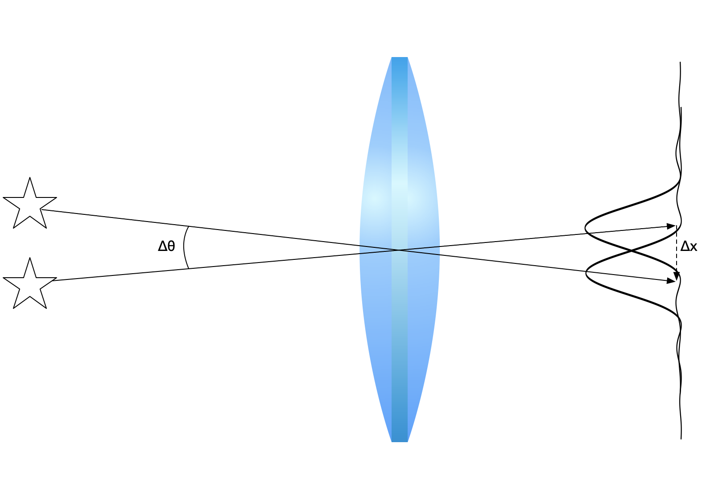

## Résolution téléscope Keck

*Durée: 20m*

### Question

Trouvez l’angle minimale (critère de Rayleigh) entre deux structures qui peuvent être résolues par le télescope de Keck à Hawaii qui a un diamètre de 10 m et une distance focale de 17.5 m. Expliquez votre choix de longueur d’onde.

### Réponse

Le critère de Rayleigh correspond à la distance qui sépare le pic principal et le premier zéro et est donné par $\Delta x = \frac{1.22 f \lambda}{D}$. Le téléscope fonctionne dans le visible et l'infrarouge.  On s'intéresse à la raie de Balmer de l'hydrogène à 656.2 nm mais toute autre ligne spectrale pourrait être utilisée pour les calculs. 

Avec un peu de géométrie et le critère de Rayleigh, on arrive aux équations suivantes : 

$$
\tan\left(\Delta\theta \right) \approx \Delta \theta = \frac{\Delta x}{f }
$$
et
$$
\frac{\Delta x}{f}=\frac{1.22 f  \lambda}{ f D}.
$$

Donc 
$$
\Delta \theta = \frac{1.22 \lambda }{D}.
$$
La résolution spatiale à la camera est donc $\Delta \theta = 1.22 \frac{\lambda}{D} = 0.08 \ \mu  \text{rad}$ dans le visible.

