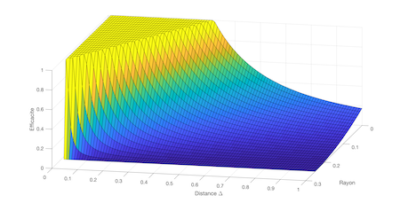

# Détection


**Objectifs**

1. Expliquer l'effet photoélectrique

2. Expliquer le phénomène d'absorption dans les semiconducteurs

3. Obtenir et utliser les paramètres importants d'un semiconducteur en ce qui a trait à l'absorption de photon: band interdite, dopants p et n, matériaux intrinsèques.

4. Nommer, expliquer le fonctionnement des types de détecteurs en optique et leurs différences.

5. Expliquer le mode de fonctionnement et la grandeur des signaux attendus dans des situations expérimentales

6. Connaître, nommer et utiliser dans des calculs les paramètres importants d'une caméra CCD ou CMOS

7. Expliquer le bruit de photon, et utiliser ses propriétés pour faire des prédictions dans des expériences

8. Calculer le nombre de photons attendus en relation aux surfaces efficaces

    

**Références**

1. [Diapositives](https://www.icloud.com/keynote/0XoMXj0S6kRg8GCmICiKpM3fQ#BPH-7006_Detection) sur la Détection pour le cours gradué "Imagerie Biomédicale".
## Tube photomultiplicateur

*Durée: 5m*

### Question

Un tube photomultiplicateur (PMT) peut détecter un seul photon.  Quel est taux de photons maximal qui peut être mesuré à 500 nm?

### Réponse

Les impulsions électriques d'une PMT sont typiquement entre 10 ns et 50 ns. Ainsi,pour détecter deux photons séparément, on devrait avoir plus que 2 photons par 10 ou 50 ns, ce qui donne entre 2ev/10ns = 40 pW et 2ev/50ns = 8 pW.

```python
h = 6.62e-34 # m^2 kg/s 
c = 3e8 # m/s
wavelength = 500e-9 # m
energyPerPhoton = h * c / wavelength # Joules

lowMaxPowerInPicoWatt = energyPerPhoton/50e-9 /1e-12 # en pW
highMaxPowerInPicoWatt = energyPerPhoton/10e-9 /1e-12 # en pW

print "Une PMT sature entre %.0f pW et %.0f pW" % (lowMaxPowerInPicoWatt, highMaxPowerInPicoWatt)

# Output 
# Une PMT sature entre 8 pW et 40 pW
```

## Caméra CCD

*Durée: 10m*

### Question

Vous avez une caméra CCD 12-bit avec une profondeur de puits de 100,000e- et une efficacité quantique de 90% sans amplification. Quelle est la plus petite différence de photons qu’elle peut vous rapporter?

### Réponse

Simplement, la quantité de photons par bit est obtenue par:
$$
\frac{100000 \text{ photoelectrons}}{\text{QE photoelectrons/photon} \times 2^{12} \text{bit}} = 27 \text{ photons par bit}
$$

```python
maxValue = 1 << 12 # 2^12
wellDepth = 100000 # photoelectrons
photonsAcquiredWellFull = wellDepth / 0.90 # 90 photoelectrons means 100 photons hit the detector
photonsPerBit = photonsAcquiredWellFull/maxValue

print "Deux valeurs numerisees different par %.0f photons" % photonsPerBit

# Output
# Deux valeurs numerisees different par 27 photons
```

## Bruit de photon

*Durée: 60m*

### Question

Un flux de photon de 1 pW à 632.8 nm est incident sur une PMT en mode “photon counting”.

1. Ceci correspond à combien de photons par seconde?
2. Quelle est la probabilité d’obtenir un photon dans un intervalle de 100 ns si les photons arrivent au hasard?
3. [Programmation]: Tracez des courbes typiques du nombre de photons accumulés toute les 100 ns jusqu’à un total de 1 seconde
4. Combien de temps devriez vous mesurer (i.e. intégrer) pour obtenir une mesure fiable à 1% ?
5. Quel est l’impact sur le temps d’intégration si on augmente la puissance du faisceau par un facteur 2?
6. Quel est l’impact sur le rapport signal sur bruit si on augmente la puissance du faisceau par un facteur 2?

### Réponse

## Sensibilité radiante de la photocathode

*Durée: 10m*

### Question

Quelle est la *radiant sensitivity* de la cathode d’une PMT R3896 en A/W?

### Réponse

On trouve la [feuille de spécifications](https://www.hamamatsu.com/resources/pdf/etd/R12829_TPMS1083E.pdf) sur le web. On obtient 100 mA/W. Ceci correspond à environ 1 photon sur 5 qui est converti en photoélectron.

## Sensibilité radiante de l'anode

*Durée: 10m*

### Question

Quelle est la *radiant sensitivity* de l'anode d’une PMT R3896 en A/W?

### Réponse

On trouve la [feuille de spécifications](https://www.hamamatsu.com/resources/pdf/etd/R12829_TPMS1083E.pdf) sur le web. Le courant qui sort de l'anode a été amplifié par les multiples dynodes. Avec un gain typique de $10^7$, on obtient donc $100 \text{ mA/W} \times 10^7 = 1 \text{ MA/W}$, ou 1 µA/pW.

## Courbe spectrale de l'oeil

*Durée: 3m*

### Question

Pouvez vous regarder un fluorophore infrarouge à 750 nm sans une caméra?

### Réponse

Non. La réponse de l'oeil est essentiellement nulle à 750 nm:


[Source de l'image](https://www.nde-ed.org/EducationResources/CommunityCollege/PenetrantTest/Introduction/lightresponse.htm)

Au contraire, une camera CCD, fait en silice, possède une réponse beaucoup plus élevée entre 650 et 1050 nm:


[Source de l'image.](https://andor.oxinst.com/learning/view/article/ccd-spectral-response-(qe))

## Efficacité

*Durée: 5m*

### Question

La sensibilité (*sensitivity*) d’une photodiode classique est d’environ 1 A par Watt de lumière dans le visible.  Justifiez pourquoi c’est le cas par un calcul du nombre d’électrons par photon incident.

### Réponse

Dans une photodiode de type p-i-n, chaque photon donne lieu à une paire électron-trou, donc un courant de 2 charges pour chaque photon à 500 nm. On obtient donc 2 charges/2eV de lumière, ce qui donne 0.8A/W.   

```python
q = 1.6e-19 # C                                                                                                                                                   
h = 6.62e-34 # m^2 kg/s                                                                                                                                           
c = 3e8 # m/s                                                                                                                                                     
I = 2 * q # charge/photon                                                                                                                                         
wavelength = 0.5e-6 # m                                                                                                                                           
energieParPhoton = h * c / wavelength # J/photon                                                                                                                  
radiantSensitivity = I / energieParPhoton # A/W                                                                                                                   
print "Radiant sensitivity:", radiantSensitivity, " A/W"

# Output:
# radiantSensitivity =
#
#    0.8056
```


## Efficacité quantique

*Durée: 5m*

### Question

On dit qu’une photodiode a une efficacité quantique de presque 50-100%.  Pourquoi utilise-t-on des PMT d’efficacité quantique de 10-30% ?

### Réponse

Parce que l'efficacité quantique n'est pas la seule chose à considérer: l'efficacité quantique est la fraction de photon convertie en électron.  Cependant, la réponse (en Volt ou en Ampère) dépend du gain du détecteur. Une réponse élevée (en V) est plus facile à détecter qu'une petite réponse (en mV). Les PMTs ont des gains de 10^6^ , ce qui leur donne un grand signal pour un seul photon.


## Paramètres bruit de photons

*Durée: 60m*

### Question

Un flux de photon de 1 pW à 632.8 nm est incident sur une PMT en mode “photon counting”.

- Ceci correspond à combien de photons par seconde?
- Quelle est la probabilité d’obtenir un photon dans un intervalle de 100 ns si les photons arrivent au hasard?
- [Programmation]: Tracez des courbes typiques du nombre de photons accumulés toute les 100 ns jusqu’à un total de 1 seconde
- Combien de temps devriez vous mesurer (i.e. intégrer) pour obtenir une mesure fiable à 1% ?
- Quel est l’impact sur le temps d’intégration si on augmente la puissance du faisceau par un facteur 2 ?
- Quel est l’impact sur le rapport signal sur bruit si on augmente la puissance du faisceau par un facteur 2 ?

### Réponse

## Bruit CCD

*Durée: 10m*

### Question

Tracez la courbe du bruit total typique d’une CCD en fonction du temps d’intégration sur une échelle logarithmique. Décrivez les trois différentes régions du graphique.

### Réponse

## Histogramme d'amplitudes

*Durée: 15m*

### Question

Supposez que des photons sont des gaussiennes de 20 ns de largeur (1/e), et supposez que vous mesurez l’amplitude de la tension à des temps aléatoires.  Quelle sera l’histogramme que vous obtiendrez ? (solution programmée acceptée). Si ce sont plutôt des carrés, quel sera l’histogramme ?

### Réponse

## Concentration de fluorophores: microscope grand champ

*Durée: 120m*

### Question

Un microscope à grand champ utilise une camera Orca Flash de Hamamatsu et un objectif Olympus 40x pour imager une mince couche de fluorophore (2 µm) fluoresceine de concentration inconnue. L'excitation se fait avec un laser 488 nm avec des filtres bleus. Lorsque vous sauvegardez l'image, vous obtenez des valeurs de 16-bit allant de  950 à 1050, avec une moyenne de 1000 lorsque vous intégrez 100 ms.  Quelle est la concentration de marqueurs fluorescents en $\text{fluorophores}/\mu m^3$?

### Réponse


## Concentration de fluorophores: microscope à balayage

*Durée: 120m*

### Question

Le microscope à balayage (recopié ici bas) utilise un tube photomultiplicateur R3896 avec un socket C7950 en détection confocale pour imager du FITC. L'objectif 40x est utilisé correctement. Le sténopé (*pinhole*) devant la PMT A a un diamètre de 10 µm.  Quel est la concentration de FITC si vous mesurez ceci à l'oscilloscope en provenance d'un seul pixel en illuminant avec un laser bleu à 488nm qui produit 10 mW:


### Réponse

#### Stratégie générale

Le problème serait extrêmement simple si on savait déjà le volume excité et qu'on détectait tout. On aurait simplement la puissance totale émise (en photons/s ou en puissance) qui serait obtenue par l'irradiance et la surface totale de fluorophores:
$$
\text{P}_\text{Émis} =\text{I}_\text{Exc} N \sigma = \text{I}_\text{Exc} VC \sigma,
$$
avec $N$ le nombre de fluorophores excités par l'irradiance $I_\text{exc}$ et $\sigma$ la section efficace du fluorophore. On remarque que les unités sont :
$$
\frac{\text{Photons}}{\text{s}} =\frac{\text{Photons}}{\text{s} \cdot \text{m}^2} \cdot \text{Molecules} \cdot \frac{\text{m}^2}{\text{Molecule}} = \frac{\text{Photons}}{\text{s} \cdot \text{m}^2} \cdot \text{m}^3 \cdot \frac{\text{Molecules}}{\text{m}^3} \cdot \frac{\text{m}^2}{\text{Molecule}}
$$
et que tout fonctionne.  La complexité vient du fait 1) qu'on ne détecte pas tous les photons et 2) qu'on ne sait pas quel volume est excité et imagé. On doit donc retrouver le volume, l'irradiance et le nombre de photons émis.

On sépare le problème en quatre:

1. **Détection:** Le capteur *détecte* 3 photons par µs ($\text{P}_\text{Dét}$). Cela correspond à combien de photons émis par le volume ($\text{P}_\text{Émis}$)? On cherche la correspondance entre $\text{P}_\text{Dét} = \alpha \text{P}_\text{Émis}$ où $\alpha$ est la fonction de transfert du microscope qui dépend de l'optique, de l'objectif, etc..
2. **Volume détecté**
3. **Irradiance d'excitation:** Quelle est l'irradiance $\text{I}_\text{Exc}$ qui atteint le volume d'excitation qui sera imagé et quel est ce volume $V$? 
4. **Concentration:** Sachant la puissance de l'excitation et de la détection, combien de fluorophores de sections efficaces $\sigma$ sont présents dans le volume pour permettre ce niveau de détection? Nous devrons obtenir de l'information sur le volume excité et le volume imagé ou détecté.

#### Détection

Un tube PMT a [une efficacité de 20% environ](https://www.hamamatsu.com/resources/pdf/etd/R12829_TPMS1083E.pdf) ($\eta$). En supposant que tout l'optique utilisée est essentiellement parfaite et que les filtres ne bloquent pas l'émission de fluorescence, il ne reste que le filtre OD 0.5 qui est utilisé comme réflecteur partiel (30% perdu en transmission, 70% en réflexion), donc de l'arrière de l'objectif à la PMT, on aura une perte de $10^{-0.5} = 30\%$, donc 70% de transmission $T$ de notre signal. L'objectif utilisé a une ouverture numérique de $\text{NA} =  n \sin \theta_\text{NA} = 0.8$ dans l'eau, donc un  angle d'acceptance de $37^{\circ}$. Si on calcule la fraction $F$ d'angle solide que cela represente, on obtient: 
$$
F = \frac{2\pi ( 1 - \cos \theta_\text{NA})}{4 \pi} = 0.1
$$

On peut même somplifier pour les petits angles: 
$$
F = \frac{ 1 - \cos \theta_\text{Max}}{2} = \frac{ 1 - (1 - \frac{\theta^2_\text{Max}}{2}+...)}{2} \approx \frac{\theta^2_\text{Max}}{4}
$$


Ainsi, on a $\alpha = \eta T F$:
$$
\text{P}_\text{Émis} = \frac{\text{P}_\text{Dét}}{\eta T F} = 71.4 \times \text{P}_\text{Dét} = 214\ \text{Photons}/\mu \text{s}
$$

Donc il y a 214 photons/s émis par le volume détecté. On ne sait pas quel est ce volume qui est imagé.


#### Volume détecté

Deux aspects entre en jeu ici: quel volume est excité et quel volume est détecté? L'image du sténopé donne le diamètre de la tache imagée mais la tache d'Airy du faisceau donne le diamètre excité.  Le plus petit des deux doit être considéré. 

* Par optique géométrique on voit une série de télescope de grossissement $f_2/f_1​$ fait l'image du sténopé de $d_s = 10\ \mu m​$ au plan objet. Le sténopé correspond donc à un cercle de diamètre de $d_o​$ à l'objet:

$$
d_o = \frac{180\ \text{mm}/40}{100\ \text{mm}}\frac{{100\ \text{mm}}}{{75\ \text{mm}}}\frac{{40\ \text{mm}}}{{50\ \text{mm}}} d_s = 0.048 d_s = 0.48 \mu m
$$
* Par simple calcul de diffraction, le diamètre de la tache d'Airy de l'excitation est $\frac{1.22\lambda}{ \text{NA}} = 0.76\ \mu\text{m}​$.

Donc le facteur limitant ici est le sténopé, qui est plus petit que le diamètre du disque d'Airy (on voit aussi que la différence entre les deux reste mineure).   Pour voir comment faire un  calcul approximatif de la profondeur de champ, lisez la partie supplémentaire à la fin de ce document intitulé "[Information supplémentaire](#Information%20supplémentaire)". On obtient une profondeur de champ d'environ $h = 1\ \mu \text{m}$, pour un volume de :
$$
V = \pi (d_o/2)^2 h = 0.18\ \mu\text{m}^3
$$

#### Irradiance d'excitation

La totalité de la lumière arrive sur la tache d'Airy, donc l'irradiance est de 10 mW sur $\pi (0.76\ \mu m)^2$ donc 
$$
I_o = \frac{P}{A} = \frac{10\ \text{mW}}{1.81\ \mu\text{m}^2} = 5.5\ \text{mW}/\mu\text{m}^2
$$

#### Concentration

Finalement, on peut obtenir la concentration sachant que $P_\text{Emis} = I_o V C \sigma$, donc:
$$
C = \frac{P_\text{Emis}}{I_o V \sigma} = \frac{214\times10^{6}\ \text{Photons/s} \times 3.2 \times 10^{-19} \text{J/Photon}}{0.0055\ \text{W}/\mu\text{m}^2 \times 0.18\ \mu\text{m}^3 \times 3 \times 10^{-8}\ \mu\text{m}^2 } = 2.3\ \text{molécules}/\mu \text{m}^3
$$

#### Information supplémentaire

Approximation géométrique de la profondeur de champ: On peut obtenir la fonction de transfert d'un plan à une distance $\Delta$ du plan objet: il suffit d'obtenir une expression de la hauteur du rayon a la position du sténopé en fonction de cette distance au plan objet. C'est en fait relativement simple: la matrice ABCD de transfert entre le plan de l'objet et le plan du sténopé est connue: c'est simplement une série de téléscope donc:

$$
\Biggl[
\begin{matrix}
r^\prime \\
\theta^\prime \\   
\end{matrix}
\Biggl]
=
\Biggl[
\begin{matrix}
M & 0 \\
0 & 1/M \\   
\end{matrix}
\Biggl]

\Biggl[
\begin{matrix}
r \\
\theta \\   
\end{matrix}
\Biggl]
$$

 Pour obtenir la matrice à une distance $\Delta$ du plan focal, on ajoute une propagation dans l'air de $\Delta$:

$$
\Biggl[
\begin{matrix}
r^\prime \\
\theta^\prime \\   
\end{matrix}
\Biggl]
=
\Biggl[
\begin{matrix}
M & 0 \\
0 & 1/M \\   
\end{matrix}
\Biggl]
\Biggl[
\begin{matrix}
1 & \Delta \\
0 & 1 \\   
\end{matrix}
\Biggl]
\Biggl[
\begin{matrix}
r \\
\theta \\   
\end{matrix}
\Biggl]
=
\Biggl[
\begin{matrix}
M & \Delta M \\
0 & 1/M \\   
\end{matrix}
\Biggl]
\Biggl[
\begin{matrix}
r \\
\theta \\   
\end{matrix}
\Biggl]
$$

Le système n'est plus imageant ($B \ne 0$), donc à une distance $\Delta$ devant le plan focal pour une hauteur de rayon $r$, certains rayons seront projetés au-delà du sténopé
car la hauteur $r^\prime$ est donnée par:
$$
M r + \Delta M \theta < r^\prime \label{eq:rayon}.
$$

Un rayon $(r, \theta)$ originant à une distance $\Delta$ du plan focal sera détecté s'il entre dans le sténopé de rayon $r_o = 5\ \mu m$:
$$
M r + \Delta M \theta < r_o \label{eq:rayonDetecte},
$$
et ne sera pas détecté si il arrive à l'extérieur du sténopé:
$$
M r + \Delta M \theta > r_o \label{eq:rayonBloque}.
$$
Donc pour un $(r,\theta)$ donné, l'angle maximale possiblement détecté est:
$$
\theta_\text{Max} = \frac{ r_o - M r }{\Delta M} \label{eq:angleMax}.
$$
qui doit être inclus entre $[-\theta_\text{NA},\theta_\text{NA}]$
sachant que l'ouverture numérique permet la détection de $\pm \theta_\text{NA}$. 

Si on regarde au plan focal, ($\Delta=0$), on voit que:
$$
r^\prime = M r
$$
comme montré plus haut, un rayon à une hauteur $r$ est grossi à $M r$, donc les rayons jusqu'à 0.24 µm seront imagés à l'intérieur du sténopé (10 µm / 2 = 21 x 0.48 µm/2), pour tous les angles de rayons jusqu'à $\theta_\text{NA}$. Pour les rayons avant le plan focal où $\Delta > 0$ , on voit que les rayons seront projetés selon $\ref{eq:rayon}$. En regardant sur l'axe $(r=0)$, on obtient que :
$$
r^\prime = \Delta M \theta.
$$
On veut savoir a partir de quelle position les rayons à l'intérieur de l'ouverture numérique commenceront à être projeter au delà du sténopé, donc:
$$
\theta \lt \frac{r_o}{\Delta M}.
$$


 À partir de $\Delta \gt \frac{r_o}{ M \theta}$, les rayons commenceront à être  bloqués car l'angle maximal qui passera dans le sténopé sera de $\frac{r_o}{\Delta M}$ au lieu de $\theta_\text{NA}$. Pour $\Delta < \frac{n r_o}{M \text{NA}}$  l'angle maximal est $\theta_\text{NA}$.

On obtient l'efficacité de collection relative au plan focal avec $\frac{1}{2} ( 1 - \cos \theta) \approx \frac{\theta^2}{4}$ et donc:
$$
{\cal F} = \frac{1}{\theta^2_\text{NA} \Delta^{\prime 2}} \text{  pour } \Delta^\prime > \theta^{-1}_\text{NA}
$$
avec $\Delta^\prime = \frac{\Delta}{r_o/M}$, soit la distance $\Delta$ en unité de grosseur de sténopé imagé au plan focal. L'efficacité de collection est tracé a l'aide du script Python suivant.

```python
import matplotlib.pyplot as plt
import numpy as np

xb = np.linspace(1/0.6, 6, 100)
xnb = np.linspace(0, 1/0.6, 100)
plt.plot(xb, 1/(0.6*0.6)/(xb*xb), label='bloque')
plt.plot(xnb, 1+0*xnb, label='non-bloque')
plt.xlabel('Distance [multiple de $r_i$]')
plt.ylabel('Efficacite de collection')
plt.title("Profondeur de champ")
plt.legend()
plt.savefig("graph.pdf", bbox_inches='tight')
plt.savefig("graph.png", bbox_inches='tight',dpi=600)
plt.show()
```

 

On voit qu'a partir de $\Delta^\prime = 2$, l'efficacité a tombé à moins de 50%, donc on peut dire que la profondeur de champ sera approximativement de $\Delta^\prime = 4 $, soit 4 fois le diamètre du sténopé au plan focal (ici, 2 microns). Le volume imagé sera donc $\pi \left(\frac{r_o}{M}\right)^2 \times 4 \left(\frac{r_o}{M}\right) = \frac{4\pi r_o^3}{M^3} = 1.35\ \mu \text{m}^3$.

```matlab
% Code MATLAB
[r,d] = meshgrid([0:0.01:0.25],[0.01:0.01:1]);surf(r,d,max(min((ro - M.*r)./(d*M), 0.6),-0.6).*max(min((ro - M.*r)./(d*M), 0.6),-0.6)/4/(0.6*0.6/4));figure(1)
zlabel('Efficacite de collection')
xlabel('Rayon')
ylabel('Distance \Delta')
```


