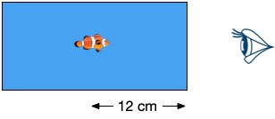

# Devoir #1

*À remettre au cours une semaine après la réception du document.*

**Historique** 

1. 20 janvier 2020: Première version, remise mardi le 28 janvier 2020.

## Indice de réfraction

a. Partez des équations de Maxwell pour obtenir l'équation d'onde d'un champ électrique polarisé linéairement dans un milieu avec une densité de polarisation uniforme $\mathbf{P}(\mathbf{r})$. 

b. Montrez que l'indice de réfraction vu par cette onde est $n \equiv \sqrt{\epsilon_r}$, ou $\epsilon = \epsilon_r \epsilon_\circ$.

c. En modélisant la polarisation comme une somme de dipôles, et chaque dipôle comme un électron attiré par une charge positive (immobile) avec une constante de rappel $K$, un coefficient d'amortissement $\gamma$, et une masse $m$, montrez que:
$$
\mathbf{P} = \frac{Ne^2/m}{\omega_\circ^2 - \omega^2 - i \omega \gamma} \mathbf{E}_\circ,
$$
où $N$ est la densité de dipôles par volume et $\omega^2_\circ \equiv \frac{K}{m}$. *Notez: un dipôle d'une charge positive et négative est la charge multipliée par la distance entre les deux charges, $\mathbf{p} = e \mathbf{d}$.*

##   Photons et énergie

a. Quelle est la puissance en Watt pour un flux moyen de 1 photon verts par nanoseconde?

b. Si un détecteur semiconducteur génère une charge positive et une charge négative pour 90% des photons incidents, quel est le courant généré en Ampère pour 1 µW de puissance incidente ?

## Imagerie

Vous regardez un poisson dans un aquarium chez le dentiste. Le poisson est en réalité au centre de l’aquarium à 12 cm du bord. 

a. En supposant que l’aquarium est un bloc d’eau d’indice n = 1.33 ~ 4/3 (négligez le verre de l’aquarium), où le poisson semblera-t-il être?

b. De quelle grosseur semble-t-il être?

