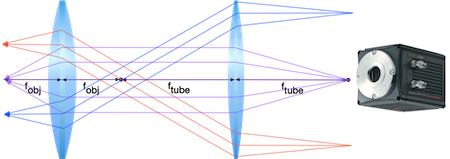

# Devoir 1

<div style="page-break-after: always; break-after: page;"></div>
# Devoir 2

**Il y aura d'autres questions qui s'ajouteront bientôt**. Le devoir doit etre remis en ligne pour mardi le 4 février 8h30.

*Historique*

1. Première version 24 janvier
2. Ajout de deux questions 27 janvier

## Lunettes

Référez-vous à la figure de Hecht suivante pour les questions.

1. Voici une citation de Hecht (p. 203):

   **“The refracting components of the eye, the cornea and crystalline lens, can be treated as forming an effective double-element lens with an object focus of about 15.6 mm in front of the anterior surface of the cornea and an image focus of about 24.3 mm behind it on the retina.”**   Pourquoi Hecht parle-t-il de deux distances focales? N'avons-nous pas dit que les points focaux sont équidistants de chaque côté d'une lentille? Expliquez.

2. Calculez la distance focale (ou puissance) de la cornée en supposant que l'indice de réfraction de l'humeur aqueuse est de 1.33 et le rayon de courbure de l'oeil est d'environ $R=23\ \text{mm} / 2 = 11.5\ \text{mm}$.

3. On utilise des lunettes pour *corriger* la vue. Les lunettes sont disposées sur le nez, environ au plan focal avant de l'oeil (soit 15.6 mm en moyenne). Calculez la matrice ABCD de l'oeil avec lunettes, et de l'oeil sans lunettes à partir du même plan de référence dans les deux cas. Pour simplifier la discussion, supposez que l'on peut remplacer les composantes optiques de l'oeil par une seule lentille de distance focale $f=15.6$ mm dans l'air, et intéressez-vous aux objets très lointains.

4. Quelles sont les distances focales du système complet dans les deux cas (avec et sans lunettes)?

5. Quel est le grossissement relatif du système avec lunettes par rapport au système sans lunettes?

6. Sachant cela, comment pouvez-vous expliquer qu'une paire de lunettes corrige la vue ? **Expliquez-le de façon formelle** avec les matrices ABCD.

<div style="page-break-after: always; break-after: page;"></div>
## Lentille épaisse

Allez chercher toute l'information pour la fabrication de la lentille doublet achromatique [**AC254-050-A**](https://www.thorlabs.com/newgrouppage9.cfm?objectgroup_id=120&pn=AC254-050-A) de Thorlabs sur http://www.thorlabs.com.  Vous y trouverez les rayons de courbure de chaque interface et chaque matériel utilisé. Le sindices de réfraction peuvent ensuite être obtenu à la longueur d'onde $\lambda=633$ sur le site http://refractiveindex.info.  En modélisant la lentille comme des diélectriques courbes et avec les bons matériaux, trouvez la distance focale effective et la *back focal length* (BFL) de la lentille, c'est-à-dire la position du point focal derrière la lentille.  Vous pouvez vérifier votre réponse avec le code Python suivant:

```python
import raytracing # Importez avec pip install raytracing
raytracing.thorlabs.AC254_050_A().display()
```

[Installez `pip` si nécessaire](https://www.liquidweb.com/kb/install-pip-windows/).


## Lentilles composées

Vous avez un système de lentilles comme suit:


pour lequel la matrice de transfert ABCD (en unités métriques) du plan d’entrée au plan de sortie est :
$$
M = \Biggl[ 
   \begin{matrix}
      -0.1 & 0.11 \\
      -10 & 1 \\
   \end{matrix}
\Biggl]
$$
 Si vous placez un objet 0.2 m devant le groupe de lentilles, où placez-vous votre capteur de caméra pour obtenir une belle image et quel sera le grossissement?

<div style="page-break-after: always; break-after: page;"></div>
## Système optique

Vous avez construit ce système optique avec une lentille divergente de $f_a$ = -2 cm et une lentille convergente de $f_b$ = 6 cm, les deux étant séparées par une distance de 10 cm :


La matrice de transfert ABCD, de la première surface de la première lentille divergente à la dernière surface de la deuxième lentille convergente, qui provient de la multiplication des matrices représentant chaque lentille et l’espace entre les deux, est la suivante :
$$
\left(
\begin{matrix}
6 & 10 \text{ cm} \\
-\frac{1}{2\text{ cm}} & -\frac{2}{3} 
\end{matrix}
\right)
$$
où est le point focal par rapport à la surface de la deuxième lentille?

## Plans principaux

Obtenez la matrice de transfert entre les deux plans principaux d'une lentille épaisse de rayons de courbure $R_1$ et $R_2$, d'indice $n$ et d'épaisseur $d$. 

<div style="page-break-after: always; break-after: page;"></div>

# Devoir 3

**Historique**:

1. 12 février : ajout de figures pour le microscope, correction pour téléscope (1 lentille, pas deux) et commentaires pour négliger la diffraction dans tous les problèmes
2. 14 février: Ajout de la lentille de scan $f_\text{scan} = 50$ mm.

## Système de microscopie

Un système de microsccopie ressemble a ceci:


Vous avez donc une partie qui illumine à travers l'objectif et une partie qui fait l'imagerie.  Les deux sont ensemble grâce à un miroir dichroique qui laisse passer l'illumination et qui reflechit la lumière qui revient de l'échantillon. Ici, le système consiste en deux sysytèmes 4f de deux lentilles de $f_\text{obj}$ = 5 mm et $f_\text{tube}$= 200 mm avec des diamètres respectifs de $D_\text{obj}$ = 5 mm et $D_\text{tube} = 50 $ mm pour l'imagerie et un autre pour l'illumination. Nous allons considérer l'illumination et l'imagerie dans ce système, en commençant par l'illumination.


### Champ d'illumination

**Question:** On peut simplement mettre une source d'illumination (e.g., DEL, lampe au mercure, etc..) au plan conjugué de l'objet. Cette méthode s'appelle l'illumination critique et n'est pas utilisée souvent. **Pourquoi**?


**Réponse**: Si on fait un système comme ci-haut, le plan objet (à gauche) sera conjugué avec le plan de la lampe (à droite). Ainsi, on verra le filament ou tout autre inhomogénéité de la source.

#### Illumination de Koehler

Ainsi, on utilise plutôt une lentille supplémentaire entre l'illumination et le système 4f pour faire ce qui s'appelle de l'illumination de Koehler:


 La lentille $f_2$ a une focale de 200 mm et un diamètre de $D_2 = $50 mm, la source est au plan focale de $L_3$.  La lampe peut être considérée comme un disque de 5 mm de diamètre avec un profil d'illumination en $I(\theta)=I_\circ \cos^2 \theta$ en tout point de sa surface. Le graphique ci-dessous montre que l'intensité (la longueur de la flèche) dépend de l'angle d'émission:


1. D'abord, définissez une ouverture numérique NA pour cette lampe. L'ouverture numérique d'une lampe est essentiellement le cône de sortie de la lumière provenant de cette lampe.  Notez que cette propriété est indédependante du système de lentille, c'est uniquement une propriété de la lampe. Obtenez une expression selon les critères que vous utilisés (*indice: 50% du maximum? 90% de la puissance?*)
  
2. Vous avez deux contraintes: 1) Vous voulez un champ d'illumination donné (1 mm) et 2) vous voulez remplir l'ouverture (i.e. la lumière couvre la surface au complet) de la lentille de l'objectif avec la lumière pour pouvoir bénéficier de son ouverture numérique maximale.

   Quelle lentille $L_3$ devez-vous prendre (distance focale $f_3$ et diamètre $D_3$) pour obtenir une illumination constante sur 1 mm de diamètre à l'échantillon ayant une variation de moins de 10% sur sa surface? *Attention: tentez de minimiser les pertes en illuminant au dela de la surface demandée, ne gaspillez pas de puissance au delà du 1 mm demandé*

3. Trouvez une lentille sur le site de Thorlabs qui répond à vos critères.

4. Il existe une quantité nommée "l'invariant optique". On peut obtenir "l'invariant optique maximal" supporté par un élément ou par un système.  Allez lire les [diapositives de classe sur le sujet](https://www.icloud.com/keynote/01VB2_464vK8oJ8nXxygbOLjQ#6-Invariant_2). Discutez du choix de la lampe dans ce système particulier ici.

**Réponse:** 

1. Si l'illumination suit un patron en $\cos^2 \theta$, le point où l'intensité sera 90% du maximum sera 0.32 radian, donc le cône d'illumination (i.e. le NA) sera de 0.64 rad.

$$
\begin{eqnarray}
\cos^2\theta_\circ & = & 0.9 \\
\theta_\circ & = & \arccos \sqrt{0.9} \\
\theta_\circ & = & 0.32 
\end{eqnarray}
$$

2. **On commence par considerer uniquement le probleme sans les diaphragmes.**
  
   La matrice de transfert, entre la lampe et l'entrée de l'objectif est un système 4f:
   $$
   M_\text{Lampe-Objectif} 
   =
   \left(
   \begin{matrix}
   -\frac{f_2}{f_3} & 0 \\
   0 & -\frac{f_3}{f_2} 
   \end{matrix}
   \right)
   $$
   Alors que celle entre la lampe et l'objet est simplement:
   $$
   M_\text{Lampe-Objet} 
   =
   \left(
   \begin{matrix}
   0 & -\frac{f_3 f_o}{f_2}\\
   -\frac{f_2}{f_3 f_o} & 0
   \end{matrix}
   \right)
   $$
On veut deux choses: 1) que l'objectif soit uniformément rempli, et 2) que le champ d'illumination soit de 1 mm de diamètre. Nous avons un ensemble de rayons $\left\{( \vec{r}_i, \theta_i) \right\}$ qui vont de -2.5 mm a 2.5 mm, et qui ont une distribution en intensité qui suit $\cos^2\theta$. Pour simplifier le probleme en 1), nous avons considéré que le dernier rayon était à $\theta_\circ = 0.32$, donc les rayons ont des angles entre -0.32 et 0.32.

   **Contrainte #1:** Pour remplir l'objectif de diametre 5 mm avec une source de 5 mm, sachant que les deux plans sont conjugués, on veut simplement que $f_2/f_3 \ge 1$: s'il est plus grand que 1, on perdra un peu d'énergie (car elle sera coupée par le diaphragme de l'objectif). On veut donc $f_3 \le f_2$, où $f_3 \le 200\ \text{mm}$. 
   
   **Contrainte #2:** On voudrait que le point à 0.5 mm ait une intensité d'au moins 90% du maximum. Les rayons ayant une intensité de 90% du maximum sont de la forme:
$$
\left(
   \begin{matrix}
   a \\
   \theta_\circ
   \end{matrix}
\right)
$$
Ces rayons sont transformés au plan objet comme:
$$
M_\text{Lampe-Objet} 
   \left(
   \begin{matrix}
   a \\
   \theta_\circ
   \end{matrix}
   \right)
   =
   \left(
   \begin{matrix}
   0 & -\frac{f_3 f_o}{f_2}\\
   -\frac{f_2}{f_3 f_o} & 0
   \end{matrix}
   \right)
   \left(
   \begin{matrix}
   a \\
   \theta_\circ
   \end{matrix}
   \right)
   =
   \left(
   \begin{matrix}
   -\frac{f_3 f_o \theta_\circ}{f_2}\\
   -\frac{f_2 a}{f_3 f_o}
   \end{matrix}
   \right)
$$
On a que le point illuminé le plus loin est :
$$
   E=-\frac{f_3 f_o \theta_\circ}{f_2} = \frac{5\times 0.32}{200} f_3  = 0.008f_3
$$

donc nous voudrons au minimum une focale $f_3> 62.5\ \text{mm}$ pour avoir une illumination de 1 mm jusqu'à un maximum $f_3 = 200\ \text{mm}$ qui donnerait un champ d'illumination de 3.2 mm.

La lentille $L_3$ doit aussi permettre de laisser passer les rayons de $\pm$0.32 rad, donc doit avoir un diamètre au moins 2/3 de $f_3$.

3. Trouver une lentille chez Thorlabs

4. **Discussion sur l'efficacité**: pourquoi ai-je le choix entre 62.5 mm et 200 mm? Quel est le compromis? Si la lentille $f_3$ est de 200 mm, on aura un champ trop grand de 3.2 mm.  Au contraire, a $f_3=62.5$ cm, nous aurons la bonne largeur de champ (1 mm), mais il y aura une perte d'énergie car les rayons de la source au-dela de 5mm de la source seront bloqués par l'objectif (le grossissement du system 4f entre la lampe et l'objectif sera de 3.2), donc approximativement, on perdra 2/3 de la puissance.

   On peut calculer l'invariant  supporté par chaque composante pour voir la quantité maximale de lumière qui peut être transmise dans le systeme.

### Champ de vue

Maintenant, on regarde la partir imagerie du même système. La figure montre la partie de l'imagerie provenant de la figure initiale.  Avec une caméra Orca Flash de Hamamatsu (trouvez les spécifications):

1. quel sera le champ de vue avec une lentille $f_\text{tube}$ = 200 mm et $D_\text{tube}$ = 50 mm? 
2. quelle sera la résolution spatiale si on néglige la diffraction? (*Bonus: quel serait l'impact de la diffraction?*)



## Microscope à balayage

1. Prouvez à l’aide des matrices ABCD qu’un balayage en angle au point focal d'une lentille donne un balayage en X/Y à l’autre point focal.

   

2. Si un faisceau laser est incident sur un miroir à un angle d'incidence $\theta$, et que ce miroir change son orientation de $\Delta \phi$, de quel angle $\Delta \theta$ le faisceau laser changera-t-il? Dans les système à balayage, on identifie toujours l'angle de balayage mécanique ($\Delta \phi$) et l'angle de balayage optique ($\Delta \theta$).

3. Si vous mettez un miroir qui peut balayer son orientation au plan focal d'une lentille de balayage (*scan lens* de $f=50 \ mm$), qui est lui-même après un système 4f composé d'un objectif 20X et d'un lentille de $f_\text{tube}=200$ mm, quel doit être l'angle de balayage du miroir pour obtenir un champ de balayage de  $500\ \mu m \times 500\ \mu m$ ?


## Soleil avec passages nuageux

Vous voulez faire un télescope qui imagera la surface complète du soleil sur votre caméra que vous venez de recevoir un cadeau, la ZWO ASI 183 PRO, disponible [ici](https://www.amazon.com/ZWO-ASI183MC-Astronomy-Camera-ASI183MC-P/dp/B07BPRLBP2?ref_=fsclp_pl_dp_3). 

1. Concevez un télescope avec **une** lentille (pas deux!) qui remplit ces conditions. Si vous cherchez des téléscopes sur Internet, vous verrez qu'ils ont souvent deux lentilles si c'est pour une utilisation avec l'oeil.  Avec une caméra, on peut prendre une ou trois lentilles.  **Prenez une seule lentille.**
2. Quelle sera sa résolution angulaire si *on néglige la diffraction*? Comment se compare-t-elle à celle du téléscope Daniel Inouye de Hawaii?
3. Quelle sera le flux de photon moyen sur chaque pixel?

