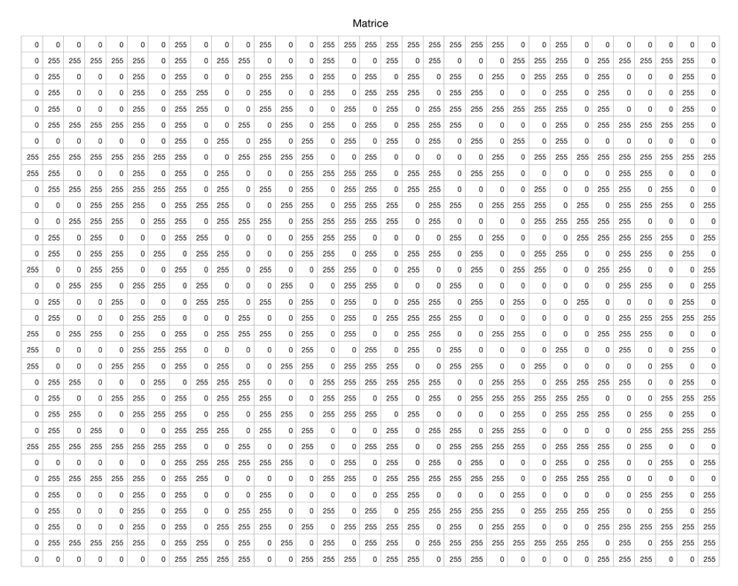

# Devoir #2

# Devoir #2

 
# Devoir #3

Vous devez compléter le devoir pour mercredi matin 8h35.

## Des calculs simples

*Durée: 30 à 60 minutes*

### a) Obtenez les déterminants suivants:

a. 
$$
\left|
\begin{matrix}
a & b \\
c & d
\end{matrix}
\right|
$$

b. 
$$
\left|
\begin{matrix}
a & b & c \\
c & d & e \\
0 & 0 & 0 \\
\end{matrix}
\right|
$$

b. 
$$
\left|
\begin{matrix}
a & b & c \\
c & d & e \\
2a & 2b & 2c \\
\end{matrix}
\right|
$$

c. 
$$
\left|
\begin{matrix}
2a & b & c \\
2a & 0 & 2 \\
2a & b & f \\
\end{matrix}
\right|
$$

d. 
$$
\left|
\begin{matrix}
2 & 5 & -1 \\
3 & 6 & -2 \\
4 & 5 & -3 \\
\end{matrix}
\right|
$$

f. 
$$
\left|
\begin{matrix}
2 & 5 & -1 \\
0 & 6 & -2 \\
0 & 0 & -3 \\
\end{matrix}
\right|
$$

g. 
$$
\left|
\begin{matrix}
a & b & -1 \\
2a & 2 & -2 \\
3a & 3b & 3 \\
\end{matrix}
\right|
$$
h. Le déterminant de ce produit:
$$
\left|
\left(
\begin{matrix}
a & b & c \\
c & d & e \\
2a & 2b & 2c \\
\end{matrix}
\right)
\left(
\begin{matrix}
a & b & -1 \\
2 & 2 & -2 \\
3 & 5 & 4 \\
\end{matrix}
\right)
\left(
\begin{matrix}
1 & 3 & 3 \\
2 & 2 & -2 \\
3 & 3 & 3 \\
\end{matrix}
\right)
\right|
$$

i. Le déterminant de la 5e puissance de cette matrice:
$$
\left|
\left(
\begin{matrix}
a & b  \\
c & d 
\end{matrix}
\right)^5
\right|
$$

###  b) En utilisant les notions de d'indépendance linéaire, de rang, de déterminant:

a. trouvez le nombre de vecteurs linéairement dépendants dans l'ensemble $\left\{ (1,2,3), (3,4,5), (-1,0,1) \right\}$

b. trouvez la dimension de l'espace vectoriel engendré par $\left\{ (1,2,3), (3,4,2), (-1,0,1), (2,3,4), (0,0,1)\right\}$.  *(Ne trouvez pas la base, la dimension de l'espace).*

c. trouvez le nombre de solutions du système d'équations suivants*(pas les solutions, le nombre de solutions):*
$$
\begin{eqnarray}
x + y + z & = & 0 \\
3x + 2y + z & = & 0 \\
6x + y + 8z & = & 0 \\
\end{eqnarray}
$$

d. Si le déterminant de la matrice suivante est non-nul:
$$
\left(
\begin{matrix}
a & b & c \\
d & e & f \\
g & h & i \\
\end{matrix}
\right),
$$
est-ce que les vecteurs $\left\{(a,d,g),(b,e,h),(c,f,i)\right\}$ forment une base de ${\mathbb{R}^3}$ ?

## Norme

*Durée: 30 minutes*

a. Montrez que si une matrice est telle que ${\bf M}^{T}{\bf M} = {\bf M}{\bf M}^{T} = {\bf I}$ , la norme du vecteur ${\bf v}^\prime = {\bf M} {\bf v}$ est la même que celle de ${\bf v}$.

b. Écrivez une matrice autre que $\left( \begin{matrix}1 & 0 \\ 0 & 1 \end{matrix} \right)$ et $\left( \begin{matrix}0 & 1 \\ 1 & 0 \end{matrix} \right)$ qui correspond à ce type de matrice.

## Équilibre statique

*Durée: 15 à 60 minutes*

Une particule de masse $m$ [kg], située au point $(x,y,z)$ [m] dans l’espace, est soumise à la force suivante :
$$
{\bf F}(x, y, z) = \alpha (x + y + 2z)\hat{i} + ( \beta y − \alpha z)\hat{j} + \beta(z − x)\hat{k},
$$
où $\alpha$ et $\beta$  sont des paramètres [N/m] qui contrôlent l’intensité et l’orientation de la force appliquée. Supposez que la particule soit initialement au repos. Existe-t-il des valeurs de $\alpha$ et $\beta$ qui ne permettent pas à la particule de rester en équilibre statique à un point autre que l'origine?

## Question bonus (33%)

Est-ce que la matrice suivante de $\mathbb{R}^{33}$ est constituée de 33 vecteurs indépendants? Elle est [disponible en ligne](http://bit.ly/2moB8a1) en format `.csv`. 

