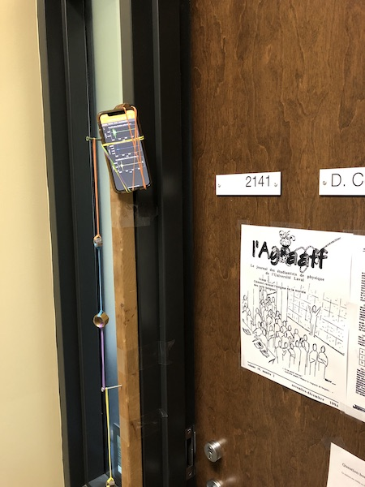

# Devoir #5.5: Boni 3%

## 1. Matrice de changements de base

Sachant que la matrice de changement de base par rotation ${\bf R}_z(\theta)$ de $\theta$ autour de $\hat{z}$ dans le sens anti-horaire (ou trigonométrique) du référentiel est la suivante (comme vue en classe):
$$
{\bf R}_z(\theta) 
   =
   \left(
   \begin{matrix}
   \cos \theta & \sin \theta & 0\\
   -\sin \theta & \cos \theta & 0 \\
   0 & 0 & 1
   \end{matrix}
   \right),
$$
on peut rapidement écrire les deux matrices pour des rotations autour de $\hat{x}$ et $\hat{y}$, comme:
$$
{\bf R}_x(\theta) 
   =
   \left(
   \begin{matrix}
   1 & 0 & 0 \\
   0 & \cos \theta & \sin \theta \\
   0 & -\sin \theta & \cos \theta  \\
   \end{matrix}
   \right),
$$

$$
{\bf R}_y(\theta) 
   =
   \left(
   \begin{matrix}
   \cos \theta & 0 &  -\sin \theta \\
   0 & 1 & 0 \\
   \sin \theta & 0 & \cos \theta \\
   \end{matrix}
   \right).
$$

Obtenez la matrice ${\bf R}(\theta,\phi)$ qui permet de faire un changement de base dans un nouveau référentiel qui est tourné de $\theta$ autour de $\hat{z}$ et ensuite de $\phi$ autour **de l'ancien axe $\hat{y}$** et de finalement faire une réflexion par rapport à **l'axe des $\hat{z}$ original** ($\hat{z}$ devient $-\hat{z}$, en référence à l'axe original, qui en passant, n'est plus l'axe des $z$).

## 2. Diagonalisation de matrice

Vous aimeriez calculer la 5e puissance de cette matrice sans utiliser Python, MATLAB ou tout autre outil informatique:

$$
{\bf M}= 
\left[
\begin{matrix}
2 & 0 & \frac{\sqrt{2}}{2}	 \\
0 & 2 & -\frac{\sqrt{2}}{2} \\
\frac{\sqrt{2}}{2} & -\frac{\sqrt{2}}{2}  & 2
\end{matrix}
\right],
$$

Comme on le sait, il est particulièrement laborieux de calculer ${\bf M}^5$. Clairement, on devrait trouver une meilleure solution.  Si vous étiez capable de trouver une matrice telle que ${\bf P}{\bf P}^{-1} ={\bf P}^{-1}{\bf P} = \mathbb{I}$, vous pourriez faire une transformation de type  ${\bf M}^\prime = {\bf P}^{-1} {\bf M} {\bf P}$ (ou inversement ${\bf M}={\bf P} {\bf M}^\prime {\bf P}^{-1}$) et ainsi obtenir la version beaucoup plus simple suivante:
$$
{\bf M}^5 = \left({\bf P} {\bf M}^\prime {\bf P}^{-1} \right)^5
$$

$$
{\bf M}^5 = {\bf P} {\bf M}^\prime {\bf P}^{-1} {\bf P} {\bf M}^\prime {\bf P}^{-1} {\bf P} {\bf M}^\prime {\bf P}^{-1} {\bf P} {\bf M}^\prime {\bf P}^{-1} {\bf P} {\bf M}^\prime {\bf P}^{-1}
$$

$$
{\bf M}^5 = {\bf P} \left({\bf M}^\prime \right)^5 {\bf P}^{-1}
$$

Trouvez une matrice ${\bf P}$ qui vous aidera à obtenir la matrice ${\bf M}^5$, et donnez la valeur de ${\bf M}^5$.

## 3. Rapports de masses et fréquence naturelle

Vous avez deux masses différentes $m_1$ et $m_2$ attachées par des élastiques de qualité étalonnés par les techniciens de Dollarama Inc. Voir photo ci-bas, ou  Greenberg  Section 11.3 exemple 2 ou encore mon bureau POP-2141. 

1. Obtenez les **vecteurs propres** (ou *modes*) et les **valeurs propres** (ou *fréquences naturelles*) de façon générale (en fonction de $k$, $m_1$ et $m_2$) en modélisant des élastiques identiques de constante $k$ et des masses différentes $m_1$ et $m_2$ (avec $m_2 > m_1$)
2. À quoi correspondent ces vecteurs propres 1 et 2? Faites un dessin des oscillations de chaque masse (oscillent-elles ensemble?) et montrez que les [vidéos](https://sitescours.monportail.ulaval.ca/ena/site/module?idSite=108791&idModule=871323&editionModule=false&idPage=2367037) sur le site de cours (Activité, Section Algèbre linéaire) sont cohérents avec votre explication.
3. La question la plus importante: en utilisant les mesures sur le système faites par Prof. Côté, ou en venant à ma porte de bureau prendre vos propres mesures,  donnez-moi le rapport des masses $\frac{m_1}{m_2}$.

                              