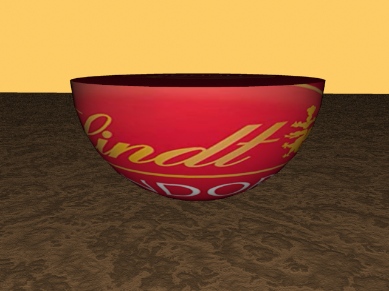
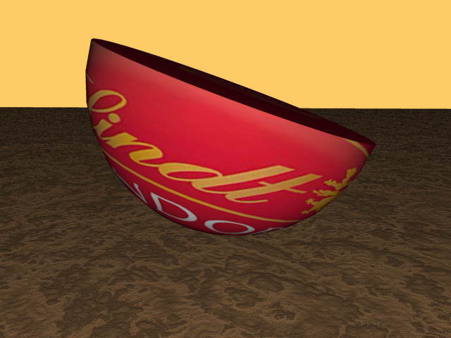

**Devoir #8**

Revision 1, Dec 1, 15h56: Correction $\cos \phi$ dans 1.2.

Revision 2. Dec 4, 11h11: Correction à la vitesse $v(\theta) = 20(1 - \theta)$ dans 6. Rayon d'ellipse (pas demi-rayon) dans 1, masse unitaire explictement mentionnée dans 2.

1. **(30 mins) Aires et volumes**
  
   1. Obtenez l'aire d'une ellipse de rayon $a$ et $b$.
   
   2. Vous avez un ellipsoïde en trois dimensions décrit par 
     $$
     \left(\frac{x}{a}\right)^2+\left(\frac{y}{b}\right)^2+\left(\frac{z}{c}\right)^2=1.
     $$
   
     À l'aide du changement de variable $x=a\rho \cos\theta \sin \phi$, $y=b\rho \sin\theta \sin \phi$, $z=c\rho \cos\phi$, obtenez le volume de cette ellipsoïde de demi-rayons $a,b,c$. Vous devrez calculer le Jacobien de cette transformation qui n'est pas exactement une transformation sphérique: il s'agit d'une transformation sphérique avec un facteur d'échelle.
   
2. **(60 mins) Exercice 15.6.7 de Greenberg fait en dépannage**
   Considérez une sphère vide décrite par $a^2 < x^2 + y^2 + z^2 < b^2$ de densité uniforme.  
   
   1. Montrez qu'au point $(0,0,z_\circ)$, la force gravitationnelle sur une masse unitaire est donnée par:
   
   $$
   \mathbf{F}(0,0,z_\circ) = \sigma G \hat{k} \int_\mathcal{V} \frac{(z-z_\circ) dV}{[x^2+y^2+(z-z_\circ)^2]^{3/2}}
   $$
   
   2. Calculez l'intégrale et montrez que la force est donnée par:

   $$
   \mathbf{F}(0,0,z_\circ) = -\frac{M G}{z_\circ^2} \hat{k} \text{ si } |z_\circ|>b
   $$
   $$
   \mathbf{F}(0,0,z_\circ) = 0\ \hat{k} \text{ si } |z_\circ|<a
   $$
   
   3. En utilisant les resultats plus haut, obtenez le champ gravitationnel à l'intérieur d'une sphère ***pleine*** de densité homogène en fonction de la distance du centre. *Indice: une sphère est une somme de coquilles.*
   

4. **(60 mins) Centre de masse**
   La position du centre de masse en $x$ pour un objet ayant une densité $M(x,y,z)$ est définie par:
   $$
   \bar{x} = \frac{1}{M_T}\int_V x M(x,y,z) dV
   $$
   où $M_T = \int_V M(x,y,z) dV$ est la masse totale. Il s'agit de la position où l'on peut conceptuellement concentrer l'ensemble de la masse pour faire les calculs dynamiques ou statiques. Supposez maintenant une demi-sphère de rayon $r_\circ=1$ cm centrée à l'origine ayant une distribution de masse non-homogène selon $x$ décrite par la fonction $M(x) = 2 + \frac{x}{r_\circ}$. Vous comprenez que la densité va de 1 (à $x=-r_\circ$, à sa gauche) jusqu'à 3 (à $x=r_\circ$, à sa droite).

   1. Trouve la position du centre de masse  $\bar{x}$.
     
   2. À quel angle retrouverez-vous la demi-sphère si vous la laissez sur la table?
            

6. **(20 mins) Densité de charge**

   Soit une densité 3D de charge électrique donnée par $\rho(r) = \rho_o e^{-r/\sigma}$ où $r$ est le rayon en coordonnées sphériques. Quelle quantité de charges contient un sphère de rayon $3\sigma$ centrée sur l'origine?

7. **(60 mins) Vélo**

   Bob fait du vélo dans la ville de Deux-Montagnes. Le profil de la piste est donné par $h(d) = 0.5 \sin^2 d$, où $d$ représente la distance *à vol d'oiseau* entre le point de départ et le point d'arrivée, et $h$ la hauteur du dénivelé (tout est en km).

   1. Écrivez le trajet $\mathbf{R}(\tau)$ de Bob en fonction d'un paramètre $\tau$ (i.e. $\mathbf{R}(\tau) = x(\tau) \hat{x} +  y(\tau) \hat{y}$)
   2. Bob ira à $d=6.28 \approx 2\pi$ km de son point de départ à vol d'oiseau en suivant la piste en montagne.  Quel distance parcourra-t-il sur son vélo en suivant la piste (dit autrement, quelle distance indiquera son odomètre à l'arrivée)?
   3. Bob est vieux (il est *beaucoup* plus vieux que le professeur de PHY-1001, qui lui, est encore *très* jeune). Sa vitesse est donnée en km/hr par $v(\theta) = 20(1 - \theta)$ où $\theta$ est l'angle de la pente en radians.  Combien de temps prendra-t-il pour parcourir la distance jusqu'à son arrivée?

8. **(5 mins) Définitions**
  De façon générale, que représentent les intégrales suivantes (dites-le en mots).
  
   1. Avec une région fermée $\mathcal{R_1}$ qui peut être décrite par $\mathbf{R} = x(u,v,w)\hat{i}+y(u,v,w)\hat{j}+z(u,v,w)\hat{k}$, que représente:
  
  $$
  \int_\mathcal{R_1} \left| \frac{\partial(x,y,z)}{\partial(u,v,w)} \right| du\ dv\ dw
  $$
  
   2. Avec une région $\mathcal{R}_2$, que représente:
  
  $$
  \int_\mathcal{R_2} dA
  $$