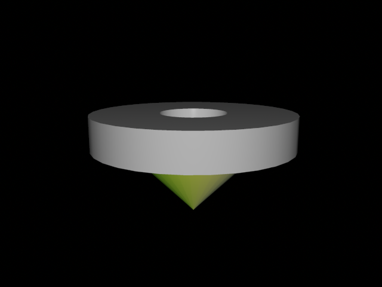
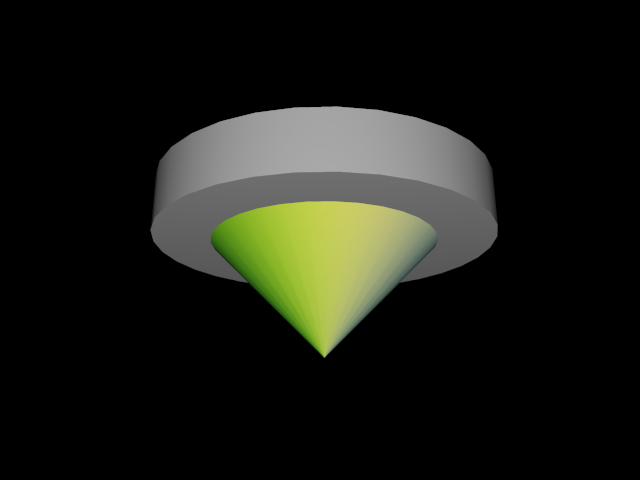

# **Devoir #6**

## **(moyen) Aires et volumes**

1. Obtenez l'aire d'une ellipse de rayon $a$ et $b$.

2. Vous avez un ellipsoïde en trois dimensions décrit par 
  $$
  \left(\frac{x}{a}\right)^2+\left(\frac{y}{b}\right)^2+\left(\frac{z}{c}\right)^2=1.
  $$

  À l'aide du changement de variable $x=a\rho \cos\theta \sin \phi$, $y=b\rho \sin\theta \sin \phi$, $z=c\rho \cos\phi$, **obtenez le volume de cette ellipsoïde** de demi-rayons $a,b,c$. Vous devrez calculer le Jacobien de cette transformation qui n'est pas exactement une transformation sphérique: il s'agit d'une transformation sphérique avec un facteur d'échelle.

## **(court) Densité de charge**

Soit une densité 3D de charge électrique donnée par $\rho(r) = \rho_o e^{-r/\sigma}$ où $r$ est le rayon en coordonnées sphériques. Quelle quantité de charges contient un sphère de rayon $3\sigma$ centrée sur l'origine?

## **(long) Vélo**

Bob fait du vélo dans la ville de Deux-Montagnes. Le profil de la piste est donné par $h(d) = 0.5 \sin^2 d$, où $d$ représente la distance *à vol d'oiseau* entre le point de départ et le point d'arrivée, et $h$ la hauteur du dénivelé (tout est en km).

1. Écrivez le trajet $\mathbf{R}(\tau)$ de Bob en fonction d'un paramètre $\tau$ (i.e. $\mathbf{R}(\tau) = x(\tau) \hat{x} +  y(\tau) \hat{y}$)
2. Bob ira à $d=6.28 \approx 2\pi$ km de son point de départ à vol d'oiseau en suivant la piste en montagne.  Quel distance parcourra-t-il sur son vélo en suivant la piste (dit autrement, quelle distance indiquera son odomètre à l'arrivée)?
3. Bob est vieux (il est *beaucoup* plus vieux que le professeur de PHY-1001, qui lui, est encore *très* jeune). Sa vitesse est donnée en km/hr par $v(\theta) = 20(1 - \theta)$ où $\theta$ est l'angle de la pente en radians.  Combien de temps prendra-t-il pour parcourir la distance jusqu'à son arrivée?

## **(long) Moments d'inertie d'un Beyblade**

Le Beyblade est une toupie pas ordinaire: on lance ses Beyblades dans une arène pour faire exploser les adversaires.  Il existe différents types de Beyblades (défense, attaque, stabilité, etc...) qui évidemment, doivent sûrement être différentes quelque part. À des fins de modélisation, nous allons utiliser le Beyblade suivant et nous concentrer sur  son moment d'inertie. Le beyblade consiste en un tube de diametre 3 cm (externe) et 1 cm (interne) en métal et d'épaisseur 1 cm. Un cône de base 2 cm et hauteur 1 cm (en plastique) sert de pointe:

1. En supposant une densité de 1 g/cm^3^ pour le plastique, 8 g/cm^3^ pour le métal, trouvez la position du  centre de masse en z (car évidemment, autrement en x et y, il est symétrique sur les deux autres axes).

2. Obtenez le moment d'inertie selon l'axe vertical, calculé à partir du centre de masse.

   

   

## Bonus: 50% de la valeur du devoir

**(Très difficile: je n'ai aucune idée si c'est facile ou non (ou même possible (bien que je m'en doute, mais je ne l'ai pas fait)))**. Faites ce problème seulement si vous avez fini les autres.  Il existe des modèles de vraies Beyblades sur Internet souvent en format `.obj` (par exemple, j'en ai mis un [ici](https://www.dropbox.com/s/l4ah4h57x5w6gx1/beyblade3.obj?dl=0)) à https://www.dropbox.com/s/l4ah4h57x5w6gx1/beyblade3.obj?dl=0. Il existe des modules pour lire ces fichiers 3D.

   1. Faites un programme Python qui calcule le moment d'inertie d'une vraie Beyblade en supposant une densité de 1 g/cm^3^ pour le plastique, 8 g/cm^3^ pour le métal.
   3. À partir du vidéo https://youtu.be/Br3P1qKn3D4, estimez la vitesse de rotation d'un Beyblade telle que lancée par un expert, en la personne de Rémi Côté. (Le vidéo est filmé avec un iPhone X en mode normal) 
      3. Émettez une hypothèse sur les différences entre les types de Beyblades (*Défense* et  *Stabilité* par exemple).