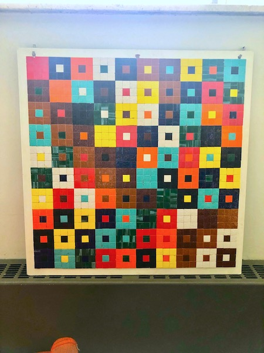

# Devoir #5

NOTE: Il y aura un ajout de questions de résolution de problèmes qui seront ajoutées.

## 1. Manipulations de matrices (court)

2. Avec la matrice de rotation suivante:

   $$
   {\bf R}(\theta) 
   =
   \left(
   \begin{matrix}
   \cos \theta & \sin \theta \\
   -\sin \theta & \cos \theta
   \end{matrix}
   \right)
   $$

   1. Quel est le déterminant de cette matrice? Comment appelle-ton ce type de matrice avec ce déterminant?
   2. Montrez que l'inverse de la matrice de rotation en 2D est aussi sa transposée. Comment appelle-t-on ce type de matrice pour lequel la transposée est l'inverse avec cette valeur de déterminant ?
     
   

## 2. Calcul de vecteurs propres (moyen)

1. Montrez votre démarche pour obtenir les vecteurs propres de la matrice:
  $$
  \left( 
  \begin{matrix}
  1 & 3 & -1  \\
  3 & 4 & -2 \\
  -1 & -2 & 2
  \end{matrix}
  \right)
  $$
  et montrez que ces vecteurs sont orthogonaux.

2. Montrez  que la matrice:
  $$
  \left( 
  \begin{matrix}
  2 & 0 & 0  \\
  -6 & 4 & 4 \\
  3 & -1 & 0
  \end{matrix}
  \right)
  $$
  1. n'a qu'une seule valeur propre dégénérée trois fois.
  2. tous ses vecteurs propres sont de la forme $\left( \mu, 3\mu - 2\nu, \nu \right)^\top$.
  
3. Calculez les valeurs et vecteurs propres de cette matrice:
  $$
  \left( 
  \begin{matrix}
  4 & 0 & 0 & 0  \\
  0 & 3 & 0 & 0 \\
  0 & 0 & 2 & 0 \\
  0 & 0 & 0 & 1
  \end{matrix}
  \right)
  $$
  et montrez que ces vecteurs sont orthogonaux.

## 3. Preuves

### a) Prouver. Toujours prouver (moyen)

Montrez que les vecteurs propres d'une matrice symétrique associés à des valeurs propres distinctes sont orthogonaux.    

### b) Multiplication (devrait etre court)

Une matrice symétrique ${\bf M}$ a les 3 vecteurs propres orthonormalisés suivants: $\left\{ \hat{\bf e}_1,\hat{\bf e}_2,\hat{\bf e}_3 \right\}$ avec les valeurs propres associées $\lambda_1, \lambda_2, \lambda_3$. Vous construisez une matrice à l'aide des vecteurs propres (colonne) ${\bf Q} = \left( \hat{\bf e}_1 | \hat{\bf e}_2  | \hat{\bf e}_3 \right)$ et vous pouvez inverser cette matrice pour obtenir ${\bf Q}^{-1}$. Obtenez le résultat du produit des matrices ${\bf Q}^{-1} {\bf M} {\bf Q}$.

## Question bonus (20% supplémentaire)

Ce tableau est visible au département, quelque part:

Remplacer chaque couleur de carré (le carré de 3 x 3 tuiles, pas la petite tuile 1 x 1 dedans) par un nombre (attention, le troisieme en bas a gauche est orange). Vous pourriez remplacer par exemple la première rangée par (1,2,3,4,5,6,7,8,9,10), mais vous pourriez aussi, à ce qui paraît, prendre (117, 46, 110, 117, 47, 109, 97, 103, 53, 0) et ensuite faire la correspondance pour toutes les autres rangées), vous obtiendrez une matrice ${\bf M}$ de $10\times10$.

1. Calculez le produit entre votre matrice ${\bf M}$ et le vecteur-colonne suivant rempli de 1  ${\bf v} = (1\ 1\ 1\ 1\ 1\ 1\ 1\ 1\ 1\ 1)^\top$, mais aussi sa transposée ${\bf M}^\top$ et calculer la trace de la matrice ${\bf M}$: qu'obtenez vous? Comment s'appelle ce type de matrice?

2. Si vous additionnez deux matrices ${\bf M}$ où vous avez utilisé des nombres différents, est-ce encore le même genre de résultat? Que croyez-vous que vous pourriez conclure?

3. (**Pas de points**) Quel est le lien entre ce tableau et le département? Qui l'a découvert et publié dans un journal en 1994? Où se trouve la murale présentement?

    