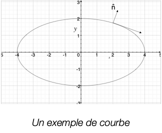
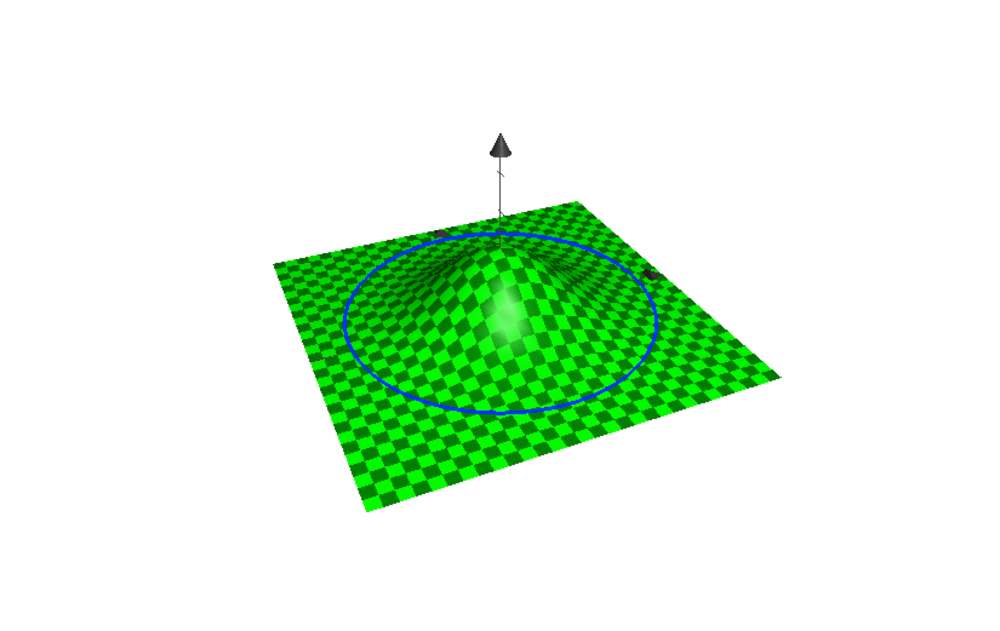

# Devoir #8

A remettre jeudi 9 décembre

1. Calculez le flux du champ vectoriel $\mathbf{v}=\hat{i}-\hat{j}+\hat{k}$ à travers une surface $A$ qui est un disque de rayon $r=1$ perpendiculaire à l'axe des $x$ positionné à l'origine. 
2. Vérifiez le théorème de la divergence en calculant $\int_\mathcal{V}\nabla \cdot \mathbf{v}\ dV$ et $\int_\mathcal{S} \hat{n} \cdot \mathbf{v}\ dA$ et en montrant qu'ils sont égaux:
   1. $\mathbf{v}=2\hat{i}-\hat{j}+4\hat{k}$ pour le prisme rectangulaire $0\le x \le 1$, $0\le y \le 3$, $0\le z \le 2$.
3. Si $\mathcal{S}$ est une surface lisse, fermée, orientée qui limite le volume $V$, montrez que:
   1. $\int_\mathcal{S} \hat{n}\ dA = \mathbf{0}$. Indice: calculez $\int_\mathcal{S} \hat{n} \cdot \mathbf{a}\ dA = \mathbf{0}$ pour tout vecteur constant $\mathbf{a}$.
   2. $\int_\mathcal{S} \hat{n} \cdot (x\hat{i})\ dA = V$. 
4. Calculez l'intégrale de ligne $\int_\mathcal{C} \mathbf{v} \cdot d\mathbf{R}$ avec $\mathbf{v} = xz^2 \hat{i}-3\hat{j}+2y\hat{k}$ pour la ligne brisée $\mathcal{C}$ connectant les deux points $(1,1,1)$ et $(1,2,3)$, et ensuite qui connecte avec $(3,2,1)$.
5. Montrez que dans un champ gravitationnel, le travail (i.e. l'énergie nécessaire définie comme $W=\int_\mathcal{C} \mathbf{F} \cdot d\mathbf{R} $) pour amener une particule du point $A$ au point $B$ ne dépend pas de la trajectoire prise. *Indice: allez lire le Theoreme 16.10.1, et montrez que le champ de force gravitationelle total d'une somme de masses est toujours irrotationnel.*
6. Tangente et normale: Soit une ellipse $\frac{x^2}{a^2}+\frac{y^2}{b^2} = 1$:

  

  a) Obtenez la pente $\frac{\mathop{dy}}{\mathop{dx}}$  à $x=a/2$ pour la partie où y est positif.

  b) Obtenez un vecteur normal (i.e. perpendiculaire) à la courbe à  $x=a/2$ pour la partie où y est positif. *Indice*: vous pouvez supposer que cette ellipse est une courbe de niveau d’un champ scalaire en 2D.

8. Soit une gaussienne $f(x) = e^{-x^2-y^2}$.  Si vous considérez un disque de rayon 2 autour de cette gaussienne, quelle est l'aire de cette surface bombée ?
   

8. Question qui ne vaut aucun point: Laurent Duvernay Tardif dans le devoir #7 a atterri au centre du terrain de football du PEPS.  Vrai ou Faux?

