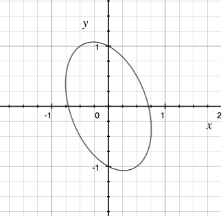

# Devoir 1
# Devoir 2

# Devoir 3

# Devoir 4

# Devoir 5

À remettre vendredi le 17 novembre, en équipe de deux.

## Dérivés partielles

1. Évaluer les dérivées partielles $f_x, f_y, f_{xy}, f_{xx}$,suivantes:
   1. $f(x,y) =  xy^2$
   2. $f(x,y) =  \sin (xy)$
   3. $f(x,y) = (x+y)^{3/2}$
   4. $f(x,y) = \frac{\ln x}{x+y^2}$
   5. $f(x,y) = e^{-\frac{mgy}{kT}}$ (*il n'y a pas de faute de frappe*)
2. Vérifiez que (i.e. en calculant les dérivées et en remplaçant dans l'équation):
   1. $f(x,y) = \ln (x^2+y^2)$ est une solution de $f_{xx}+f_{yy}=0$ sauf à (0,0)
   2. $f(x,t) = e^{i (x - c t) } + e^{-i (x - c t) }$ est une solution de $c^2 f_{xx} - f_{tt} = 0$
   3. $f(r,\theta) = r^n \cos n\theta $ est une solution de $r^2 f_{rr} + r f_r + f_{\theta \theta} = 0$.

## Dérivées totales

1. Avec $f(x,y)=(y^2+x^2)e^{-kx^2}$, où $x(t)=2t$ et $y(t)=t^2+2t + 1$, et en utilisant la notation $F(t) \equiv f(x(t),y(t))$:

   1. Calculez $dF/dt$ en remplaçant directement $x(t)$ et $y(t)$ dans $f(x,y)$.

   2. Calculez $dF/dt$ en utilisant la règle des dérivées en chaîne (Greenberg Théorème 13.4.1)

	
   3. Obtenez une expression pour $\frac{d x}{dt}$ si $x^2+y^2+xy = 1$ si $x\equiv x(t)$ et $y \equiv y(t)$. 

## Série de Taylor

Vous avez l'équation d'une gaussienne $f(x,y) = e^{-\sigma (x^2+y^2)}$. Obtenez une expansion en Série de Taylor pour les termes jusqu'au 2e degrés valide autour d'un point à la mi-hauteur.

## Bonus 10%: Penchée

1. L'équation $2x^2+y^2 +xy = 1$ représente une ellipse penchée.  Quel angle fait son petit axe avec l'axe des $\hat{x}$?

   

