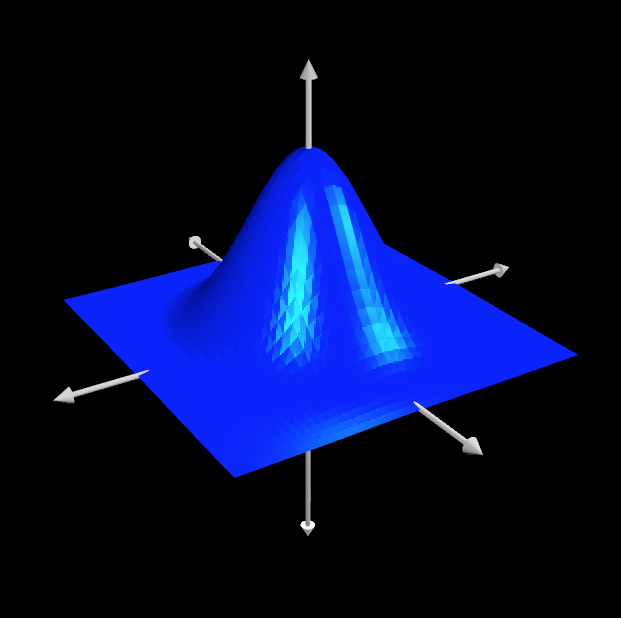
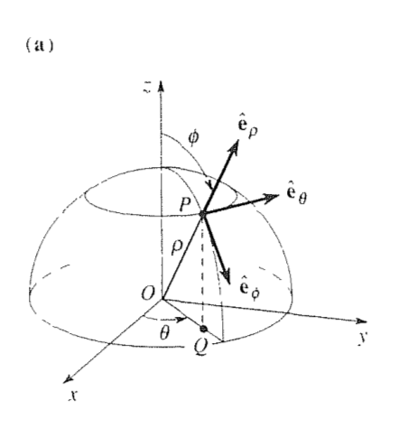
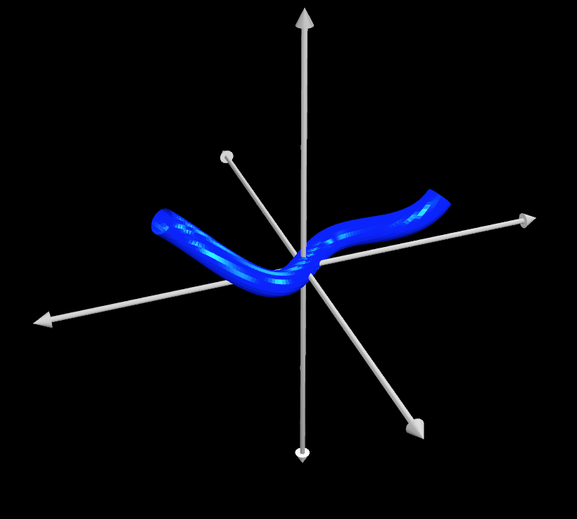

# Devoir #7 

A remettre vendredi 8 décembre 8h30.

# **Aires et volumes**

1. Obtenez l'aire d'une ellipse de rayon $a$ et $b$.

2. Vous avez un ellipsoïde en trois dimensions décrit par 
   $$
   \left(\frac{x}{a}\right)^2+\left(\frac{y}{b}\right)^2+\left(\frac{z}{c}\right)^2=1.
   $$

   À l'aide du changement de variable $x=a\rho \cos\theta \sin \phi$, $y=b\rho \sin\theta \sin \phi$, $z=c\rho \cos\phi$, obtenez le volume de cette ellipsoïde de demi-rayons $a,b,c$. Vous devrez calculer le Jacobien de cette transformation qui n'est pas exactement une transformation sphérique: il s'agit d'une transformation sphérique avec un facteur d'échelle.

# **Densité de charge**

Soit une densité 3D de charge électrique donnée par $\rho(r) = \rho_o e^{-r/\sigma}$ où $r$ est le rayon en coordonnées sphériques. Quelle quantité de charges contient un sphère de rayon $3\sigma$ centrée sur l'origine?

# **Aire**

Soit une fonction $f(x,y) = e^{-(x^2+y^2)}$. 

1. Quelle est l'aire de la surface pour |x| et |y| < 2 ? 
2. Quelle est l'aire de la surface pour $x^2+y^2 < 4 $? 

# **Dequoy qui a rapport au football**

Pour aller à la coupe Grey sans rater les cours du Vendredi et du Lundi, il est nécessaire de voler directement à la destination. Marc-Antoine Dequoy étant un homme sérieux, il décide d'y aller, et directement du COPL aux coordoonnées lattitude/longitude 46.78198° N, 71.27762° W, se catapulte vers Calgary pour atterrir au 51.07011° N, 114.12126° W. Il suit une trajectoire parabolique en hauteur et atteint  $h=1500$ km à mi-parcours.

D'abord, allez vérifier la correspondance entre les coordonnées sphériques et les coordonnées en lattitude et longitude. Supposez que le rayon de la terre est de $r_o = 6500$ km. La question finale (en c) est: Quelle est la longueur de la trajectoire de Marc-Antoine Dequoy? Vous **devez** faire le calcul en coordonnées sphériques: vous ne pouvez supposer que la terre est plate entre le Missouri et Québec. Les étapes sont les suivantes:

a) Obtenez le trajet $\mathbf{R}(\tau)$ en coordonnées sphériques **avec l'origine au centre de la terre** en fonction du paramètre $\tau$ de votre choix. *Indice: vous connaissez $\theta$ et $\phi$ initiaux et finaux.*

b) Obtenez l'élément différentiel $ds$ et completez l'intégrale

c) Quelle est la longueur de la trajectoire de Marc-Antoine Dequoy?

# Particule

Une particule part du pole supérieur d'une sphère de rayon $\rho$ et spirale tout autour en descendant.   Ses coordonnées sphériques varient comme  $\theta = 16 \pi t $ et $\phi = \pi t$. Utilisez la figure 6 de 14.6 dans Greenberg pour bien visualiser les coordonnées.

1. Représentez la trajectoire graphiquement
2. Trouvez la **grandeur** de la vitesse et de l'accélération lorsque la particule croise l'équateur.
3. Trouvez la distance totale voyagée par la particule dans l'intervalle $t=[0,1]$.

# Bonus, difficile 10%

Vous avez une fonction *arbitraire* $\mathbf{R}(\tau)$ qui représente une courbe avec $\tau$ allant de 0 à 1.  Vous voulez la tracer à l'ordinateur, mais comme un "tube" de rayon $r_o$ au lieu d'une ligne.  Obtenez la forme paramétrique de la surface du tube de rayon $r_o$ suivant la ligne $\mathbf{R}(\tau)$, pour les paramètres de votre choix.

