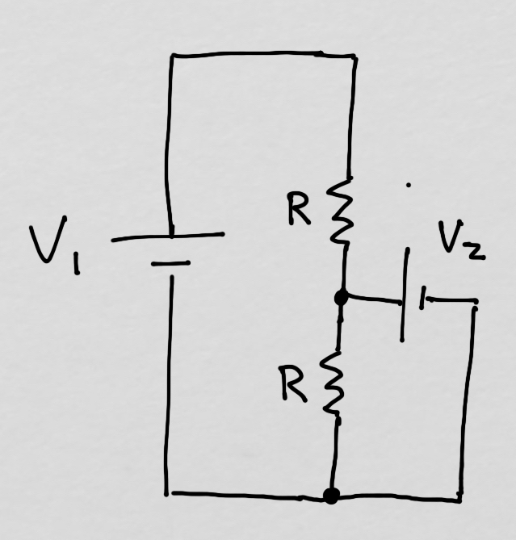
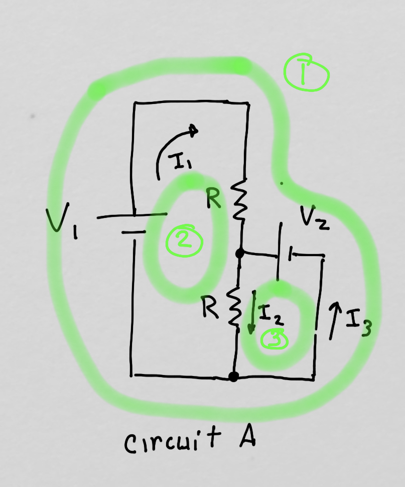

# Devoir #1

# Devoir #2

# Devoir #3

## Des calculs simples

*Durée: 30 à 60 minutes*

### a) Obtenez les déterminants suivants:

a. 
$$
\left|
\begin{matrix}
a & b \\
c & d
\end{matrix}
\right|
$$

b. 
$$
\left|
\begin{matrix}
a & b & c \\
c & d & e \\
0 & 0 & 0 \\
\end{matrix}
\right|
$$

b. 
$$
\left|
\begin{matrix}
a & b & c \\
c & d & e \\
2a & 2b & 2c \\
\end{matrix}
\right|
$$

c. 
$$
\left|
\begin{matrix}
2a & b & c \\
2a & 0 & 2 \\
2a & b & f \\
\end{matrix}
\right|
$$

d. 
$$
\left|
\begin{matrix}
2 & 5 & -1 \\
3 & 6 & -2 \\
4 & 5 & -3 \\
\end{matrix}
\right|
$$

e. 
$$
\left|
\begin{matrix}
2 & 5 & -1 \\
0 & 6 & -2 \\
0 & 0 & -3 \\
\end{matrix}
\right|
$$

f. 
$$
\left|
\begin{matrix}
1 & 0 & 0 \\
0 & 6 & 2 \\
0 & 3 & 5 \\
\end{matrix}
\right|
$$
f. Le déterminant de ce produit:
$$
\left|
\left(
\begin{matrix}
a & b & c \\
c & d & e \\
2a & 2b & 2c \\
\end{matrix}
\right)
\left(
\begin{matrix}
a & b & -1 \\
2 & 2 & -2 \\
3 & 5 & 4 \\
\end{matrix}
\right)
\left(
\begin{matrix}
1 & 3 & 3 \\
2 & 2 & -2 \\
3 & 3 & 3 \\
\end{matrix}
\right)
\right|
$$

###  b) En utilisant les notions d'indépendance linéaire, de rang, de déterminant:

a. trouvez le nombre de vecteurs linéairement dépendants dans l'ensemble $\left\{ (1,2,3), (3,1,5), (-1,0,1) \right\}$

b. trouvez la dimension de l'espace vectoriel engendré par $\left\{ (1,2,3), (3,4,2), (-1,0,1), (2,3,1), (0,0,1)\right\}$.  *(Ne trouvez pas la base, donnez moi seulement la dimension de  l'espace).*

c. trouvez le nombre de solutions du système d'équations suivants *(pas les solutions, juste le nombre  de solutions):*
$$
\begin{eqnarray}
x + y + z & = & 0 \\
3x + 2y + z & = & 0 \\
6x + y + 8z & = & 0 \\
\end{eqnarray}
$$

d. Si le déterminant de la matrice suivante est non-nul:
$$
\left(
\begin{matrix}
a & b & c \\
d & e & f \\
g & h & i \\
\end{matrix}
\right),
$$
est-ce que les vecteurs $\left\{(a,d,g),(b,e,h),(c,f,i)\right\}$ forment une base de ${\mathbb{R}^3}$ ?

## Preuve : matrice orthogonale

*Durée: 10 minutes*

1. Vous savez (car nous l'avons fait en classe) que si une matrice est telle que ${\bf M}^{T}{\bf M} = {\bf M}{\bf M}^{T} = {\bf I}$ , la norme du vecteur ${\bf v}^\prime = {\bf M} {\bf v}$ est la même que celle de ${\bf v}$. Utilisez les propriétés des matrices que vous connaissez pour le **prouver encore une fois**.
2. Trouvez la valeur du déterminant de ces matrices (qu'on appelle matrices orthogonales).  **Utilisez les propriétés des matrices et des déterminants que vous connaissez.**
3. Écrivez une matrice autre que $\left( \begin{matrix}1 & 0 \\ 0 & 1 \end{matrix} \right)$ et $\left( \begin{matrix}0 & 1 \\ 1 & 0 \end{matrix} \right)$ qui correspond à ce type de matrice.
4. Évaluez $\left( \begin{matrix} \cos \theta & \sin \theta \\ -\sin \theta & \cos \theta \end{matrix} \right)^n$

## Preuve : Matrice

1. Montrez que n'importe quelle matrice carrée peut-etre écrite comme la somme d'une matrice symétrique et d'une matrice anti-symétrique.

## Preuve : Trianguler

Durée: 30 minutes

a. Prouvez que le déterminant d'une matrice triangulaire est le produit des éléments de la diagonale. Pour prouver, vous devez partir des définitions du déterminant et arrivez à la conclusion demandée.

b. **Montrez** que si j'ai une matrice diagonale en bloc, le déterminant de cette matrice est le produit des déterminants des blocs, c'est-a-dire:
$$
\bf{A} = 
\left(
\begin{matrix}
\bf{A}_1 & 0 & 0 & 0 \\
0        & \bf{A}_{2} & 0 & 0 \\
0       & 0 & ... &  0 \\
0       & 0 & 0 & \bf{A}_{n} 
\end{matrix}
\right)
$$
où tous les $ \bf{A}_i $ sont des matrices carrées, possiblement de différentes dimensions. On veut montrer que:
$$
\det{\bf{A}} = \det{\bf{A}_1}\det{\bf{A}_2}...\det{\bf{A}_n}
$$
*Indice: Pour montrer quelque chose (et non prouver) vous prenez chaque côté de l'équation et vous montrez qu'ils sont égaux.*

## Circuit électrique

Vous avez le circuit suivant:

En dénotant tous les courants dans le circuit comme $I_1, I_2$ et $I_3$, utilisez les lois de Kirchoff (la somme des gains et pertes de potentiel sur une boucle fermée est nulle) et la loi des noeuds (la somme des courants entrant et sortant d'un noeud est nulle) pour obtenir le courant partout dans les deux circuits. Pour simplifer vos calculs, utilisez simplement  $R=1 \Omega$, mais conservez des tensions $V_1$ et $V_2$ arbitraires.

Sur la figure ci-dessous en vert, j'indique les trois boucles possibles dans le circuit.  Les deux noeuds sont simplement le point où les fils se connectent avec les courants $I_1, I_2$ et $I_3$.

1. Obtenez les 5 équations pour les courants **sous forme matricielle.** Vous devez le faire sous forme matricielle.
2. Solutionnez pour tous les courants,
3. Obtenez la tension aux bornes des résistances.

## Question pour les fans du Rouge et Or et des athlètes olympiques canadiens (10%)

1. Serez-vous capables de trouver le rang de cette matrice? Vous pouvez prendre Python pour le calculer avec numpy, c'est très facile.

   
   $$
   \left(
   \begin{matrix}
   0 & 1 & 1 & 0 & 0 & 0 & 1 & 1 \\
   0 & 1 & 1 & 0 & 1 & 0 & 0 & 0 \\
   0 & 1 & 1 & 0 & 0 & 0 & 0 & 1 \\
   0 & 1 & 1 & 1 & 0 & 0 & 1 & 0 \\
   0 & 1 & 1 & 0 & 1 & 1 & 0 & 0 \\
   0 & 1 & 1 & 0 & 1 & 0 & 0 & 1 \\
   0 & 1 & 1 & 0 & 0 & 1 & 0 & 1 \\
   0 & 0 & 1 & 0 & 0 & 0 & 0 & 1
   \end{matrix}
   \right)
   $$

2. Je suis l'ultime fan. Je me cache partout même dans les matrices. Qui suis-je et où étais-je? Indice: ce n'est pas Greenberg.

