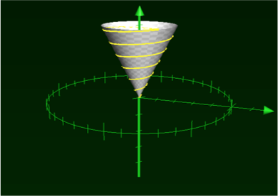
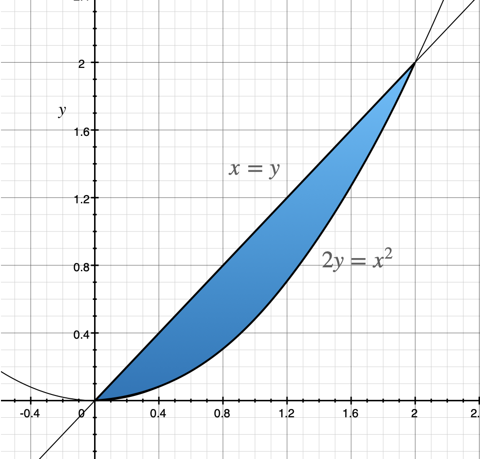
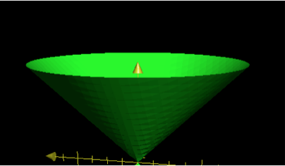

Vous mesurez un champ electrique constant sur une sphere, combien de charge y'a-t-il a l'intérieur?

Compléetez la preuve de l'équation de continuité (25)

relation  $f(x,y,z)=x^2-y^2-xy+z$ calculer la normale

Courant de lumière dans un sapin conique: quelle longueur

Bonus:

Nabla en cylindrique a partir de Nabla en cartesien.

# Questions à réponses courtes

## Paramétrisation d'une surface

a. (3 pts) Écrivez une expression paramétrique $\mathbf{R}(u,v)$ pour une surface de cylindre de rayon 1 et de hauteur 2 dans l'axe $\mathbf{\hat{z}}$ (sans les bouts, juste le tour cylindre) qui sera balayée par $u$ et $v$ entre 0 et 1.

$\mathbf{R}(u,v) = $

b. Paramétriser un ligne

## Dérivées partielles et dérivées totales

a. (2 pts) Obtenez les dérivées partielles $\frac{\partial f}{\partial x} $,$\frac{\partial^2 f}{\partial x \partial y} $  de $f(x,y) = xy + \sin(yx^2)$.

$ \frac{\partial f}{\partial x} = $

$ \frac{\partial^2 f}{\partial x \partial y} = $

b. (2 pt) Si j'ai $x(t) = t^2$ et $y(t) = 1-t$, et $f(x,y) = xy$, je peux définir $f(x(t),y(t)) \equiv F(t)$. Écrivez $F(t)$ et obtenez  $\frac{d F(t)}{d t}$.

c. (2 pts) Obtenez un expression pour $\frac{d x}{dt}$ si $x^2+y^2+xy = 1$ si $x\equiv x(t)$ et $y \equiv y(t)$. *Indice: isolez $\frac{d x}{dt}$ après avoir dérivé, votre réponse dépendra de x, y et y'*.

## Des gradients, des rotationnels et des divergences

Calculez les différentes expressions suivantes, **toujours en coordonnées cartésiennes**:

   1. (3 pts) $\nabla \cdot \mathbf{v}$ avec $\mathbf{v}(x,y,z) = x^2y \hat{i} + x \hat{j} + xz^2 \hat{k}$. 

       

      

      

   2. (3 pts) $\nabla \cdot \mathbf{v}$ avec $\mathbf{v}(x,y,z,t) = 2x \hat{i} + ty^2 \hat{j} + t^2 \hat{k}$, où $t$ est le temps.

       

      

      

   3. (3 pts) $\nabla \phi $ avec $\phi(x,y,z) = \frac{1}{\sqrt{x^2+y^2}}$.

        

      

      

        

      

   4. (3 pts) $\nabla \times \mathbf{v}$ avec $\mathbf{v}(x,y,z) = y \hat{i} + x \hat{j} + z \hat{k}$  (Notez: le "0" est un zéro).

        

      

      

      

       

      

   5. (3 pts) Obtenez un vecteur normal à la surface $f(x,y,z)=x^2-y^2-xy+z$ (*Note: vous n'êtes pas obligés de le normaliser*).

      

      

      

      

   6. (2 pt) Si le rotationnel d'un champ vectoriel est nul, que pouvez-vous dire du champ?

      

      

## Intégrales de ligne et de surface

a. (2 pt) Pour une courbe $\mathbf{R}(\tau)$, écrivez l'expression de l'élément de ligne $ ds = \left| d\mathbf{R}(\tau)\right| $

# Questions à développement

## Spinner

## Ho ho ho

(10 pts) Je vais faire mon sapin de Noël en fin de semaine.  La partie la plus difficile est de savoir combien de lumière acheter pour pouvoir en avoir assez. Mon sapin est un cône de 2 mètres de hauteur avec une base de rayon 1 mètre. On met les lumières en spirale à partir de la pointe du sapin, et on descend jusqu'en bas en complétant précisément $6$ tours de lumière.  **Je cherche la longueur de fil électrique dont j'ai besoin pour les lumières de mon sapin.** 

En termes mathématiques, je cherche donc:
$$
L = \int_\mathcal{C} ds
$$
avec $ds$ l'élement différentiel sur ma courbe $\mathcal{C}$. 

Pour vous aider, j'ai fait la première étape en paramétrisant la courbe  $\mathcal{C}$ avec $\mathbf{R}(\tau)$ pour décrire la position des lumières dans le sapin en **coordonnées cylindriques**. Pour simplifier les mathématiques, on suppose que le sapin est à l'envers dans l'espace pour avoir un rayon $r$ qui va de 0 à $1$ m, une hauteur $z$ qui va de 0 à 2m et finalement un angle $\theta$ qui va de 0 à $12\pi$. Ainsi, je peux paramétriser la courbe avec $r = \tau$, $z = 2\tau$ et $\theta = 12 \pi \tau$ avec $\tau$ allant de 0 à 1 ce qui donne la position des lumières sur $\mathcal{C}$:
$$
\mathbf{R}(\tau) = \tau \mathbf{\hat{e}_r} + 2\tau \mathbf{\hat{e}_z}\ \text{, avec } \theta(\tau)=12 \pi  \tau\ \text{ et } \tau=[0,1]
$$

a) (10 pts) Vous cherchez la longueur totale de la courbe. Écrivez l'intégrale $L = \int_\mathcal{C} ds$ à résoudre avec l'expression pour l'élément de longueur $ds$ en fonction de $\tau$ et $d\tau$. **Vous n'avez pas à la solutionner mais elle doit être fonction de $ \tau $ seulement.**

b) **5 pts Bonus**: sachant que $\int \sqrt{x^2 + a^2} dx = \frac{x \sqrt{x^2+a^2}}{2} + \frac{a^2}{2}\ln (x + \sqrt{x^2+a^2})$, de quelle longueur ai-je besoin? 

## Intégrale limitée

(15 pts) Calculez l'intégrale suivante:
$$
\int_\mathcal{S} x \ dA
$$
sur la surface $\mathcal{S}$ dans le plan $xy$ délimitée par $x=y$,  $2y=x^2$.

## Martini

(15 pts) Un cône quadrique est décrit par la relation  $x^2 + y^2 = z^2$. On veut obtenir la surface de ce cône entre $z=0$ et $z=h$. 

a) (5 pts) Cette forme n'est malheureusement pas très utile, car ce n'est pas une forme paramétrique $\mathbf{R}(u,v)$. Montrez que la paramétrisation $x=u \cos v$, $y=u \sin v$ et $z = u$ est appropriée.

b) (10 pts) Obtenez la surface totale de ce cône entre $z=0$ et $z=h$ en calculant l'intégrale $A = \int_\mathcal{S} \mathop{dA}$.

## *I'm Stoked*

Avec le champ vectoriel $\mathbf{J}(x,y,z)= y\hat{i}+x\hat{j}$.  Calculez l'intégrale de ligne sur un carré de côté 2 délimité par à $x=\pm 1$ et $y=\pm 1$.

Montrez que le résultat est le meme que le flux de $\nabla \times \mathbf{J}(x,y)$ \ travers ce carré.

## Série de Taylor

(10 pts) Faites le développement en série de Taylor de $f(x) = \ln(x)$ autour de $a=2$.  Obtenez la série complète en exprimant le terme de façon générale. Note: $\frac{d \ln x}{dx} = \frac{1}{x}$.

## Le retour de la preuve

(10 pts) Soit un champ $\mathbf{v}(x,y,z)$ continu sur l'ensemble de l'espace. Les 4 énoncés suivants sont équivalents (i.e. si un est vrai, ils le sont tous):

1. Le champ $\mathbf{v}(x,y,z)$ peut être exprimé comme le gradient d'un potentiel saclaire $\mathbf{v} = \nabla \phi(x,y,z)$. 
2. Le rotationnel $\nabla \times \mathbf{v} = \mathbf{0} $ partout.
3. $\oint_\mathcal{C} \mathbf{v} \cdot d\mathbf{R} = 0$ pour tout chemin $\mathcal{C}$.
4. $\int_\mathcal{C'} \mathbf{v} \cdot d\mathbf{R}$ est indépendant du chemin $\mathcal{C'}$.

Montrez que si un des énoncés (de votre choix) est vrai, un autre (aussi de votre choix) est vrai.

## Bonus (5 pts): Nabla en cylindriques

En partant de montrez comment on transforme l'opérateur nabla des coordonnées cartésiennes aux coordonnées sphériques.

#