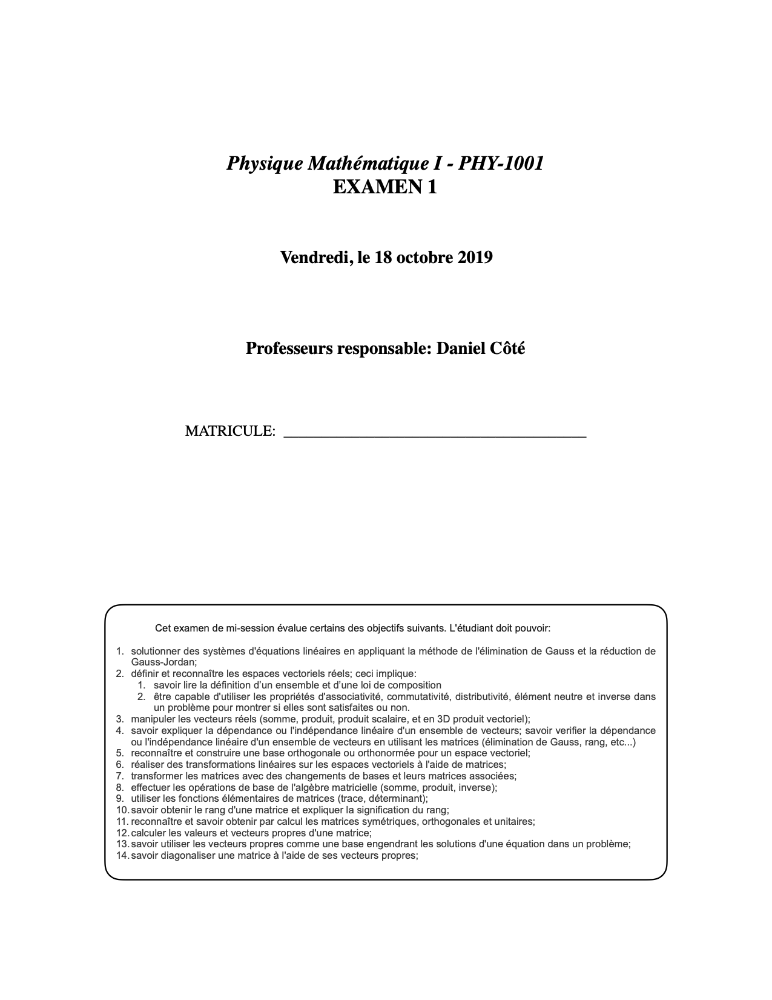
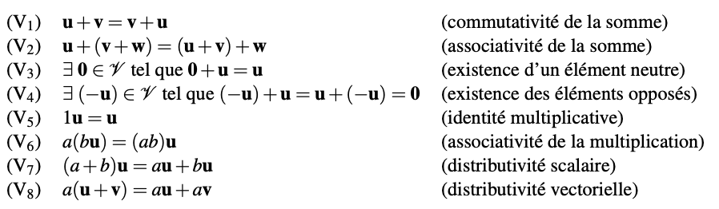

 

## Questions à réponses courtes (25 points possibles)

### a) Questions courtes

1. (5 pts) **Vrai ou Faux:** Un espace vectoriel  $\mathbb{R}^n$ sur $\mathbb{R}$ est un ensemble d'éléments n-tuplets $\left( x_1, x_2, ... x_n\right)$, qu'on appelle aussi *vecteur*, pour lequel on a défini deux opérations: la somme (ou addition) des vecteurs et le produit d'un vecteur par un scalaire (ici, un nombre réel). Ces deux opérations doivent aussi répondre aux 8 propriétés suivantes:

    

2. (1 pts) **Vrai ou Faux:** Je peux toujours additionner ${\bf A}$ et ${\bf A}^\top$ où ${\bf A}$ est une matrice $m \times n$.

3. (1 pts) **Vrai ou Faux:** Une matrice carrée de $n \times n$ peut toujours s'exprimer comme la somme d'une matrice symétrique et une anti-symétrique.

4. (1 pts) **Vrai ou Faux:** Le produit vectoriel $\times$ est toujours défini pour un espace vectoriel.

5. (1 pts) **Vrai ou Faux:** Des vecteurs qui sont linéairement indépendants sont orthogonaux.

6. (1 pts) **Vrai ou Faux:** Des vecteurs qui sont orthogonaux sont linéairement indépendants.

7. (1 pts) **Vrai ou Faux:** Cet ensemble de vecteurs est linéairement indépendant: $\left\{ (1,0,0),(1,0,1),(0,1,0)\right\}$?

   

8. (1 pts) **Vrai ou Faux:** Cet ensemble de vecteurs forme une base pour $\mathbb{R}^4$: $\left\{ (1,0,0,0),(1,0,1,0),(0,1,0,0),(1,1,1,0)\right\}$?

   

9. (1 pts) **Vrai ou Faux:** Une base est toujours composée de vecteurs normalisés. 

10. (1 pts) **Vrai ou Faux:** Le nombre de vecteurs d'une base est la dimension de l'espace vectoriel. 

11. (1 pts) **Vrai ou Faux:** Une matrice rectangulaire de $m \times n$ peut avoir un rang égal à $m$ si $m > n$.

12. (1 pts) Obtenez un vecteur perpendiculaire au vecteur $(1,2,3)$.
  

   ​    

13. (2 pts) Montrez, en utilisant les propriétés des matrices, que si ${\bf A}^{\top} {\bf A} =  {\bf A} {\bf A}^\top = {\mathbb{I}}$, son déterminant est  $\det {\bf A} = 1$.

   ​    

   ​    

   ​    

   ​    
   ​    

   ​    
   

   ​    

   ​    

   ​    

14. (2 pts) Si ${\bf M}$ est une matrice orthogonale telle que ${\bf M}^{-1} = {\bf M}^\top$, montrez qu'elle conserve la norme des vecteurs qu'elle transforme.

  ​     

  

  

  ​     

  ​     

  ​     
  
  ​     
  
  ​     

### b)  (5 pts) Calculer les déterminants suivants

a. 
$$
\left|\begin{matrix}a & b \\c & d\end{matrix}\right| = \hspace{10cm}
$$

b. 
$$
\left|
\begin{matrix}
a & b & c \\
c & d & e \\
0 & 0 & 0 \\
\end{matrix}
\right|= \hspace{10cm}
$$

c. 
$$
\left|
\begin{matrix}
a & b & c \\
c & d & e \\
a+3c & b+3d & c+3e \\
\end{matrix}
\right|= \hspace{10cm}
$$

d. 
$$
\left|
\begin{matrix}
2 & 5 & -1 \\
0 & 6 & -2 \\
0 & 0 & -3 \\
\end{matrix}
\right|= \hspace{10cm}
$$

e.
$$
\left|
\left(
\begin{matrix}
1 & 3 \\
3 & 4 \\
\end{matrix}
\right)
\left(
\begin{matrix}
3 & 0 \\
1 & 2 \\
\end{matrix}
\right)
\left(
\begin{matrix}
4 & 3 \\
4 & 4 \\
\end{matrix}
\right)
\right|= \hspace{10cm}
$$

## Questions à développement (100 points possibles)

### a) (30 pts) "Et pourtant, elle tourne!"

**Contexte:** Vous avez fait les cours de mécanique et vous avez vu les objets en rotation.  Par exemple, en 3D nous savons que les objets peuvent tourner autour de trois axes (qui sont dans notre problème les coordonnées numérotées 1, 2 et 3).  Ainsi, pour caractériser une rotation, nous parlons du moment cinétique ${\bf L}$, du moment d'inertie ${\bf I}$ et du vecteur de vitesse de rotation angulaire ${\bf \omega}$ que nous pouvons exprimer sous forme matricielle de la façon suivante:
$$
\left( \begin{matrix}L_1 \\L_2 \\L_3 \end{matrix}\right)=\left( \begin{matrix}I_{11} & I_{12} & I_{13} \\I_{21} & I_{22} & I_{23} \\I_{31} & I_{32} & I_{33}\end{matrix}\right)\left( \begin{matrix}\omega_1 \\\omega_2 \\\omega_3 \end{matrix}\right).
$$
La matrice du moment d'inertie ${\bf I}$ (parfois appelé tenseur d'inertie) est une quantité qui représente la difficulté d'un objet à accélérer autour d'un axe donné (i.e. l'équivalent de la masse, mais en mouvement de rotation). 

**Problème:** Vous vous joignez à un groupe de chercheurs grâce à vos excellentes aptitudes mathématiques, et ceux-ci ont déjà la matrice du moment d'inertie d'un objet d'intérêt, qui est donnée par :
$$
{\bf I}
=
\left(
\begin{matrix}
2 & -1 & 0 \\
-1 & 2 & 0 \\
0 & 0 & 4 
\end{matrix}
\right).
$$

Après une brève introduction à la mécanique rotationnelle, on vous explique que **les axes principaux d'un solide en rotation sont les vecteurs propres de la matrice du moment d'inertie**, et que **les valeurs propres (des scalaires) correspondent aux moments d'inertie selon ces axes**.

**Question (20 pts):** 1) Obtenez les trois axes principaux de ce solide avec les trois moments d'inertie.

**Question (10 pts):** 2) En faisant un changement de coordonnées, vous pouvez obtenir une version de la matrice du moment d'inertie ${\bf I}$ qui est diagonale. **Écrivez cette matrice** ${\bf I}_D$ qui est diagonale (5 pts) et expliquez quel changement de coordonées vous avez fait (5 pts).

### b) (10 pts) Multiplication

Une matrice ${\bf M}$ a les 3 vecteurs propres orthonormalisés suivants: $\left\{ \hat{\bf e}_1,\hat{\bf e}_2,\hat{\bf e}_3 \right\}$ avec les valeurs propres associées $\lambda_1, \lambda_2, \lambda_3$. Vous construisez une matrice à l'aide des vecteurs propres (colonne) ${\bf Q} = \left( \hat{\bf e}_1 | \hat{\bf e}_2  | \hat{\bf e}_3 \right)$ et vous pouvez inverser cette matrice pour obtenir ${\bf Q}^{-1}$. Obtenez le résultat du produit des matrices ${\bf Q}^{-1} {\bf M} {\bf Q}$.

### c) (15 pts) On retourne à la base, comme annoncé en classe

Montrez à partir des définitions que la matrice modale de changement de base ${\bf Q}_{B\rightarrow B^\prime}$, c'est-à-dire la matrice qui permet de changer les coordonnées d'un vecteur de la base orthonormée $B = \left\{ \hat{\bf e}_1, \hat{\bf e}_2 \right\}$ à la base orthonormée $B^\prime = \left\{ \hat{\bf e}^\prime_1, \hat{\bf e}^\prime_2 \right\}$ par l'opération ${\bf v}^\prime = {\bf Q} {\bf v}$ a ses éléments $q_{ij}$ donnés par :

$$
q_{ij} = \hat{\bf e}_i^\prime \cdot \hat{\bf e}_j
$$

Vous devriez utiliser les expressions de ${\bf v}$ et ${\bf v}^\prime$ dans leur base respective pour faire le problème.

### d) (15 pts) Prouver. Toujours prouver.

Montrez que les vecteurs propres d'une matrice symétrique associés à des valeurs propres distinctes sont orthogonaux.

### e) (30 pts) "Regardez-moi dans les yeux..."

**Contexte:** Vous avez un intérêt marqué pour les pendules. Vous en accrochez deux comme suit:

Les deux masses sont identiques, et les deux fils sont aussi identiques, donc $m_1 = m_2=m$, et $L_1=L_2=l$.  Vous appliquez les principes de Newton pour obtenir les équations des forces sur les différentes masses (la force gravitationnelle sur chacune, et les composantes qui agissent sur les deux masses). Vous voyez que les deux masses tirent l'une sur l'autre, donc les deux pendules sont couplés (ou dépendant l'un de l'autre). Vous supposez une solution de type oscillatoire pour: 

$$
\begin{matrix}
\theta_1(t) = q_1 \sin({\omega t + \phi_1}), \\
\theta_2(t) = q_2 \sin({\omega t+\phi_2}),
\end{matrix}
$$

 et après un peu de manipulations mathématiques (et en définisssant $g = l = 1$ pour éviter les complications mathématiques), vous obtenez les équations de mouvement  que vous mettez tout de suite sous forme matricielle:
$$
\left(
\begin{matrix}
2 & -1 \\
-1 & 2 
\end{matrix}
\right)
\left(
\begin{matrix}
q_1 \\
q_2 
\end{matrix}
\right)
=
\omega^2
\left(
\begin{matrix}
q_1 \\
q_2 
\end{matrix}
\right)
$$
où $q_1$ est l'amplitude du mouvement du pendule du haut et $q_2$ l'amplitude du mouvement du pendule du bas. 

**Problème:** Vous voulez décrire les mouvements possibles lorsque les pendules oscillent librement. Il nous faut donc trouver les paires d'amplitudes $(q_1, q_2)$. 

**Question:** Trouvez la solution générale qui décrit le mouvement des deux masses. Votre solution aura 4 paramètres: deux amplitudes ($\alpha$ et $\beta$) et deux phases ($\phi_1$ et $\phi_2$), mais sachant ce que nous avons fait en classe, vous devriez obtenir deux fréquences d'oscillations différentes.

Solution