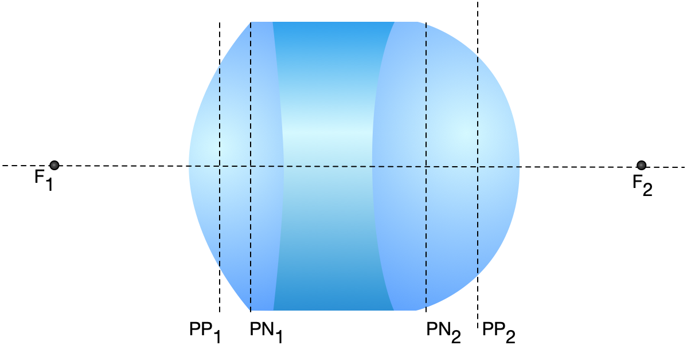
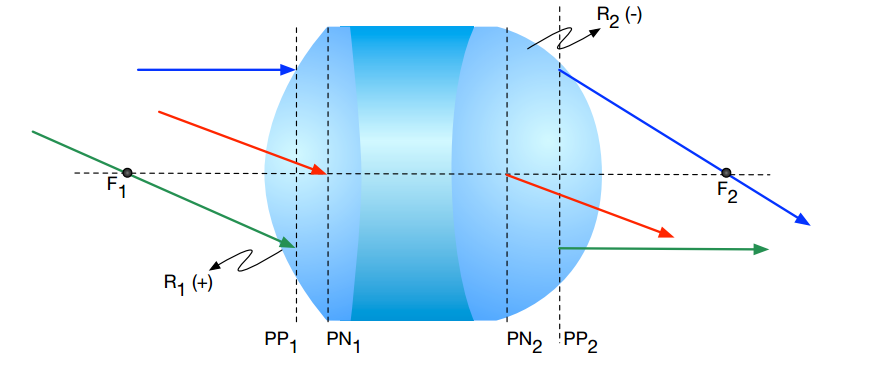
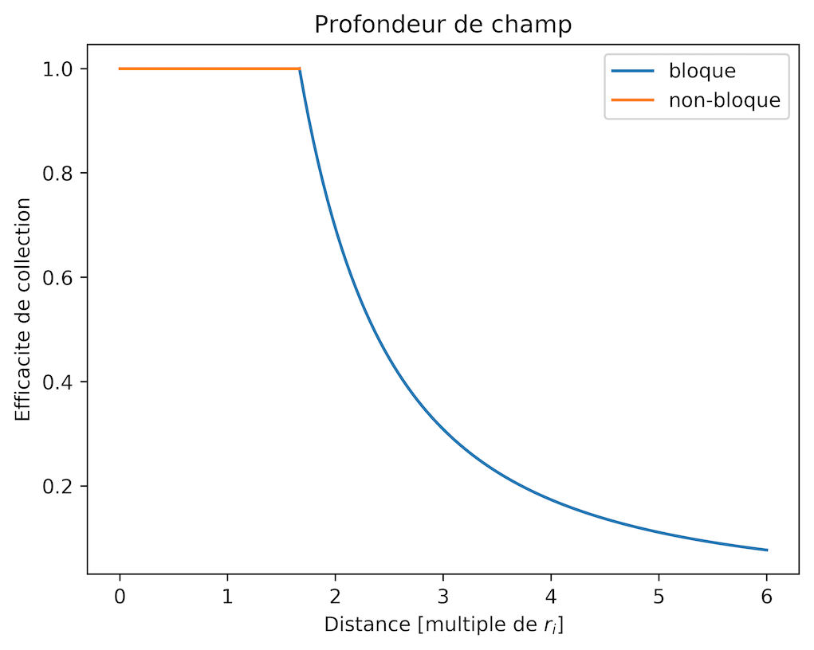

**Contexte**

Ce document, généré automatiquement à partir des questions individuelles, regroupe l'ensemble des questions en optique préparées par Daniel C. Côté. 

Pour corriger les questions, veuillez vous référer [aux versions en ligne des documents](https://github.com/dccote/Questions), disponible sur GitHub.

Pour bien visualiser le document original en Markdown, utilisez Typora.io et le stylesheet questions, [disponible](https://github.com/dccote/Questions/tree/master/site/typora%20css-themes) dans le répertoire `site`. Copiez le repertoire au complet dans le `Theme Folder` de Typora.

[TOC]

# Ondes

Les questions de cette section se rapportent aux phénomènes ondulatoires électromagnétiques de base. Les objectifs importants découlent directement de l'utilisation et de la compréhension des équations de Maxwell. 

**Objectifs**

1. Expliquer la signification des termes dans les équations de Maxwell
2. Savoir dériver et utiliser l’équation d’onde de Helmholtz
3. Expliquer et utiliser les bases complètes (sphériques, planes et autres) représentant les ondes dans les matériaux et dans le vide
4. Expliquer le concept, savoir utiliser et identifier un front d’onde et un rayon
5. Interpréter, savoir calculer et utiliser le vecteur de Poynting
6. Expliquer l’origine de l’indice de réfraction et son impact sur les ondes
7. Définir et savoir utiliser la loi de la réflexion
8. Définir et savoir utiliser la loi de Snell pour la réfraction
9. Définir, identifier et utiliser les polarisations $\hat{s}$ et $\hat{p}$.
10. Savoir utiliser les coefficients de Fresnel pour les deux polarisations
11. Expliquer l’origine et calculer l’angle de Brewster

**Références**

1. Notes de cours "Optique" de Daniel C. Côté, Chapitre 1 ([iBook](https://itunes.apple.com/us/book/optique/id949326768?mt=13) ou [iPDF](https://www.dropbox.com/s/ms9onzkg4y4771n/Optique-1.1.9.pdf?dl=0)).
2. Hecht: Début de Section 5.2
3. Saleh & Teich: Section 1.1, Sections 2.1 et 2.2


## Rayon et front d'onde

*Durée: 1m*

### Question

**[Vrai ou Faux]** Pour toute onde, un seul rayon pointant dans une direction donnée est suffisant pour décrire le front d’onde en tout point.

### Réponse

Faux. Pour une onde plane (i.e. un front d'onde plan), tous les rayons sont perpendiculaires au front d'onde et parallèles entre eux.  Au contraire, une onde sphérique (i.e. un front d'onde courbe) a plusieurs rayons différents qui ne sont pas parallèles entre eux, donc plusieurs rayons représentent les front d'onde courbes.

## Origine de l'indice de réfraction

*Durée: 1m*

### Questioné

Quel(s) terme(s) des équations de Maxwell est ou sont impliqué(s) dans la définition de l’indice de réfraction?

### Réponse

La constante diélectrique $\epsilon = \epsilon_r \epsilon_\circ$ est relié à l'indice de réfraction par $n \equiv \sqrt{\epsilon_r}$. Cette constante diélectrique dépend de la fréquence de l'onde.

## Solution équation de Maxwell indépendante du temps

*Durée: 10m*

### Question

Trouvez une solution de l’équation d’onde vectorielle tridimensionnelle dépendente du temps:
$$
\mathbf{\nabla}^2 \mathbf{E} + \mu_\circ\epsilon \frac{\partial^2 \mathbf{E}}{\partial t^2} = 0
$$
par séparation de variables.

### Réponse

## Vecteur de Poynting 

*Durée: 1m*

### Question

**[Vrai ou Faux]** Le vecteur de Poynting correspond à la direction dans laquelle la puissance se propage.

### Réponse

Vrai. Il s'agit de la définition exacte du vecteur de Poynting, qui est donné par $\vec{S} \equiv \vec{E}\times\vec{H}$.

## Solution à l'équation d'onde

*Durée: 10m*

### Question

Montrez qu’une onde plane $\mathbf{E}\left( \mathbf{r}, t\right) = \mathbf{E}_\circ e^{i \left(\mathbf{k} \cdot \mathbf{r} - \omega t\right) }$ est une solution de l’équation d’onde.

### Réponse
## Somme d'ondes sphériques

*Durée: 1m*

### Question

**[Vrai ou Faux]** On ne peut pas décrire une onde plane par une somme d’ondes sphériques, car son front d’onde est droit.

### Réponse

Faux.  L'ensemble des ondes planes est une base complète qui peut représenter toute onde, c'est-à-dire:
$$
\vec{E}(r,t) = \sum_{\vec{k}} \vec{E}(\vec{k})e^{i (\vec{k}\cdot\vec{r} - \omega t)}.
$$
C'est la même chose pour les ondes sphériques:
$$
\vec{E}(r,t) = \sum_{\vec{r}_i} \vec{E}(\vec{r}_i)e^{i (k \left| \vec{r}-\vec{r}_i \right| - \omega t)}.
$$

La différence est simplement que pour représenter une onde plane par une somme d'ondes sphériques, nous aurons besoin de beaucop de termes dans la somme puisque la géométrie sphérique n'est évidemment pas plane.  

## Faisceau focalisant

*Durée: 1m*

### Question

Quelle est la forme du front d’onde d’un faisceau focalisant?

### Réponse

Le front d'onde est sphérique.

## Focus de caméra

*Durée: 2m*

### Question

Une caméra peut ajuster le *focus* sans changer le grossissement.  Comment est-ce que ca fonctionne ?

### Réponse

## Conversion photon et puissance

*Durée: 5m*

### Question

1 photon par seconde donne combien de Watts à $\lambda = 1\ \mu m $?

### Réponse

Un photon à 1 µm a une énergie de 1 eV, donc 1 photon $\left( 1 \text{ eV/photon} \right) = 1.6 \times 10^{-19} \text{J}​$ ou 0.2 zeptoJoule. En une seconde, un obtient simplement 0.2 zeptoWatt.

## Puissance et photons

*Durée: 1m*

### Question

 1 pW donne combien de photon par seconde à $\lambda = 500 \text{ nm} $?

### Réponse

Un photon à 500 nm a une énergie de 2 eV (ou $1.6 \times 10^{-19}J$), donc $ 1 \text{ pW} / \left( 2 \text{ eV/photon} \right)  = 3 \times 10^{6} \text{photon/s}$ ou 3 photons par 1 µs.

```

```

## Indice de réfraction

*Durée: 2m*

### Question

Quel est l’origine de l’indice de réfraction dans le contexte des équations de Maxwell?

### Réponse

L'indice de réfraction vient de la réponse de la densité de polarisation (i.e. les dipôles par volume) dans le matériel.  On suppose une réponse des dipôles proportionnelle $P=\chi \epsilon_\circ E$, mais $\chi$ est dépendant de la fréquence, et est un nombre complexe (donc une amplitude et une phase). On obtient ensuite que $n^2 = \left( 1 + \chi\right)^2 = \epsilon_r​$.

## Longueur d'onde

*Durée: 1m*

### Question

Un laser rouge de longeur d'onde 632.8 nm illumine une piscine.  Sachant que la vitesse dans un milieu est  $c/n$ et que la longueur d’onde dans un milieu est $\lambda^\prime= \lambda/n$, est-ce que si vous regardez dans la piscine vous verrez que le laser est bleu dans l’eau?

### Réponse

Le laser est toujours rouge car la couleur est donnée par la fréquence d'oscillation de l'onde (qui est une propriété de l'onde indépendante de la propagation et qui détermine son énergie) alors que la longueur d'onde est une propriété découlant de la propagation.

## Examples d'indice

*Durée: 2m*

### Question

Donnez des valeurs d’indice de réfraction pour l’eau, le verre, l’huile, les semiconducteurs.  Est-ce que cette valeur dépend de la longueur d’onde ? Pourquoi ?

### Réponse

L'eau $n=1.33$, le verre $n \approx 1.50$ et les semi-conducteurs varient mais sont plutôt élevés $n_\text{Si} = 3.4$ et  $n_\text{GaAs} = 3.5$. Vous pouvez trouver une base de données très complète sur le site [refractiveindex.info](https://refractiveindex.info).

Cette valeur dépend évidemment de la longueur d'onde.  Cependant, pour des milieux transparents (comme l'eau, le verre), l'indice varie peu sauf près de l'absorption, à longueurs d'ondes courtes.  Ainsi, on utilise souvent un seul indice mais on doit confirmer lorsque les longueurs d'ondes approchent l'UV dans l'eau et le verre par exemple.

## Paramètres d'illumination

*Durée: 5m*

### Question

Calculer pour un faisceau à 800 nm de 0.1 nm de largeur spectrale ayant une surface de 10 mm^2^ et une puissance moyenne de 1 mW

1. Fréquence du faisceau
2. Flux d’énergie pendant 1 seconde
3. Irradiance
4. Irradiance spectrale

### Réponse

1. La fréquence est défini $ f = \frac{c}{\lambda} ​$  où $\lambda​$ est la longueur d'onde et $c​$ la vitesse de la lumière. On a donc: 

   $$   f = \frac{800 \times 10^{-9} \text{m}}{3 \times 10^8 \text{m/s}} =  375\times 10^{12} \text{Hz} = 375 \text{THz}$$


2. $ 1 \text{W} = 1 \text{J/s}​$   donc   $1 \text{mW} = 1 \text{mJ/s} ​$

   

3. $ I=\frac{P}{A} = \frac{10 \text{mW}}{ \text{cm}^2}$ 

   

4. $\text{I}$ ~spectrale~ $= \frac{I}{\Delta f} = 100 \frac{\text{mW}}{\text{cm}^2 \cdot \text{nm}}​$


   ```python
# Available at 
   c = 3e8 # SI units
   wavelength = 800e-9 
   surface = 10*(1e-3)*(1e-3) # in m^2
   power = 1e-3 # in Watts
   duration = 1 # in seconds
   spectralWidth = 0.1e-9
   spectralWidthInNm = spectralWidth*1e9
   
   frequency = c/wavelength #in Hertz
   flux = power * duration
   irradiance = power/surface #in W/m^2
   irradianceInMwPerCm2 = irradiance * 1000/(1e2)/(1e2)
   irradianceInMwPerCm2PerNanoMeter = irradianceInMwPerCm2/(spectralWidthInNm)
   
   print("1. Frequency: {0} THz".format(frequency/1e12))
   print("2. Energy flux in 1 second: {0} mJ".format(flux*1000))
   print("3. Irradiance: {0} mW/cm^2".format(irradianceInMwPerCm2))
   print("4. Irradiance spectrale: {0} mW/cm^2/nm".format(irradianceInMwPerCm2PerNanoMeter))

# Output:
#1. Frequency: 375.0 THz
#2. Energy flux in 1 second: 1.0 mJ
#3. Irradiance: 10.0 mW/cm^2
#4. Irradiance spectrale: 100.0 mW/cm^2/nm

   ```


# Optique Géométrique

Les questions de cette section se rapportent à l'optique géomtétrique, où la longueur d'onde est négligeable. On parle de lentilles, formation d'image et de systèmes optiques simples. 

**Objectifs**

1. Faire le tracé de rayons pour les rayons importants et pour obtenir une image
2. Définir et identifier la distance focale d’une lentille simple ou complexe, ses plans principaux et ses plans nodaux.
3. Comprendre et expliquer l'origine de la formation de l'image dans des systèmes simples et complexes et savoir calculer la position de l’image
4. Expliquer la différence entre une image réelle et une image virtuelle
5. Comprendre, expliquer et savoir faire des calculs impliquant les phénomènes qui régissent l'optique géométrique
6. Savoir utiliser la loi de l’imagerie, la loi de Lensmaker et bien utiliser les conventions de signes
7. Expliquer, connaître les propriétés, savoir reconnaître, concevoir et faire des calculs impliquant un système 4f
8. Définir et savoir utiliser les matrices représentant les différentes composantes simples pour transformer les rayons
9. Décrire et savoir utiliser le formalisme des matrices ABCD
10. Comprendre et savoir comment obtenir la condition d’imagerie, les plans principaux et les points nodaux d’un système complexe
11. Identifier la distance focale équivalente d’un système complexe
12. Calculer la position d’une image avec le formalisme matriciel
13. Résoudre des problèmes en utilisant le formalisme matriciel


**Références**

1. Notes de cours "Optique" de Daniel C. Côté, Chapitre 2, sections 1 et 2 ([iBook](https://itunes.apple.com/us/book/optique/id949326768?mt=13) ou [iPDF](https://www.dropbox.com/s/ms9onzkg4y4771n/Optique-1.1.9.pdf?dl=0)).
2. Hecht, Section 5.2 et et 6.1
3. Saleh & Teich: Sections 1.C

## Points cardinaux

*Durée: 2m*

### Question

Sur la figure suivante:



tracez les rayons cardinaux passant par les points focaux  [F~1~] et [F~2~] , nodal [PN~1~] et [PN~2~] et par les plans principaux [PP~1~] et [PP~2~ ].

### Réponse

1. Le rayon au plan principal PP~1~​ apparaît au plan principal PP~2~ à la même hauteur en subissant toute l'action de la lentille.

2. Un cône au plan nodal ressort avec un cône de même grandeur.  Si un rayon croise la plan nodal sur l'axe optique, il continue tout droit (rayon rouge).

3. Un rayon passant par le point focal F~1​~ ressort parallèle (rayon vert)

4. Un rayon parallèle se dirige vers le point focal F~2~ (rayon bleu)

   




## Distance focale

*Durée: 1m*

### Question

**[V ou F]** La distance focale est définie comme la distance entre la surface (physique) d’une lentille et son point focal.

### Réponse

Faux. C'est la distance entre le plan principal et le point focal.

## Plans nodaux

*Durée: 1m*

### Question

**[V ou F]** Les plans nodaux sont des plans de grossissement angulaire unitaire.

### Réponse

Vrai.
## Plan principaux

*Durée: 1m*

### Question

**[V ou F]** Les plans principaux sont des plans de grossissement transverse unitaire.

### Réponse

Vrai.
## Plans nodaux et principaux

*Durée: 1m*

### Question

Où sont les plans nodaux et les plans principaux pour une lentille mince ?

### Réponse

Au centre.

## Couches diélectriques

### Question

Imaginez une série arbitraire de plaques diélectriques parallèles, d'indices de réfraction tout aussi arbitraires mais sans absorption, le tout, dans l'air (comme une fenêtre multi-couche épaisse).  Démontrez de façon générale la relation entre les coefficients de réflexion (ou de transmission) dans un sens et l'autre, c'est-à-dire qu'arrive-t-il à l'intensité de la lumière provenant de la gauche et celle provenant de la droite en termes de coefficients de Fresnel ? Vous devez obtenir que le coefficient de transmission (ou de réflexion) de l'intensité par la gauche et par la droite est identique s’il n’y a pas d’absorption.

### Réponse

## Salle d'interrogation

### Question

Vous savez que les coefficients de transmission par la gauche ou par la droite sont identiques (même chose pour les coefficients de réflexion). Dans les émissions de télé de Gangsters et Police, il y a souvent des fenêtres “miroirs” où le suspect ne peut pas voir à l’intérieur, mais les victimes peuvent le voir et essayer de l’identifier.  À la lumière de la question précédente, expliquez ce qui se passe de façon formelle.  Vous devriez utiliser une petite égalité très simple pour supporter votre explication.


### Réponse

## Lentille à distance focale donnée

*Durée: 20 m*

### Question

Pour une lentille biconvexe diélectrique épaisse d’indice n et de rayons de courbure avant et arrière identiques R, obtenez une expression pour l’épaisseur qui donne une distance focale infinie.

### Réponse

## Lunette dans l'eau

### Question

Lorsqu’on regarde dans l’eau sans lunettes de plongée, on ne voit pas très bien.  Au contraire, avec des lunettes de plongée, on voit clairement les objets.  Comment expliquer cela considérant que l’oeil est identique dans les deux cas et que les lunettes de plongée sont plates?

### Réponse

## Laser dans l'eau

### Question

Vous avez un pointeur laser inoffensif rouge et vous voulez viser un poisson rouge qui se trouve devant vous dans un lac sans vague alors que vous êtes sur un quai.  Vous regardez le poisson.  Où devez-vous viser pour atteindre le poisson sous l’eau: un peu en avant, un peu en arrière ou exactement où vous le voyez?

### Réponse


## Inversion

### Question

Un miroir inverse la gauche et la droite. Pourquoi n’inverse-t-il pas le haut et le bas?

### Réponse

Un miroir n'inverse pas vraiment la gauche et la droite: il inverse le devant et le derrière (i.e. il inverse $\hat{z}$ en $-\hat{z}$).  Ce faisant, le système de coordonnées est maintenant "main gauche" au lieu de "main droite" et en effet, la gauche et la droite sont inversés. Mais en fait, le haut et le bas, si on se tourne la tête de $90^o$ vers la gauche sont aussi inversés, en ce sens que le haut est a ma droite mais a la gauche pour mon image.

## Image-objet

### Question

Quelle est la position de l’image si un objet est placé à $f/2$ devant une lentille de distance focale  $f$ ? L’image est-elle virtuelle ou réelle ? 

### Réponse


## Tracé de rayons

### Question

**[VRAI ou FAUX]** Pour trouver la position d’une image dans un système optique, on doit tracer au moins 3 rayons provenant de l’objet.

### Réponse

Faux.  Deux sont suffisants.

## Loupe

*Durée: 1m*

### Question

Comment faire la meilleure loupe ?

### Réponse

Pour utiliser une loupe, la meilleure position de l'objet est au plan focal.  Une image à l'infini est obtenue, mais notre oeil, avec sa lentille, formera un image sur la rétine.

## Doublet

*Durée: 1m*

### Question

Y'a-t-il une bonne raison de faire une lentille de type doublet achromatique avec le même matériel ?

### Réponse

Non.  Les deux matériaux sont de types Crown et de type Flint. Les verres de types Crown sont peu dispersifs, alors que les verres de type Flint sont très dispersif. Deux matériaux identiques ne permettraient pas de corriger les aberrations chromatiques.


## Objet dans l'eau

*Durée: 1m*

### Question

Un objet dans l’eau a l’air plus profond ou moins profond?

### Réponse

Moins profond.


## Lentilles cornéennes

*Durée: 1m*

### Question

Pourquoi les lentilles cornéennes avec correction pour l’astigmatisme sont-elle plus chères ?

### Réponse

Parce qu'elles doivent s'orienter dans l'oeil car la correction qu'elles produisent est associée à l'axe des $x$ et $y$, elle n'est pas symétrique. Elle ont donc un poids dans le bas qui les fait s'orienter correctement.

## Déterminant matrices ABCD

*Durée: 10 m*

### Question 

Montrez que le déterminant des matrices ABCD est en général $n_1/n_2$

### Réponse

## Grossissement

*Durée: 1m*

### Question

VRAI ou FAUX: L’élément A d’une matrice de transfert ABCD représente toujours le grossissement.

### Réponse

Faux.  Seulement lorsque le système est imageant. On ne parle pas de grossissement quand il n'y a pas d'image.
## Matrice de lentille

*Durée: 1m*

### Question

Pour un système optique quelconque ayant une distance focale équivalente $f$, écrivez la matrice de transfert qui transforme un rayon d’un plan principal à l’autre plan principal.

### Réponse

Par définition, l'effet totale d'une lentille est appliquée entre ses plans principaux:

$ \Biggl[ 
   \begin{matrix}
​      1 & 0 \\
​      -\frac{1}{f} & 1 \\
   \end{matrix}
\Biggl]​$

## Goutte d'eau

*Durée: 15m*

### Question 

Une goutte de pluie de forme sphérique tombe en direction d’une feuille d’arbre dans une forêt à l’équateur.  Trouvez les conditions dans lesquelles la lumière du soleil qui passe à travers la gouttelette est focalisée directement sur la feuille.

### Réponse

On obtient la matrice de transfert d’une surface diélectrique de rayon de courbure $R$ et d’indice (à droite), $n$ une propagation de $2R$ suivi d’une autre surface diélectrique de rayon de courbure  et $-R$  d’indice (à gauche) $n​$.

$$
\Biggr[
\begin{matrix}
1 & 0 \\
\frac{1-n}{R} & n
\end{matrix}
\Biggl]

\Biggr[
\begin{matrix}
1 & 2R \\
0 & 1
\end{matrix}
\Biggl]

\Biggr[
\begin{matrix}
1 & 0 \\
\frac{1-n}{n R} & \frac{1}{n}
\end{matrix}
\Biggl]

=

\left[
\begin{matrix}
 \frac{2(1-n)}{n}+1 & \frac{2R}{n} \\
 (n-1) \left[ \frac{2}{R}  + \frac{2(n-1)}{n R} \right] & 1+ \frac{2(1-n)}{n } \\
\end{matrix}
\right]
$$

$$
\Biggr[
\begin{matrix}
1 & 0 \\
\frac{n-1}{R_2} & n
\end{matrix}
\Biggl]

\Biggr[
\begin{matrix}
1 & d \\
0 & 1
\end{matrix}
\Biggl]

\Biggr[
\begin{matrix}
1 & 0 \\
\frac{1-n}{n R_1} & \frac{1}{n}
\end{matrix}
\Biggl]

=

\left[
\begin{matrix}
 \frac{d (1-n)}{n R_1}+1 & \frac{d}{n} \\
-  (n-1) \left[ \frac{1}{R_1}- \frac{1}{R_2} + \frac{d (n-1)}{n R_1 R_2} \right] & 1+ \frac{d (n-1)}{n R_2} \\
\end{matrix}
\right]
$$


## Lentille dans milieux différents

*Durée: 15m*

### Question

Supposez une interface diélectrique courbe de rayon $R$ et d’indice $n$. Montrez que les points focaux de chaque côté de l’interface sont à des distances différentes de chaque côté de l’interface.

### Réponse


## Rayon généralisé

*Durée: 30m*

### Question

1. À partir des rayons tels que définis par le formalisme ABCD et de leur transformation, obtenez une expression en fonction de $r$ et  $\theta$ pour le rayon de courbure $\hat{R}$ du front d'onde d'un faisceau.
2. Obtenez la règle de transformation du rayon de courbure d'un faisceau en fonction des matrices ABCD. La propagation des ondes à fronts d'ondes courbes est donc incluse dans le formalisme ABCD.  Nous verrons plus tard l'importance de cette règle.

### Réponse

1. On voit que le rayon de courbure peut facilement être obtenu en traçant le rayon qui part de l'axe optique ainsi que les paramètres utilisés dans le formalisme ABCD pour décrire un rayon. Il y a correspondance directe avec $\tan \theta \approx \theta = r/\hat{R}$, donc $\hat{R}=r/\theta$.


2. Puisqu'on sait les règles de transformation de $r$ et $\theta​$:

   $$
   \Biggl[ 
      \begin{matrix}
         r^\prime \\
         \theta^\prime \\
      \end{matrix}
   \Biggr] 
   =
   \Biggl[ 
      \begin{matrix}
         A & B \\
         C & D \\
      \end{matrix}
   \Biggl]
   \Biggl[ 
      \begin{matrix}
         r \\
         \theta \\
      \end{matrix}
   \Biggl]
   =
   \Biggl[ 
      \begin{matrix}
         Ar + B \\
         C \theta + D \\
      \end{matrix}
   \Biggl]
   $$

   on obtient simplement:
   $$
   \hat{R}^\prime =  \frac{r^\prime}{\theta^\prime} =   \frac{A\hat{R} + B}{C \theta + D}
   $$
   Nous verrons qu'avec un rayon généralisé, nous pourrons propager les faisceaux lasers
   gaussiens avec cette équation.


## L'oeil et les lunettes

*Durée: 120m*

### Question

Référez-vous à la figure de Hecht suivante pour les questions.

1. Voici une citation de Hecht (p. 203):

    **“The refracting components of the eye, the cornea and crystalline lens, can be treated as forming an effective double-element lens with an object focus of about 15.6 mm in front of the anterior surface of the cornea and an image focus of about 24.3 mm behind it on the retina.”**   Pourquoi Hecht parle-t-il de deux distances focales? N'avons-nous pas dit que les points focaux sont équidistants de chaque côté d'une lentille? Expliquez.

2. Calculez la distance focale (ou puissance) de la cornée en supposant que l'indice de réfraction de l'humeur aqueuse est de 1.33 et le rayon de courbure de l'oeil est d'environ $R=23\ \text{mm} / 2 = 11.5\ \text{mm}$.

3. On utilise des lunettes pour ``corriger'' la vue. Les lunettes sont disposées sur le nez, environ au plan focal avant de l'oeil (soit 15.6 mm en moyenne). Calculez la matrice ABCD de l'oeil avec lunettes, et de l'oeil sans lunettes à partir du même plan de référence dans les deux cas. Pour simplifier la discussion, supposez que l'on peut remplacer les composantes optiques de l'oeil par une seule lentille de distance focale $f=15.6$ mm dans l'air, et intéressez-vous aux objets très lointains.

4. Quelles sont les distances focales du système complet dans les deux cas (avec et sans lunettes)?

5. Quel est le grossissement relatif du système avec lunettes par rapport au système sans lunettes?

6. Sachant cela, comment pouvez-vous expliquer qu'une paire de lunettes corrige la vue ? Expliquez-le de façon formelle avec les matrices ABCD.
  

### Réponse

1. Les deux côtés de l'oeil ne baignent pas dans le même indice de réfraction.  Les deux distances focales (avant et arrière) d'une interface diélectrique ne sont les mêmes que lorsque l'indice est le même des deux côtés (par exemple, dans l'air).

2. On utilise la loi des diélectriques courbes ou la matrice ABCD diélectrique courbe qui donne simplement $f = -1/C$, donc $f= \frac{1.33 R}{1.33 - 1.00} = 4 R = 46 \text{mm}$, par 
  $$
  \left[
     \begin{matrix}
        1 & 0 \\
        - \frac{(n_2-n_1)}{n_2 R} & \frac{n_1}{n_2} \\
     \end{matrix}
  \right]
  $$

3. Les matrices ABCD pour le cas sans lunettes et avec lunettes, telles que calculées à partir de $f$ devant la lentille de l'oeil

   Cas sans lunettes:
   $$
   \left(
      \begin{matrix}
         1 & 0 \\
         -\frac{1}{f} & 1 \\
      \end{matrix}
   \right)
   \left(
      \begin{matrix}
         1 & f \\
         0 & 1 \\
      \end{matrix}
   \right)
   =\left(
      \begin{matrix}
         1 & f \\
         -\frac{1}{f} & 0 \\
      \end{matrix}
   \right)
   $$
   Cas avec lunettes:
   $$
   \left(
      \begin{matrix}
         1 & 0 \\
         -\frac{1}{f} & 1 \\
      \end{matrix}
   \right)
   \left(
      \begin{matrix}
         1 & f \\
         0 & 1 \\
      \end{matrix}
   \right)
   \left(
      \begin{matrix}
         1 & 0 \\
         -\frac{1}{F} & 1 \\
      \end{matrix}
   \right)
   =\left(
      \begin{matrix}
         1 - \frac{f}{F}& f \\
         -\frac{1}{f} & 0 \\
      \end{matrix}
   \right)
   $$

4. La distance focale $C^{-1}$ du système complet n'a pas changée et est toujours celle de l'oeil, $f$.

5. Le grossissement depend de l'objet et de l'image.  Les deux systèmes ont la même distance focale, donc le grossissement est identique.  

6. Prenons le cas sans lunettes, avec l'équation (c.1) et la figure suivante:

   

   Le plan principal avant est à $d_\mathrm{PP_1} = \frac{1-D}{C} = -f $ devant le système, donc $f$ vers la droite, i.e. sur la lentille mince. Le plan principal de arrière est à d $d_\mathrm{PP_2} = \frac{1-A}{C} = 0$ donc lui aussi sur la lentille mince. Aucune surprise.
   Cependant, le plan principal arrière du système avec lunette a changé: on le voit tout de suite, l'élément  $A$ a changé. Un calcul de la position du plan donne $PP_2$  qu'il est maintenant à $d_\mathrm{PP_2} = \frac{1-A}{C} = -\frac{f^2}{F}$.  Ainsi, le plan focal a été déplacé de $-\frac{f^2}{F}$ , la distance focale reste la même mais le point focal est avancé, d'où la correction par les lunettes.

## Objectif

*Durée: 60 m*

### Question

Vous avez l’objectif Olympus suivant, identifié « Olympus UPlanFl 40x ». Vous savez que cet objectif s’utilise normalement dans un système 4f avec une seconde lentille de distance focale f=18 cm pour compléter ledit système 4f. Cependant, vous voulez l’utiliser seul, sans aucune autre lentille, pour tirer profit de ses excellentes propriétés optiques. Vous savez aussi que le point focal F1 est collé sur la première surface de l’objectif et que le point focal F2 est à 2 mm du bout de l’objectif, comme sur la Figure.


1. Quelle est la distance focale de cet objectif Olympus 40X ?
2. Écrivez la matrice ABCD qui permet de transformer un rayon entrant de la première surface de l’objectif au plan focal F2.
3. Quelles sont les positions des plans principaux ? Donnez les distances en fonction des points focaux F1 et F2.
4. Vous voulez maintenant utiliser l’objectif (sans aucune autre lentille) pour faire l’image d’un objet qui est à 2.5 mm du bout de l’objectif, donc 0.5 mm après le point focal  . Où placeriez-vous votre camera par rapport à la première surface de l’objectif pour obtenir une image claire de cet objet? 

### Réponse


## Lentilles composées

*Durée: 15m*

### Question

Vous avez un système de lentilles comme suit:

pour lequel la matrice de transfert ABCD (en unités métriques) du plan d’entrée au plan de sortie est :
$$
M = \Biggl[ 
   \begin{matrix}
      -0.1 & 0.11 \\
      -10 & 1 \\
   \end{matrix}
\Biggl]
$$
 Si vous placez un objet 0.2 m devant le groupe de lentilles, où sera l’image et quel sera le grossissement?

### Réponse

## Diaphragme

*Durée: 30m*

### Question

Vous avez une lentille de diamètre $D=5\ \text{cm}$ et de focale $f = 50\ \text{cm}$ qui fait l'image du soleil, un disque d'illumination constante pour nos besoins. Le soleil sous-tend un angle de $\theta = 0.5^o$ à la surface de la terre, où son irradiance est de 1000 W/m^2^.  Quelle est l'irradiance de l'image du soleil qui apparaît sur la caméra?

### Réponse

## Mirages

*Durée: 90m*

### Question

Qu'est-ce qui explique la formation des mirages dans le désert? À partir de quelle température apparaitront-ils?

### Réponse


## Examen 2016 partie 1

*Durée: 25m*

### Question

Un exemple, en vrac, de question pour la partie 1 de l'examen.

1. [Vrai/Faux] Pour toute onde, un seul rayon pointant dans une direction donnée est suffisant pour décrire le front d’onde en tout point 

2. [Vrai/Faux] On ne peut pas décrire une onde plane par une somme d’ondes sphériques, car son front d’onde est droit.
3. [Vrai/Faux] On peut avoir une onde qui a un front d’onde plan mais qui n’est pas une onde plane
4. [Vrai/Faux] Une one plane qui se propage dans l’atmosphère sera perturbée par les variations d’indices de réfraction et ne restera plus une onde plane.
5. [Vrai/Faux] Le vecteur de Poynting correspond à la direction vers laquelle la puissance se propage
6. [Vrai/Faux] Le vecteur de Poynting a les unités de puissance par surface.
7. [Vrai/Faux] La distance focale est définie comme la distance entre la surface (physique) d’une lentille et son point focal.
8. Où sont les plans nodaux et les plans principaux pour une lentille mince ?
9. [Vrai/Faux] Les plans principaux sont des plans conjugués
10. Vous avez un pointeur laser inoffensif et vous voulez viser avec ce faisceau laser un poisson qui se trouve dans un aquarium.  À partir du point A, où devez-vous viser pour atteindre le poisson sous l’eau? Tracez la lumière à partir du point A et expliquez.

 

 


11. [Vrai/Faux] Un miroir sphérique peut avoir des aberrations chromatiques
12. [Vrai/Faux] Pour trouver la position d’une image dans un système optique, on doit tracer au moins 3 rayons provenant de l’objet.
13. **GRIN** Pour quelles longueurs non nulles L une lentille GRIN, décrite par la matrice suivante donnera-t-elle une image à un bout de la lentille pour un objet collé à l’autre bout?

 

14.  Avec l’iris devant la lentille qui bloque la lumière, tracez le rayon marginal du point O et le rayon principal du point O’, sachant que ces points ont des images correspondantes aux points I et I’.

 

15.    [Vrai/Faux] Le diamètre du diaphragme d’entrée (*aperture stop*) est la valeur qui définit le f# du système.

16. [Vrai/Faux] La pupille d’entrée définit la quantité de lumière qui entre dans un système

16. [Vrai/Faux] L’élément A d’une matrice représente toujours le grossissement.


16. [Vrai/Faux] La matrice suivante représente un ou plusieurs éléments optiques.

    

    1. La focale équivalente est de  0.50 cm
    2. Il n’y a pas de focale équivalente, car l’élement B n’est pas zéro comme dans une lentille mince
    3. Si je mets un objet devant ce groupe d’élements optiques, une image virtuelle ou réelle existera


17.  [Vrai/Faux] Une goutte d’eau sphérique agit comme une lentille épaisse.

18.  [Vrai/Faux] Les lunettes corrigent la vue en diminuant ou augmentant la distance focale du système complet de l’œil et des lunettes ensemble

19.  [Vrai/Faux] L’étoile Vega, qui sous-tend un angle de 1 milliradians, formera un point sur une camera puisqu’elle est infiniment loin.

### Réponse


## Examen 2016, partie 2

*Durée: 45m*

### Question

Un exemple, en vrac, de question pour la partie 2 de l'examen.

1. Pour un système optique quelconque ayant une distance focale équivalente f, écrivez la matrice de transfert qui transforme un rayon d’un plan principal à l’autre plan principal.

2. Quelle est la position de l’image si un objet est placé à 2f devant une lentille de distance focale f ?

   1. L’image est-elle virtuelle ou réelle ? 
3. Vous avez le système imageant suivant (pas à l’échelle) qui consiste en un objet à une distance 4f d’une lentille de distance focale f=5 cm. Le diaphragme d’entrée limitant la quantité de lumière se trouve à une position dA=f/2 après la lentille et a un diamètre de D=1cm.

   

     1. Pour un rayon sur l’axe et sur l’objet, quel est l’angle maximal θmax pour lequel un rayon se rendra jusqu’à l’image
     2. Comment s’appelle ce rayon ?

 4. Vous avez construit ce splendide objectif téléphoto inverse avec une lentille divergente de fa = -2 cm et une lentille convergente de fb = 6 cm, les deux étant séparées par une distance de 10 cm :

    

    La matrice de transfert ABCD, de la première surface de la première lentille divergente à la dernière surface de la deuxième lentille convergente, qui provient de la multiplication des matrices représentant chaque lentille et l’espace entre les deux, est la suivante :
    

    où est le point focal par rapport à la surface de la deuxième lentille ?

**BONI FACULTATIF**

5. En optique infrarouge, on utilise parfois des lentilles de type « sphérique » (ou *ball lens*) comme sur la figure. Il suffit de déposer la sphère sur un échantillon pour focaliser à sa surface.  À partir de quel valeur de l’indice de réfraction le point focal sera-t-il directement sur la sphère?


# Instrumentation

**Objectifs**

1. Définir et savoir identifier les diaphragmes d’entrée et de champ, les pupilles d’entrée et de sortie, les fenêtres d’entrée et de sortie
2. Expliquer l’importance des diaphragmes dans un instrument
3. Définir et savoir tracer le rayon principal et la rayon marginal d’une source ponctuelle
4. Définir le $f_\#$ d’un système.
5. Savoir calculer la quantité de lumière captée par un système


**Lecture préparatoire**

1. Notes de cours "Optique" de Daniel C. Côté, Chapitre 2, section 3 ([iBook](https://itunes.apple.com/us/book/optique/id949326768?mt=13) ou [iPDF](https://www.dropbox.com/s/ms9onzkg4y4771n/Optique-1.1.9.pdf?dl=0)).
2. Pedrotti, Chapitre 6
3. Hecht, Section 5.3
## Objectif et résolution

*Durée: 1m*

### Question

Est-ce qu’un objectif 40x a une résolution optique spatiale meilleure ou pire qu’un objectif 100x ? Pourquoi?

### Réponse

Impossible à dire.  La résolution optique est donnée par l'ouverture numérique ou par le $f_\#$, et cette information n'est pas donnée.  Le 40x ou 100x ne nous donne que la distance focale de l'objectif: elle est 40x ou 100x plus petite que celle du *tube lens*.


## Balayage en $x$ et $\theta$

*Durée: 5m*

### Question

Prouver à l’aide des matrices ABCD qu’un balayage en angle au point focal donne un balayage en X/Y à l’autre point focal ?

### Réponse

Deux méthodes: par matrice ABCD ou par raisonnement de secondaire 5. 

Un faisceau provenent du point focal ressort parallèle à l'axe.  Par géométrie on obtient $y = f \theta$.

Par matrices ABCD, on obtient simplement:
$$
\Biggl[ 
\begin{matrix}
1 & 0 \\
-\frac{1}{f} & 1
\end{matrix}
\Biggr]

\Biggl[ 
\begin{matrix}
1 & f \\
0 & 1
\end{matrix}
\Biggr]

\Biggl[ 
\begin{matrix}
0 \\
\theta 
\end{matrix}
\Biggr]

= \Biggl[ 
\begin{matrix}
1 & f \\
-\frac{1}{f_1} & 0
\end{matrix}
\Biggr]

\Biggl[ 
\begin{matrix}
0 \\
\theta 
\end{matrix}
\Biggr]

= 
\Biggl[ 
\begin{matrix}
f \theta \\
0 
\end{matrix}
\Biggr]
$$
Le rayon sort à une hauteur de $ y = f \theta$ et parallèle à l'axe car $\theta = 0​$.


## Champ de vue microscope à balayage

*Durée: 120m*

### Question

Le microscope suivant, qui fonctionne avec un laser Ti:sapphire et un objectif Olympus 40x 0.8 NA (Objectif #1 ci-dessous), permet de balayer à 30 images par secondes avec un polygone à 36 faces. Tout l'optique a 1 pouce de diamètre.

1. Quel est le champ de vue du microscope?

2. Quel est la résolution optique du microscope?

3. Si vous numérisez de façon idéale, quelle sera la taille de l'image (micron et pixels) à 30 images par secondes?

4. J'aimerais utiliser le 20X (Objectif #2 ci-dessous). Est-ce possible? Est-ce que j'ai des modifications à faire? Qu'arrivera-t-il au champ de vue?

5. Après avoir complété vos calculs, que devriez vous vérifier pour confirmer le tout? Où sont les incertitudes dans votre système?

   

   


### Réponse

# Diffraction


**Objectifs**

1. Expliquer la diffraction et son origine physique, comprendre les conditions selon lesquelles une onde diffracte ou non
2. Expliquer le principe de Huygens-Fresnel
3. Savoir faire des calculs de diffraction pour des profils d'illuminations simples ou complexes
4. Comprendre, savoir expliquer et reconnaître que la diffraction de Fraunhofer correspond à la transformée de Fourier du champ électrique incident
5. Savoir faire la correspondance d'échelle pour les calculs de diffraction faisant appel aux transformées de Fourier, dans le cas de l'utilisation d'une lentille ou non
6. Savoir faire des calculs à l'aide de méthodes numériques pour obtenir le patron de diffraction d'un profil arbitraire 
7. Connaître le critère de sélection pour les régimes de Fraunhofer et Fresnel, comprendre appliquer ces critères pour résoudre des problèmes
8. Connaître et savoir identifier des paires de transformées de Fourier importantes
9. Expliquer et savoir calculer les propriétés des réseaux de diffraction
10. Nommer, identifier et connaître les propriétés spécifiques des trois types de réseaux d'amplitude, de phase et blasé
11. Définir et expliquer l'intervalle spectral libre, la dispersion angulaire, la résolution et le pouvoir de résolution et savoir les utiliser dans des calculs


**Références**

1. Notes de cours "Optique" de Daniel C. Côté, Chapitre 3, sections 1 et 2 ([iBook](https://itunes.apple.com/us/book/optique/id949326768?mt=13) ou [iPDF](https://www.dropbox.com/s/ms9onzkg4y4771n/Optique-1.1.9.pdf?dl=0)).
## Point focal

*Durée: 5m*

### Question

Vous voulez le plus petit point focal possible.  Quelle lentille prenez vous et quelle laser prenez vous ?

### Réponse

Une lentille avec le plus petit $f_\#$ possible: le plus petit ratio de distance focale sur diamètre.  Je prends un laser avec la plus petite longueur d'onde possible, et je remplis la lentille avec ce laser car la grosseur du point focal est donnée par $w = f_\# \lambda$.

## Plans de Fourier

*Durée: 1m*

### Question

Est-ce que des plans de Fourier sont des plans  conjugués de l'objet ou de l'image?

### Réponse

Non.  Les plans conjugués sont des plans objet-image.  Deux plans de Fourier sont en effet conjugués entre eux, mais on ne sont pas des plans conjugués de l'objet ou de l'image.

## Point focal

*Durée: 5m*

### Question

Vous envoyez un faisceau collimé (i.e. provenant de l’infini) de diamètre $d_\circ = 1 \text{ mm}$ dans une lentille mince de 25.4 mm de diamètre et d’ouverture numérique 0.5.  Quelle sera la grosseur du point focal ?

### Réponse

Le point focal sera de $w = \lambda f_\#\text{eff} = \lambda \frac{f}{d_\text{\circ}} $ car la lentille n'est pas remplie. La distance focale est obtenue de la définition du $\text{NA} = \frac{D}{2f}$, donc $f = 25.4 \text{ mm}$.   Ainsi, $w = 25.4\text{ mm}/1 \text{ mm} \approx 25 \times \lambda​$. 

## Conception et construction d’un spectromètre Czerny-Turner

Durée: 180m

### Question

Vous voulez construire un spectromètre de Czerny-Turner dans le visible (permettant des mesures de 400 nm à 700 nm inclusivement). Vous avez seulement des fentes de 50 microns pour travailler et vous voulez une résolution spectrale de 50 pm. Quels miroirs courbes, quel réseau de diffraction de type blasé utilisez-vous et à quelles positions les placez vous ? Expliquez vos choix.

### Réponse

## Diffraction par des billes

Durée: 180m

### Question

Vous voulez caractériser un jet assez dense de particules opaques de diamètres $d$ . Le jet lui-même a un diamètre d’environ 1 cm. Vous avez un laser à 632.8 nm émettant un faisceau gaussien collimé (1 mm de diamètre), une boite de lentilles convergentes de distances focales variées et une caméra avec un capteur CCD ayant 1024 x 768 pixels de 16 µm et produisant 30 images par secondes. Vous ne savez pas la grosseur des particules, mais vous savez qu’elles sont toutes identiques, et qu’elles ont un diamètre d’au moins 1 µm et probablement de moins de 10 µm. Vous faites un montage pour que le laser (que vous pourrez collimer autrement ou non) diffracte sur les particules et vous voulez mesurer le patron de diffraction sur le caméra.

a) Dessinez votre montage de façon conceptuel.

 b) Obtenez (équation à l’appui) le patron que vous verrez sur la caméra. Vous devrez utiliser le principe de Babinet.  **Attention:** bien sûr, le flux de particules est tel que plusieurs particules se retrouveront dans le faisceau, à des distances variables l’une de l’autre.  Restera-t-il un patron de diffraction non nul? Obtenez une expression mathématique décrivant cette situation.

c) Avec les lentilles que vous utiliserez et votre caméra, quelles sont les limites des diamètres que vous pourrez détecter (plus petit et plus grand diamètres de particules)?

d) Lorsque vous avez dérivé b), vous avez fait des hypothèses (implicites ou non) sur la densité de particules.  Donnez un critère sur la grosseur du jet et la densité maximale de particules (particules par surface par seconde) que le jet devrait avoir pour que vos mesures soient possibles. **Des indices**: est-ce qu’un photon diffracté pourrait diffracter à nouveau sur une deuxième particule? Quelle est la probabilité qu’un photon diffracte dans un jet de particule de diamètre $d$ ?

### Réponse

## Tache focale, lentille complètement illuminée

### Question

Une onde plane est incidente sur une lentille de distance focale $f$ et de diamètre $D$.  Quelle est la grosseur de la tache focale?

### Réponse

Ceci est un problème de diffraction par une fente circulaire, car la lentille bloque l’onde plane incidente. On a donc une illumination uniforme sur l’ensemble de la fente.

À partir de la solution de la diffraction d’une fente circulaire de l’exemple 3.1.2 présenté dans les notes 
$$
I_{\sigma}(r) \approx \frac{ \left|E_\circ\right|^2 \pi a^2}{f^2} \left[ \frac{2 J_1 \left( \frac{ 2\pi ar}{\lambda f} \right)}{ \frac{2\pi ar}{\lambda f} } \right]^2
$$


on obtient que la largeur, définie comme la distance entre le maximum et le point où la fonction $J_1(x)/x$ est nulle, est donné par $J_1 \left( \frac{ 2\pi a r_\circ}{\lambda f} \right) = 3.82$ donc $2r_\circ = 2 \times 1.22 \lambda \frac{f}{2a} = 2.44 \lambda f_{\#}$ . La tache focale, dans le cas où la lentille est remplie par l’illumination, est environ le double de la longueur d’onde multipliée par le *f-number* de la lentille. 
## Tache focale, petit faisceau

### Question

Un petit faisceau en forme de disque de diamètre $d$  est incident sur une lentille de distance focale $f$ et de diamètre $D$.  Quelle est la grosseur de la tache focale?

### Réponse

Nous avons un problème dangereusement similaire au problème précédent. Cependant, l’intensité de l’illumination ne s’étend pas sur l’ensemble de la lentille car le faisceau est plus petit  que celle-ci. Ainsi, en posant le problème de diffraction, l’intégrale sera nulle au-delà du faisceau, ce qui réduira le diamètre de l’intégrale à $d$ au lieu de $D$. On refait donc le problème de la même façon.

À partir de la solution de la diffraction d’une fente circulaire de l’exemple Exemple 3.1.2,, on obtient
$$
E_{\sigma}(r) \approx \frac{E_\circ{{e^{i{kf}}}} 2 \pi}{f} \int_0^{d/2} J_0 \left( \frac{kr\prime r}{f} \right) r\prime dr\prime 
$$

$$
I_{\sigma}(r) \approx \frac{ \left|E_\circ\right|^2 \pi (d/2)^2}{f^2} \left[ \frac{2 J_1 \left( \frac{ \pi d r}{\lambda f} \right)}{ \frac{\pi d r}{\lambda f} } \right]^2
$$

on obtient essentiellement la même solution que le problème précédent, sauf que le diamètre effectif de “blocage” est $d$ au lieu de $D$. On obtient donc $2r_\circ = 2 \times 1.22 \lambda \frac{f}{d}$. Dans ce cas, on dit que le faisceau “n’utilise pas” toute la lentille est que le $f_\#$ effectif est augmenté de $f^{\rm{eff}}_\# = \frac{D}{d} \times f_{\#}$ ce qui augmente proportionnellement la grosseur de la tache focale.
## Résolution de l'oeil

Durée: 120m

### Question

Les deux phares d’une voitures sont séparés par une distance de $h = 1.5 \text{ m}$.  Quelle est la distance maximale  $d$ à partir de laquelle vous pourrez résoudre les deux phares comme étant distincts si votre pupille a un diamètre de  $D = 5 \text{ mm}$ et que la longueur d’onde principale est de 550 nm ?

### Réponse

#### Stratégie

 L’onde de chaque phare frappe l’ouverture circulaire de l’oeil et diffracte en un disque d’Airy (le champ en fonction de l’angle). Ceci correspond à un ensemble de rayons qui frappent la lentille de l’oeil. On solutionne d’abord en ignorant l’oeil.  Ensuite, on montre que finalement, la réfraction à l’interface de l’oeil ne change rien à la résolution.


Les phares $E_+$ et $E_-$ émettent des ondes sphériques, et chacune diffracte dans l’ouverture de la pupille.  On obtient les champs diffractés selon $\theta$ tout de suite après la pupille centré sur $\pm\phi$:


$$
E_\pm\left( \theta \right) \propto  E_\circ\frac{2 J_1 \left( \frac{ \pi D \sin( \theta \pm \phi)}{\lambda } \right)}{ \left( \frac{\pi D\sin( \theta \pm \phi)}{\lambda } \right)}
$$

On utilise le critère de Rayleigh, c’est-à-dire le premier minimum (zéro) du patron de diffraction [~] doit être superposé au maximum du patron de diffraction de l’autre faisceau [~] à [~]. On veut donc:

$$
E_+(\theta = \phi) = \text{Premier zéro de la fonction }J_1
$$

Lorsque l’argument de $J_1(x)$ est $,\frac{ \pi D \sin( 2\phi)}{\lambda }  = 3.82$ nous obtenons $\phi  = 1.22  \frac{\lambda}{2D}$. Par considération géométrique, on obtient simplement que $\tan \phi \approx \phi = \frac{h}{2d}$ donc 

#### Est-ce que l’indice de l’oeil ou sa courbure sont importants?

Le rayon au centre de la pupille est réfracté lors de la traverse de l’interface diélectrique. La relation entre l’angle avant l’interface $\theta$ et après l’interface $ \theta'$ est par la loi de Snell:
$$
\theta^\prime=\frac{\theta}{n}
$$


ce qui est équivalent à la transformation par une interface courbe avec les matrices ABCD pour un rayon au centre de la pupille. On remplace pour obtenir une expression en fonction des angles $\theta^\prime$ et $ \phi^\prime$ à l’intérieur de l’oeil :
$$
E^\prime_\pm\left( \theta^\prime \right) \propto  E_\circ\frac{2 J_1 \left( \frac{ \pi D \sin( n\theta^\prime \pm n\phi^\prime)}{\lambda } \right)}{ \left( \frac{\pi D\sin( n\theta^\prime \pm n\phi^\prime)}{\lambda } \right)}
$$


On refait le même cheminement: en fonction des angles intérieurs le premier minimum (zéro) du patron de diffraction $E^\prime_+(\theta^\prime) $  doit être superposé au maximum du patron de diffraction de l’autre faisceau à $\phi^\prime$.

$$
E^\prime_+(\theta^\prime = \phi^\prime) = \text{Premier zéro de la fonction }J_1
$$

On obtient donc: $\phi^\prime  = 1.22  \frac{\lambda}{2nD}$. Donc l’angle minimal pouvant être résolu est en effet plus petit *à l’intérieur de l’oeil*, cependant, un rapide calcul montre bien que l’angle correspondant à l’extérieur, entre les deux phares, est toujours le même car on a:
$$
\phi = n\phi^\prime =  1.22  \frac{\lambda}{2D}
$$


Donc l’oeil et son indice de réfraction n’ont pas d’impact sur la résolution.


# Aberrations

Des questions imsples sur les aberrations.


**Objectifs**

1. Nommer les aberrations: chromatiques, géométriques

2. Nommer les types d'aberrations géometriques

3. Expliquer l'origine de abbération chromatique et savoir reconnaitre sa présence, son absence et son importance

4. Savoir faire les calculs pour corriger l'aberration chromatique avec un doublet

5. Utiliser correctement des lentilles en laboratoire


## Lamelle et aberrations

*Durée: 15m*

### Question

Prouvez qu’une lentille sphérique plano-convexe aura des aberrations sphériques

### Réponse

À faire.


## Aberration

*Durée: 5m*

### Question

De quel côté doit-on placer une lentille au laboratoire si c'est une lentille Plano-convexe lorsqu'on a :

1. Un faisceau collimé incident
2. Un faisceau provenant d'un point près de la lentille


### Réponse

La règle: on veut faire travailler les deux côtés de la lentille.

1. Côté courbe d'abord
2. Côté plan d'abord.

# Détection


**Objectifs**

1. Expliquer l'effet photoélectrique

2. Expliquer le phénomène d'absorption dans les semiconducteurs

3. Obtenir et utliser les paramètres importants d'un semiconducteur en ce qui a trait à l'absorption de photon: band interdite, dopants p et n, matériaux intrinsèques.

4. Nommer, expliquer le fonctionnement des types de détecteurs en optique et leurs différences.

5. Expliquer le mode de fonctionnement et la grandeur des signaux attendus dans des situations expérimentales

6. Connaître, nommer et utiliser dans des calculs les paramètres importants d'une caméra CCD ou CMOS

7. Expliquer le bruit de photon, et utiliser ses propriétés pour faire des prédictions dans des expériences

8. Calculer le nombre de photons attendus en relation aux surfaces efficaces

    

**Références**

1. [Diapositives](https://www.icloud.com/keynote/0XoMXj0S6kRg8GCmICiKpM3fQ#BPH-7006_Detection) sur la Détection pour le cours gradué "Imagerie Biomédicale".
## Tube photomultiplicateur

*Durée: 5m*

### Question

Un tube photomultiplicateur (PMT) peut détecter un seul photon.  Quel est taux de photons maximal qui peut être mesuré à 500 nm?

### Réponse

Les impulsions électriques d'une PMT sont typiquement entre 10 ns et 50 ns. Ainsi,pour détecter deux photons séparément, on devrait avoir plus que 2 photons par 10 ou 50 ns, ce qui donne entre 2ev/10ns = 40 pW et 2ev/50ns = 8 pW.

```python
h = 6.62e-34 # m^2 kg/s 
c = 3e8 # m/s
wavelength = 500e-9 # m
energyPerPhoton = h * c / wavelength # Joules

lowMaxPowerInPicoWatt = energyPerPhoton/50e-9 /1e-12 # en pW
highMaxPowerInPicoWatt = energyPerPhoton/10e-9 /1e-12 # en pW

print "Une PMT sature entre %.0f pW et %.0f pW" % (lowMaxPowerInPicoWatt, highMaxPowerInPicoWatt)

# Output 
# Une PMT sature entre 8 pW et 40 pW
```

## Caméra CCD

*Durée: 10m*

### Question

Vous avez une caméra CCD 12-bit avec une profondeur de puits de 100,000e- et une efficacité quantique de 90% sans amplification. Quelle est la plus petite différence de photons qu’elle peut vous rapporter?

### Réponse

Simplement, la quantité de photons par bit est obtenue par:
$$
\frac{100000 \text{ photoelectrons}}{\text{QE photoelectrons/photon} \times 2^{12} \text{bit}} = 27 \text{ photons par bit}
$$

```python
maxValue = 1 << 12 # 2^12
wellDepth = 100000 # photoelectrons
photonsAcquiredWellFull = wellDepth / 0.90 # 90 photoelectrons means 100 photons hit the detector
photonsPerBit = photonsAcquiredWellFull/maxValue

print "Deux valeurs numerisees different par %.0f photons" % photonsPerBit

# Output
# Deux valeurs numerisees different par 27 photons
```

## Bruit de photon

*Durée: 60m*

### Question

Un flux de photon de 1 pW à 632.8 nm est incident sur une PMT en mode “photon counting”.

1. Ceci correspond à combien de photons par seconde?
2. Quelle est la probabilité d’obtenir un photon dans un intervalle de 100 ns si les photons arrivent au hasard?
3. [Programmation]: Tracez des courbes typiques du nombre de photons accumulés toute les 100 ns jusqu’à un total de 1 seconde
4. Combien de temps devriez vous mesurer (i.e. intégrer) pour obtenir une mesure fiable à 1% ?
5. Quel est l’impact sur le temps d’intégration si on augmente la puissance du faisceau par un facteur 2?
6. Quel est l’impact sur le rapport signal sur bruit si on augmente la puissance du faisceau par un facteur 2?

### Réponse

## Sensibilité radiante de la photocathode

*Durée: 10m*

### Question

Quelle est la *radiant sensitivity* de la cathode d’une PMT R3896 en A/W?

### Réponse

On trouve la [feuille de spécifications](https://www.hamamatsu.com/resources/pdf/etd/R12829_TPMS1083E.pdf) sur le web. On obtient 100 mA/W. Ceci correspond à environ 1 photon sur 5 qui est converti en photoélectron.

## Sensibilité radiante de l'anode

*Durée: 10m*

### Question

Quelle est la *radiant sensitivity* de l'anode d’une PMT R3896 en A/W?

### Réponse

On trouve la [feuille de spécifications](https://www.hamamatsu.com/resources/pdf/etd/R12829_TPMS1083E.pdf) sur le web. Le courant qui sort de l'anode a été amplifié par les multiples dynodes. Avec un gain typique de $10^7$, on obtient donc $100 \text{ mA/W} \times 10^7 = 1 \text{ MA/W}$, ou 1 µA/pW.

## Courbe spectrale de l'oeil

*Durée: 3m*

### Question

Pouvez vous regarder un fluorophore infrarouge à 750 nm sans une caméra?

### Réponse

Non. La réponse de l'oeil est essentiellement nulle à 750 nm:


[Source de l'image](https://www.nde-ed.org/EducationResources/CommunityCollege/PenetrantTest/Introduction/lightresponse.htm)

Au contraire, une camera CCD, fait en silice, possède une réponse beaucoup plus élevée entre 650 et 1050 nm:


[Source de l'image.](https://andor.oxinst.com/learning/view/article/ccd-spectral-response-(qe))

## Efficacité

*Durée: 5m*

### Question

La sensibilité (*sensitivity*) d’une photodiode classique est d’environ 1 A par Watt de lumière dans le visible.  Justifiez pourquoi c’est le cas par un calcul du nombre d’électrons par photon incident.

### Réponse

Dans une photodiode de type p-i-n, chaque photon donne lieu à une paire électron-trou, donc un courant de 2 charges pour chaque photon à 500 nm. On obtient donc 2 charges/2eV de lumière, ce qui donne 0.8A/W.   

```python
q = 1.6e-19 # C                                                                                                                                                   
h = 6.62e-34 # m^2 kg/s                                                                                                                                           
c = 3e8 # m/s                                                                                                                                                     
I = 2 * q # charge/photon                                                                                                                                         
wavelength = 0.5e-6 # m                                                                                                                                           
energieParPhoton = h * c / wavelength # J/photon                                                                                                                  
radiantSensitivity = I / energieParPhoton # A/W                                                                                                                   
print "Radiant sensitivity:", radiantSensitivity, " A/W"

# Output:
# radiantSensitivity =
#
#    0.8056
```


## Efficacité quantique

*Durée: 5m*

### Question

On dit qu’une photodiode a une efficacité quantique de presque 50-100%.  Pourquoi utilise-t-on des PMT d’efficacité quantique de 10-30% ?

### Réponse

Parce que l'efficacité quantique n'est pas la seule chose à considérer: l'efficacité quantique est la fraction de photon convertie en électron.  Cependant, la réponse (en Volt ou en Ampère) dépend du gain du détecteur. Une réponse élevée (en V) est plus facile à détecter qu'une petite réponse (en mV). Les PMTs ont des gains de 10^6^ , ce qui leur donne un grand signal pour un seul photon.


## Paramètres bruit de photons

*Durée: 60m*

### Question

Un flux de photon de 1 pW à 632.8 nm est incident sur une PMT en mode “photon counting”.

- Ceci correspond à combien de photons par seconde?
- Quelle est la probabilité d’obtenir un photon dans un intervalle de 100 ns si les photons arrivent au hasard?
- [Programmation]: Tracez des courbes typiques du nombre de photons accumulés toute les 100 ns jusqu’à un total de 1 seconde
- Combien de temps devriez vous mesurer (i.e. intégrer) pour obtenir une mesure fiable à 1% ?
- Quel est l’impact sur le temps d’intégration si on augmente la puissance du faisceau par un facteur 2 ?
- Quel est l’impact sur le rapport signal sur bruit si on augmente la puissance du faisceau par un facteur 2 ?

### Réponse

## Bruit CCD

*Durée: 10m*

### Question

Tracez la courbe du bruit total typique d’une CCD en fonction du temps d’intégration sur une échelle logarithmique. Décrivez les trois différentes régions du graphique.

### Réponse

## Histogramme d'amplitudes

*Durée: 15m*

### Question

Supposez que des photons sont des gaussiennes de 20 ns de largeur (1/e), et supposez que vous mesurez l’amplitude de la tension à des temps aléatoires.  Quelle sera l’histogramme que vous obtiendrez ? (solution programmée acceptée). Si ce sont plutôt des carrés, quel sera l’histogramme ?

### Réponse

## Concentration de fluorophores: microscope grand champ

*Durée: 120m*

### Question

Un microscope à grand champ utilise une camera Orca Flash de Hamamatsu et un objectif Olympus 40x pour imager une mince couche de fluorophore (2 µm) fluoresceine de concentration inconnue. L'excitation se fait avec un laser 488 nm avec des filtres bleus. Lorsque vous sauvegardez l'image, vous obtenez des valeurs de 16-bit allant de  950 à 1050, avec une moyenne de 1000 lorsque vous intégrez 100 ms.  Quelle est la concentration de marqueurs fluorescents en $\text{fluorophores}/\mu m^3$?

### Réponse


## Concentration de fluorophores: microscope à balayage

*Durée: 120m*

### Question

Le microscope à balayage (recopié ici bas) utilise un tube photomultiplicateur R3896 avec un socket C7950 en détection confocale pour imager du FITC. L'objectif 40x est utilisé correctement. Le sténopé (*pinhole*) devant la PMT A a un diamètre de 10 µm.  Quel est la concentration de FITC si vous mesurez ceci à l'oscilloscope en provenance d'un seul pixel en illuminant avec un laser bleu à 488nm qui produit 10 mW:


### Réponse

#### Stratégie générale

Le problème serait extrêmement simple si on savait déjà le volume excité et qu'on détectait tout. On aurait simplement la puissance totale émise (en photons/s ou en puissance) qui serait obtenue par l'irradiance et la surface totale de fluorophores:
$$
\text{P}_\text{Émis} =\text{I}_\text{Exc} N \sigma = \text{I}_\text{Exc} VC \sigma,
$$
avec $N$ le nombre de fluorophores excités par l'irradiance $I_\text{exc}$ et $\sigma$ la section efficace du fluorophore. On remarque que les unités sont :
$$
\frac{\text{Photons}}{\text{s}} =\frac{\text{Photons}}{\text{s} \cdot \text{m}^2} \cdot \text{Molecules} \cdot \frac{\text{m}^2}{\text{Molecule}} = \frac{\text{Photons}}{\text{s} \cdot \text{m}^2} \cdot \text{m}^3 \cdot \frac{\text{Molecules}}{\text{m}^3} \cdot \frac{\text{m}^2}{\text{Molecule}}
$$
et que tout fonctionne.  La complexité vient du fait 1) qu'on ne détecte pas tous les photons et 2) qu'on ne sait pas quel volume est excité et imagé. On doit donc retrouver le volume, l'irradiance et le nombre de photons émis.

On sépare le problème en quatre:

1. **Détection:** Le capteur *détecte* 3 photons par µs ($\text{P}_\text{Dét}$). Cela correspond à combien de photons émis par le volume ($\text{P}_\text{Émis}$)? On cherche la correspondance entre $\text{P}_\text{Dét} = \alpha \text{P}_\text{Émis}$ où $\alpha$ est la fonction de transfert du microscope qui dépend de l'optique, de l'objectif, etc..
2. **Volume détecté**
3. **Irradiance d'excitation:** Quelle est l'irradiance $\text{I}_\text{Exc}$ qui atteint le volume d'excitation qui sera imagé et quel est ce volume $V$? 
4. **Concentration:** Sachant la puissance de l'excitation et de la détection, combien de fluorophores de sections efficaces $\sigma$ sont présents dans le volume pour permettre ce niveau de détection? Nous devrons obtenir de l'information sur le volume excité et le volume imagé ou détecté.

#### Détection

Un tube PMT a [une efficacité de 20% environ](https://www.hamamatsu.com/resources/pdf/etd/R12829_TPMS1083E.pdf) ($\eta$). En supposant que tout l'optique utilisée est essentiellement parfaite et que les filtres ne bloquent pas l'émission de fluorescence, il ne reste que le filtre OD 0.5 qui est utilisé comme réflecteur partiel (30% perdu en transmission, 70% en réflexion), donc de l'arrière de l'objectif à la PMT, on aura une perte de $10^{-0.5} = 30\%$, donc 70% de transmission $T$ de notre signal. L'objectif utilisé a une ouverture numérique de $\text{NA} =  n \sin \theta_\text{NA} = 0.8$ dans l'eau, donc un  angle d'acceptance de $37^{\circ}$. Si on calcule la fraction $F$ d'angle solide que cela represente, on obtient: 
$$
F = \frac{2\pi ( 1 - \cos \theta_\text{NA})}{4 \pi} = 0.1
$$

On peut même somplifier pour les petits angles: 
$$
F = \frac{ 1 - \cos \theta_\text{Max}}{2} = \frac{ 1 - (1 - \frac{\theta^2_\text{Max}}{2}+...)}{2} \approx \frac{\theta^2_\text{Max}}{4}
$$


Ainsi, on a $\alpha = \eta T F$:
$$
\text{P}_\text{Émis} = \frac{\text{P}_\text{Dét}}{\eta T F} = 71.4 \times \text{P}_\text{Dét} = 214\ \text{Photons}/\mu \text{s}
$$

Donc il y a 214 photons/s émis par le volume détecté. On ne sait pas quel est ce volume qui est imagé.


#### Volume détecté

Deux aspects entre en jeu ici: quel volume est excité et quel volume est détecté? L'image du sténopé donne le diamètre de la tache imagée mais la tache d'Airy du faisceau donne le diamètre excité.  Le plus petit des deux doit être considéré. 

* Par optique géométrique on voit une série de télescope de grossissement $f_2/f_1​$ fait l'image du sténopé de $d_s = 10\ \mu m​$ au plan objet. Le sténopé correspond donc à un cercle de diamètre de $d_o​$ à l'objet:

$$
d_o = \frac{180\ \text{mm}/40}{100\ \text{mm}}\frac{{100\ \text{mm}}}{{75\ \text{mm}}}\frac{{40\ \text{mm}}}{{50\ \text{mm}}} d_s = 0.048 d_s = 0.48 \mu m
$$
* Par simple calcul de diffraction, le diamètre de la tache d'Airy de l'excitation est $\frac{1.22\lambda}{ \text{NA}} = 0.76\ \mu\text{m}​$.

Donc le facteur limitant ici est le sténopé, qui est plus petit que le diamètre du disque d'Airy (on voit aussi que la différence entre les deux reste mineure).   Pour voir comment faire un  calcul approximatif de la profondeur de champ, lisez la partie supplémentaire à la fin de ce document intitulé "[Information supplémentaire](#Information%20supplémentaire)". On obtient une profondeur de champ d'environ $h = 1\ \mu \text{m}$, pour un volume de :
$$
V = \pi (d_o/2)^2 h = 0.18\ \mu\text{m}^3
$$

#### Irradiance d'excitation

La totalité de la lumière arrive sur la tache d'Airy, donc l'irradiance est de 10 mW sur $\pi (0.76\ \mu m)^2$ donc 
$$
I_o = \frac{P}{A} = \frac{10\ \text{mW}}{1.81\ \mu\text{m}^2} = 5.5\ \text{mW}/\mu\text{m}^2
$$

#### Concentration

Finalement, on peut obtenir la concentration sachant que $P_\text{Emis} = I_o V C \sigma$, donc:
$$
C = \frac{P_\text{Emis}}{I_o V \sigma} = \frac{214\times10^{6}\ \text{Photons/s} \times 3.2 \times 10^{-19} \text{J/Photon}}{0.0055\ \text{W}/\mu\text{m}^2 \times 0.18\ \mu\text{m}^3 \times 3 \times 10^{-8}\ \mu\text{m}^2 } = 2.3\ \text{molécules}/\mu \text{m}^3
$$

#### Information supplémentaire

Approximation géométrique de la profondeur de champ: On peut obtenir la fonction de transfert d'un plan à une distance $\Delta$ du plan objet: il suffit d'obtenir une expression de la hauteur du rayon a la position du sténopé en fonction de cette distance au plan objet. C'est en fait relativement simple: la matrice ABCD de transfert entre le plan de l'objet et le plan du sténopé est connue: c'est simplement une série de téléscope donc:

$$
\Biggl[
\begin{matrix}
r^\prime \\
\theta^\prime \\   
\end{matrix}
\Biggl]
=
\Biggl[
\begin{matrix}
M & 0 \\
0 & 1/M \\   
\end{matrix}
\Biggl]

\Biggl[
\begin{matrix}
r \\
\theta \\   
\end{matrix}
\Biggl]
$$

 Pour obtenir la matrice à une distance $\Delta$ du plan focal, on ajoute une propagation dans l'air de $\Delta$:

$$
\Biggl[
\begin{matrix}
r^\prime \\
\theta^\prime \\   
\end{matrix}
\Biggl]
=
\Biggl[
\begin{matrix}
M & 0 \\
0 & 1/M \\   
\end{matrix}
\Biggl]
\Biggl[
\begin{matrix}
1 & \Delta \\
0 & 1 \\   
\end{matrix}
\Biggl]
\Biggl[
\begin{matrix}
r \\
\theta \\   
\end{matrix}
\Biggl]
=
\Biggl[
\begin{matrix}
M & \Delta M \\
0 & 1/M \\   
\end{matrix}
\Biggl]
\Biggl[
\begin{matrix}
r \\
\theta \\   
\end{matrix}
\Biggl]
$$

Le système n'est plus imageant ($B \ne 0$), donc à une distance $\Delta$ devant le plan focal pour une hauteur de rayon $r$, certains rayons seront projetés au-delà du sténopé
car la hauteur $r^\prime$ est donnée par:
$$
M r + \Delta M \theta < r^\prime \label{eq:rayon}.
$$

Un rayon $(r, \theta)$ originant à une distance $\Delta$ du plan focal sera détecté s'il entre dans le sténopé de rayon $r_o = 5\ \mu m$:
$$
M r + \Delta M \theta < r_o \label{eq:rayonDetecte},
$$
et ne sera pas détecté si il arrive à l'extérieur du sténopé:
$$
M r + \Delta M \theta > r_o \label{eq:rayonBloque}.
$$
Donc pour un $(r,\theta)$ donné, l'angle maximale possiblement détecté est:
$$
\theta_\text{Max} = \frac{ r_o - M r }{\Delta M} \label{eq:angleMax}.
$$
qui doit être inclus entre $[-\theta_\text{NA},\theta_\text{NA}]$
sachant que l'ouverture numérique permet la détection de $\pm \theta_\text{NA}$. 

Si on regarde au plan focal, ($\Delta=0$), on voit que:
$$
r^\prime = M r
$$
comme montré plus haut, un rayon à une hauteur $r$ est grossi à $M r$, donc les rayons jusqu'à 0.24 µm seront imagés à l'intérieur du sténopé (10 µm / 2 = 21 x 0.48 µm/2), pour tous les angles de rayons jusqu'à $\theta_\text{NA}$. Pour les rayons avant le plan focal où $\Delta > 0$ , on voit que les rayons seront projetés selon $\ref{eq:rayon}$. En regardant sur l'axe $(r=0)$, on obtient que :
$$
r^\prime = \Delta M \theta.
$$
On veut savoir a partir de quelle position les rayons à l'intérieur de l'ouverture numérique commenceront à être projeter au delà du sténopé, donc:
$$
\theta \lt \frac{r_o}{\Delta M}.
$$


 À partir de $\Delta \gt \frac{r_o}{ M \theta}$, les rayons commenceront à être  bloqués car l'angle maximal qui passera dans le sténopé sera de $\frac{r_o}{\Delta M}$ au lieu de $\theta_\text{NA}$. Pour $\Delta < \frac{n r_o}{M \text{NA}}$  l'angle maximal est $\theta_\text{NA}$.

On obtient l'efficacité de collection relative au plan focal avec $\frac{1}{2} ( 1 - \cos \theta) \approx \frac{\theta^2}{4}$ et donc:
$$
{\cal F} = \frac{1}{\theta^2_\text{NA} \Delta^{\prime 2}} \text{  pour } \Delta^\prime > \theta^{-1}_\text{NA}
$$
avec $\Delta^\prime = \frac{\Delta}{r_o/M}$, soit la distance $\Delta$ en unité de grosseur de sténopé imagé au plan focal. L'efficacité de collection est tracé a l'aide du script Python suivant.

```python
import matplotlib.pyplot as plt
import numpy as np

xb = np.linspace(1/0.6, 6, 100)
xnb = np.linspace(0, 1/0.6, 100)
plt.plot(xb, 1/(0.6*0.6)/(xb*xb), label='bloque')
plt.plot(xnb, 1+0*xnb, label='non-bloque')
plt.xlabel('Distance [multiple de $r_i$]')
plt.ylabel('Efficacite de collection')
plt.title("Profondeur de champ")
plt.legend()
plt.savefig("graph.pdf", bbox_inches='tight')
plt.savefig("graph.png", bbox_inches='tight',dpi=600)
plt.show()
```

 

On voit qu'a partir de $\Delta^\prime = 2$, l'efficacité a tombé à moins de 50%, donc on peut dire que la profondeur de champ sera approximativement de $\Delta^\prime = 4 $, soit 4 fois le diamètre du sténopé au plan focal (ici, 2 microns). Le volume imagé sera donc $\pi \left(\frac{r_o}{M}\right)^2 \times 4 \left(\frac{r_o}{M}\right) = \frac{4\pi r_o^3}{M^3} = 1.35\ \mu \text{m}^3$.

```matlab
% Code MATLAB
[r,d] = meshgrid([0:0.01:0.25],[0.01:0.01:1]);surf(r,d,max(min((ro - M.*r)./(d*M), 0.6),-0.6).*max(min((ro - M.*r)./(d*M), 0.6),-0.6)/4/(0.6*0.6/4));figure(1)
zlabel('Efficacite de collection')
xlabel('Rayon')
ylabel('Distance \Delta')
```


# Faisceaux gaussiens

Les problèmes de cette section concerne les faisceaux laser gaussiens. Ces fasiceaux ont une grande utilité et le formalisme pour les manipuler est très puissant et très approprié dans une grande majorité des cas qui nous intéressent.


### Question

Quelle sera la grosseur du point focal d’une onde plane de longueur d’onde 500nm qui frappe une lentille de diamètre D = 2.5 cm et de distance focale f = 10 cm ?

### Réponse

# Interactions linéaires

Les problèmes de cette section concerne les interactions linéaires entre la lumière et les particules ou les tissus. Les concepts de section efficace, coefficient de diffusion, d'absorption et d'anisotropie de même que la fluorescence par excitation linéaire sont exposés dans des problèmes.


### Question

Vous savez que la probabilité qu’un photon soit diffusé dans un élément différentiel d'épaisseur $ds$ est $dP = \mu_s ds$, et que $\mu_s = N \sigma_s$ (voir les notes), où N est la densité de particules de section efficace $\sigma_s$. À grande densité, cette égalité ne tient plus: obtenez la condition sur la densité à partir de laquelle une erreur de 5% sera obtenue. 

### Réponse

### Question

Un tissu a une épaisseur de 1 mm.  Supposez $\mu_a = 0\ \text{cm}^{-1}$, $\mu_s = 200\ \text{cm}^{-1}$ et $g=0.8$.  Quelle est la probabilité qu’un photon sorte sur l’axe d’entrée après une distance d = 1 mm sans avoir été diffusé ? 

### Réponse

### Question

Vous utilisez une cuvette de 1 cm de chemin optique contenant une solution de FITC.  Un laser à 488 nm se propage et 1% de la lumière est absorbée après avoir traversé la cuvette.  Quelle est la concentration de FITC dans la cuvette?  Note: FITC et fluorescein sont des synonymes.

### Réponse

### Question

Si vous choisissez des nombres entre -0.5 et 0.5 de façon uniforme à l’aide de la fonction Random() de votre langage de programmation préféré, vous pouvez obtenir une série de points (x,y) à l’intérieur du carré de côté unitaire centré sur l’origine.


1. Quelle est la probabilité que le point soit à l’intérieur d’un cercle de rayon $r=0.5​$? Quelle est la probabilité qu’il soit à l’intérieur du carré?
2. Obtenez la valeur de $\pi$ à l’aide de la méthode Monte Carlo. Note: ma solution prend 14 lignes en Perl, incluant le texte de sortie et prend 5 secondes à calculer.

### Réponse

### Question

Faites un code Monte Carlo pour calculer la propagation dans un milieu homogène (sans interface) de coefficient µs, µa et g arbitraire, pour un source isotrope (attention: réfléchissez a ce que veut dire source isotrope et comment le programmer). Allez http://omlc.org/software/mc/, en particulier: http://omlc.org/classroom/ece532/class4/index.html la section sur Sampling of probability distribution.
 Il existe des tonnes de solutions et de programmes sur le Web.  Cependant, c’est un excellent exercice de pouvoir le programmer soi même.

### Réponse

### Question

Vous illuminez votre doigt avec un laser rouge à 630 nm.  

1.  Quelle fraction de la lumière sera absorbée? Indice: vous devez trouver le coefficient d’absorption dû au sang.  Vous devrez surement faire un estimé du volume de sang dans votre doigt. 
2. Quelle serait la réponse si la longueur d’onde était 488 nm ?


### Réponse

### Question

Obtenez le code Monte Carlo Multi Layer (MCML) du site: http://omlc.ogi.edu/software/mc/.  Sentez vous bien libre de vous référer à la documentation http://omlc.ogi.edu/pubs/pdf/man_mcml.pdf. Utilisez une couche seulement de $d=5\ \text{mm}$, $\mu_s=100\ \text{cm}^{-1}$ et $g=0.75.$  On appelle la réflectance diffuse et la transmittance diffuse la quantité totale de lumière réfléchie et transmise. 

1. Obtenez la quantité de lumière **totale** réfléchie et transmise de façon diffuse (i.e deux nombres)
2. Obtenez la distribution de la fluence (Energie par surface) dans un plan 2D transverse à la surface du tissu centré sur le faisceau dans l’échantillon.  Cette donnée est essentiellement dans le fichier de sortie du programme.
3. Obtenez la distribution de la fluence dans un plan 2D passant au centre du faisceau dans l’échantillon. Cette donnée est essentiellement dans le fichier de sortie du programme. 

### Réponse

### Question

À l'aide de techniques Monte Carlo en 3D, calculez l’irradiance [en $\text{W/cm}^2$] à 2 mm d’une source ponctuelle isotrope (émission dans toutes les direction) de 1 W pour du tissu infini et homogène diffusant ayant $\mu_s = 10\ \text{cm}^{-1}$, $\mu_a = 0\ \text{cm}^{-1}$ et $g=0$ (donc uniquement de la diffusion istotrope).

### Réponse

### Question

Calculez la quantité **moyenne** de photons émis par secondes par un fluorophore FITC (Fluorescein) à concentration $1\ \mu\text{M}$ dans une sphère de diamètre $0.5\ \mu\text{m}$ pour 1 mW de lumière à 488 nm? 

### Réponse

La littérature scientifique qui discute de l'émission de fluorescence par excitation à 1-photon suit deux courants principaux: l'utilisation du coefficient d'absorption molaire $\epsilon$ et de l'équation de Beer-Lambert ou l'utilisation de la section efficace $\sigma$ (plutôt dans le domaine de la physique et moins répandue).  La loi de Beer-Lambert pour l'absorption à 1-photon avec l'absorption molaire est $I(L) = 10^{-\epsilon C L} I_\circ$. Elle peut aussi s'écrire en terme des puissances $P(L) = 10^{-\epsilon C L} P_\circ$. Elle s'applique car les photons ne sont pas diffusés sur cette petite distance (1 $\mu$m). Nous supposons que la lumière est focalisé entièrement sur la sphère, comme dans un microscope. Puisque nous savons la concentration et le diamètre de la sphère, nous pouvons simplement calculer le coefficient d'absorption avec le coefficient d'absorption molaire $\epsilon$ et obtenir la quantité de photons absorbés dans le volume focal. Ensuite, avec l'efficacité quantique du fluorophore ($\eta$), nous pourrons simplement convertir la puissance absorbée en puissance ré-émise.

Nous trouvons facilement\footnote{http://www.dcclab.ca/fluorophores/ ou http://www.piercenet.com/instructions/2162081.pdf} le coefficient d'absorption molaire de la fluorescein (aussi appelé FITC) avec $\epsilon = 70000\ \rm{cm}^{-1} \rm{M}^{-1}​$ et une efficacité quantique de $\eta = 0.99​$. Il y a deux façons de calculer la puissance absorbée :

* Soustraire la puissance juste avant et juste après le point focal pour obtenir la puissance absorbée dans le volume focal. $P_\circ-  10^{-\epsilon C L} P_\circ  $ avec $L=1 \mu m$.
* Calculer la différentielle pour obtenir la variation d'intensité en fonction de la distance parcourue, ce qui est essentiellement le calcul précédent de façon plus élégante. $dP = 10^{-\epsilon C L} P_\circ (-\epsilon C \ln 10)  dL​$,

avec $L=0\ \mu m$ et $dL =  1\ \mu m$. Dans les deux cas, on obtient qu'il y a une quantité $\Delta P = 0.000002 P_\circ​$ qui est absorbée. Ensuite, nous savons que 99\% des photons sont ré-émis en fluorescence, donc nous obtenons 2 nW de puissance émise, isotropiquement, dans toutes les directions. Pour l'avoir en nombre de photons par seconde, on fait simplement:
$$
F_{\rm{em}}  =   \frac{\eta \Delta P}{ \frac{hc}{\lambda} / \rm{photon} } = 8 \times 10^9\ \rm{photon \cdot s^{-1}}
$$


# Impulsions brèves

Les problèmes de cette section concerne les impulsions brèves, la dispersion, la puissance au pic, les taux de répétition, les largeurs de spectre.
### Question

Vous avez un laser Ti:Sapphire qui émet un faisceau sur $2\ \text{mm}^2$ des impulsions de 150 femtosecondes (*transform-limited*) à toutes les 12 nanosecondes. La lumière émise est centrée à 800 nm et il y a 10 mW de puissance moyenne c’est à dire que si on fait la moyenne de la puissance en 150 femtsoecondes de lumière et 12 nanosecondes de “vide”, on obtient 10 mW.

1. Calculez la puissance au pic des impulsion (en kW).
2. Quelle est la largeur spectrale du faisceau ? (en nanomètres).  Utilisez les notes de cours.

3. Quel est l’irradiance au pic de l’impulsion en $\text{MW/cm}^2$ ?

4. Quel est l’irradiance spectrale en $\text{MW/nm/cm}^2$ ?

5. Qu’arrivera-t-il à la durée des impulsions si elles voyagent dans 3 cm de verre BK7 ? Trouvez le coefficient de dispersion dans le verre BK7 sur le web. Utilisez le tableau en annexe pour convertir les coefficients, ou pour les calculer.

6. Calculez le produit  $\Delta t \Delta f$ avant le bloc de verre et après le bloc de verre

7. Vous utilisez un puissance-mètre pour mesurer la puissance avant et après le verre. Que mesurez-vous? Discutez (brièvement, bien sûr).


### Réponse
### Question

Vous avez un laser Ti:Sapphire qui émet un faisceau sur $2\ \text{mm}^2$ des impulsions de 30 femtosecondes (*transform-limited*) à toutes les 12 nanosecondes. La lumière émise est centrée à 800 nm et il y a 10 mW de puissance moyenne c’est à dire que si on fait la moyenne de la puissance en 150 femtsoecondes de lumière et 12 nanosecondes de “vide”, on obtient 10 mW.

1. Calculez la puissance au pic des impulsion (en kW).
2. Quelle est la largeur spectrale du faisceau ? (en nanomètres).  Utilisez les notes de cours.
3. Quel est l’irradiance au pic de l’impulsion en MW/cm2 ?
4. Quel est l’irradiance spectrale en $\text{MW/nm/cm}^2$ ?
5. Qu’arrivera-t-il à la durée des impulsions si elles voyagent dans 3 cm de verre BK7 ? Trouvez le coefficient de dispersion dans le verre BK7 sur le web. Utilisez le tableau en annexe pour convertir les coefficients, ou pour les calculer.
6. Calculez le produit  $\Delta t \Delta f$ avant le bloc de verre et après le bloc de verre
7. Vous utilisez un puissance-mètre pour mesurer la puissance avant et après le verre. Que mesurez-vous? Discutez (brièvement, bien sûr).


### Réponse

### Question

En supposant que seule la dispersion du verre de silice compte dans une fibre optique, calculez la dispersion d’impulsions de 150 femtsoecondes à 800 nm dans 10 cm de fibre optique et dans 2 mètres de fibre optique. 

### Réponse

### Question

En supposant que seule la dispersion du verre de silice compte dans une fibre optique:

1. Calculez la dispersion d’impulsions de 150 femtsoecondes à 800 nm dans 10 cm de fibre optique et dans 2 mètres de fibre optique. 
2. Discutez l’importance pour l’endoscopie multiphoton.

### Réponse


# Interactions non-linéaires

Les problèmes de cette section concerne les interactions non-linéaires entre les impulsions (habituellement brèves) et la matière.  Par exemple, on y retrouve des problèmes sur l'excitation de fluorescence multi-photonique (i.e. 2-photon), la génération de deuxième harmonique, de troisième harmonique, le Raman cohérent, etc...

### Question

Calculez la quantité **moyenne** de photons émis par nanoseconde par un fluorophore FITC (Fluorescein) à concentration $1\ \mu\text{M}$ dans une sphère de diamètre $0.5\ \mu\text{m}$ pour 10 mW de lumière à 800 nm et impulsions de 150 femtosecondes à 80 MHz?

### Réponse

Il n'y a pas vraiment de loi de Beer-Lambert en 2-photons car l'absorption dépend de l'intensité de la lumière. De plus, la littérature en 2-photon est différente du 1-photon: en effet, on ne donne pas de coefficient molaire d'absorptivité mais bien la section efficace à 2-photon, $\sigma_{(2)}$ en unité GM (ou $10^{-50} \rm{cm}^{4}\cdot  s\cdot  \rm{photon}^{-1}$) qui est valide **pour une seule molécule**.  Ainsi, on obtient: 

$$
F_{\rm{em-mol}} = \frac{1}{2} \sigma_{(2)} N_{\rm{inc}}^2 \label{twophoton}
$$

Pour plusieurs molécules, on additione les contributions:

$$
F_{\rm{em}} = n \cdot F_{\rm{em-mol}} = \frac{n}{2} \sigma_{(2)} N_{\rm{inc}}^2
$$

où $n$ est le nombre de molécules illuminées, l'illumination incidente $N_{\rm{inc}}$ est donnée en $\rm{photon \cdot s^{-1} \cdot cm^{-2}}$ et $F_{\rm{em}}$ en $\rm{photon \cdot s^{-1}}$ représente la taux de photon émis dans toutes les direction pour l'ensemble des molécules pendant qu'elles sont illuminées.  Donc en trouvant la section efficace 2-photon de FITC (allez à http://www.dcclab.ca/fluorophores ou http://www.drbio.cornell.edu}, on peut calculer la quantité de photons émis en exprimant la puissance incidente en photon par seconde. Le laser de $\tau = 150\ \rm{fs}$ émet 10 mW / 80 MHz = 1.2 nJ par impulsion, ce qui donne pour des photons de $hc/\lambda = 2.5 \times 10^{-19}$ J, une irradiance de photons incidents de:

$$
\begin{eqnarray}
N_{\rm{inc}} & = & \frac{1.2\ \rm{nJ} / 2.5 \times 10^{-19} \rm{J \cdot photon^{-1}}}{ \tau \cdot \pi r^2} \\
& = & \frac{4.8 \times 10^9\ \rm{photons}} {150\ \times 10^{-15} \rm{s}\ \pi ( 0.25 \times 10^{-4}\ \rm{cm})^2 } \\
& = & 1.6 \times 10^{31} \rm{photons \cdot s^{-1} \cdot cm^{-2}}
\end{eqnarray}
$$
Le volume focal est calculé comme suit:

$$
\begin{eqnarray}
V & =  & \frac{4}{3} \pi r^3 \\
& = & \frac{4}{3} \pi (0.25 \times 10^{-5}\ \rm{dm})^3 \\
& = & 7 \times 10^{-17} \rm{dm}^3 \\
& = & 7 \times 10^{-2}\ \rm{femto litre}
\end{eqnarray}
$$

La quantité de molécules $n$ dans ce volume $V$ à la concentration $C=1\mu M$ est donc:

$$
\begin{eqnarray}
n & = & C V \\
 &  = & 1 \times 10^{-6} \times 6 \times 10^{23} \rm{molécules}/\rm{dm^3}  \times 7 \times 10^{-17} \rm{dm}^3 \\
 & = & 39\ \rm{molécules}
\end{eqnarray}
$$


Donc en remplacant dans l'équation ($\ref{twophoton}$), on obtient:

$$
\begin{eqnarray}
F_{\rm{em}} & = & n \cdot  F_{\rm{em-mol}} \\
 & = & 39 \cdot \frac{1}{2} \cdot \left( 40 \times 10^{-50}\ \rm{cm}^{4}\cdot s \cdot \rm{photon}^{-1} \right) \left( 1.6 \times 10^{31} \rm{photon \cdot s^{-1} \cdot cm^{-2}} \right)^2 \\
&  = & 2.1 \times 10^{15}\ \rm{photon \cdot s^{-1}}
\end{eqnarray}
$$

Ainsi, l'ensemble de molécules, pendant leur illumination par l'impulsion de 150 fs, émettent des photons au taux $F_{\rm{em}}$, et elles sont excitées à 80 MHz (i.e. toutes les $T = 12.5$ ns). Elles émettent donc un *burst* de $ \tau \cdot F_{\rm{em}}$ photons, pour un taux moyen de:

$$
\begin{eqnarray}
\bar{F}_{\rm{em}} & = &  \frac{\tau \cdot F_{\rm{em}}}{T}  \\
& = & \frac{150 \times 10^{-15}\ \rm{s} \cdot 2.1 \times 10^{15}\ \rm{photons \cdot s^{-1}} }{12.5 \times 10^{-9}\ \rm{s}} \\
& = & 2.5 \times 10^{10}\ \rm{photons \cdot s^{-1}}
\end{eqnarray}
$$

ou environ 1 photon par nanoseconde.
### Question

Vous voulez mesurer le potentiel électrique à l’aide de la génération de deuxième harmonique. 

1. En supposant que le signal change de 10% pour une variation de potentiel de la cellule de 100 mV, combien de puissance devez-vous générer pour être capable de mesurer une variation de 10 mV (un “mini”)? 
2. Discutez (un paragraphe) pourquoi avec une section efficace “normale” de $10^{-16}\ \text{cm}^2$, ces mesures sont difficiles, même pour un potentiel d’action de 100 mV? Une membrane est environ 90 nm d’épaisseur. 

### Réponse

### Question

En supposant que vous générez de la lumière par le processus de Raman cohérent (qui émet la lumière majoritairement par l’avant), utilisez le code Monte Carlo MCML (http:// omlc.ogi.edu/software/mc/) pour répondre aux questions suivantes. Supposez que votre source de CARS est directement à la surface de votre échantillon et émet sa lumière directement dans le tissu. 

1. Vous voulez visualiser une vibration Raman de 1600 cm-1. Choisissez deux longueurs d’onde laser pour exciter la vibration par effet CARS sachant ωanti-Stokes= 2ωpompe- ωStokes. 
2. Quelle est la largeur de la tache de lumière diffuse à la surface de l’échantillon? 
3. Obtenez le graphique de la fraction de lumière qui revient vers l’objectif si votre objectif un a champ de vision (field of view) infini. Obtenez le graphique en fonction de l’épaisseur de tissu (de 10 micron à 2 mm). 

### Réponse

### Question

Vous voulez détecter la malaria dans le sang par émission de troisième harmonique avec une source à 1300 nm. Vous voulez utiliser un objectif de microscope qui focalisera la lumiere sur un vaisseau, la troisième harmonique est générée vers l’avant seulement. 

1. Quelle est la troisième harmonique de 1300 nm ? 
2. D’abord estimez la densité de vaisseaux sanguins dans la peau (i.e. quelle fraction du volume de la peau est remplie de sang). 
3. Ensuite, vous rappelant que l’hémoglobine représente seulement une fraction du sang (combien?), estimez le coefficient d’absorption de la lumière à la longueur d’onde qui sera générée. 
4. En supposant que les vaisseaux sanguins sont 60 microns sous la surface de la peau, quelle fraction de la lumière générée sera rendra au détecteur? 

### Réponse

